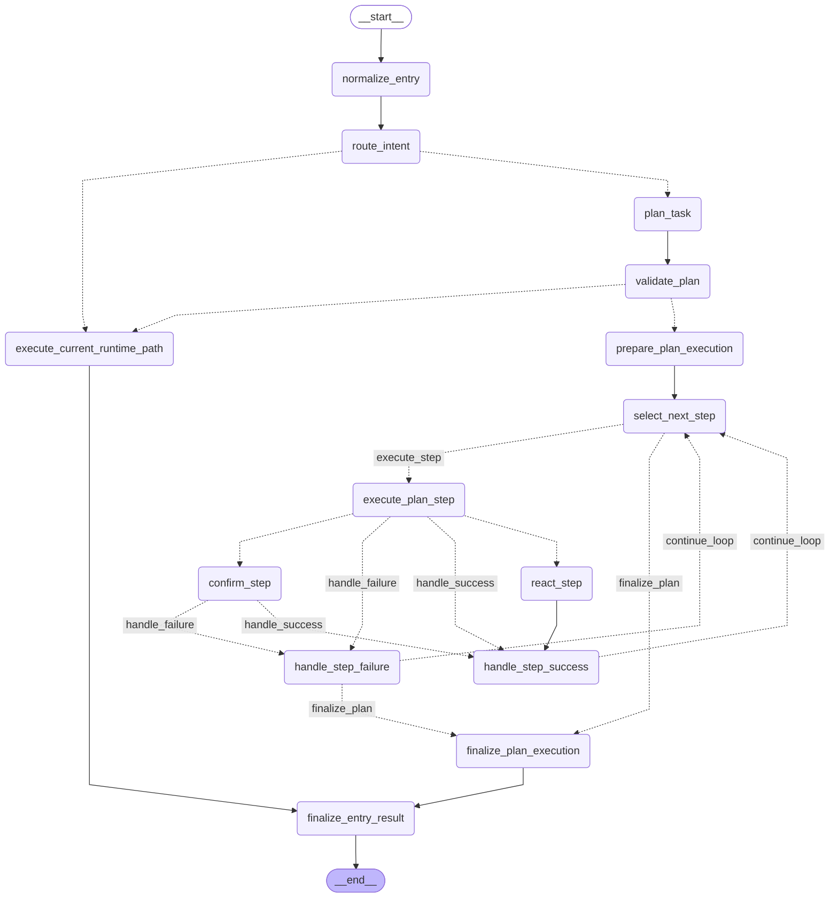

```mermaid
---
config:
  flowchart:
    curve: linear
---
graph TD;
	__start__([<p>__start__</p>]):::first
	normalize_entry(normalize_entry)
	route_intent(route_intent)
	plan_task(plan_task)
	validate_plan(validate_plan)
	execute_current_runtime_path(execute_current_runtime_path)
	finalize_entry_result(finalize_entry_result)
	prepare_plan_execution(prepare_plan_execution)
	select_next_step(select_next_step)
	execute_plan_step(execute_plan_step)
	handle_step_success(handle_step_success)
	handle_step_failure(handle_step_failure)
	confirm_step(confirm_step)
	react_step(react_step)
	finalize_plan_execution(finalize_plan_execution)
	__end__([<p>__end__</p>]):::last
	__start__ --> normalize_entry;
	confirm_step -. &nbsp;handle_failure&nbsp; .-> handle_step_failure;
	confirm_step -. &nbsp;handle_success&nbsp; .-> handle_step_success;
	execute_current_runtime_path --> finalize_entry_result;
	execute_plan_step -.-> confirm_step;
	execute_plan_step -. &nbsp;handle_failure&nbsp; .-> handle_step_failure;
	execute_plan_step -. &nbsp;handle_success&nbsp; .-> handle_step_success;
	execute_plan_step -.-> react_step;
	finalize_plan_execution --> finalize_entry_result;
	handle_step_failure -. &nbsp;finalize_plan&nbsp; .-> finalize_plan_execution;
	handle_step_failure -. &nbsp;continue_loop&nbsp; .-> select_next_step;
	handle_step_success -. &nbsp;continue_loop&nbsp; .-> select_next_step;
	normalize_entry --> route_intent;
	plan_task --> validate_plan;
	prepare_plan_execution --> select_next_step;
	react_step --> handle_step_success;
	route_intent -.-> execute_current_runtime_path;
	route_intent -.-> plan_task;
	select_next_step -. &nbsp;execute_step&nbsp; .-> execute_plan_step;
	select_next_step -. &nbsp;finalize_plan&nbsp; .-> finalize_plan_execution;
	validate_plan -.-> execute_current_runtime_path;
	validate_plan -.-> prepare_plan_execution;
	finalize_entry_result --> __end__;
	classDef default fill:#f2f0ff,line-height:1.2
	classDef first fill-opacity:0
	classDef last fill:#bfb6fc

```
