# Capture / Ask 的 RAG 架构设计

本文按 RAG 架构重新组织 `capture` 和 `ask` 两条链路，说明当前实现、与优秀 RAG 系统的差距、推荐的目标形态，以及关键模型在各层中的职责。

对应代码主要位于：

- [src/personal_agent/web/api.py](../src/personal_agent/web/api.py)
- [src/personal_agent/agent/runtime_capture.py](../src/personal_agent/agent/runtime_capture.py)
- [src/personal_agent/agent/graph_capture_flow.py](../src/personal_agent/agent/graph_capture_flow.py)
- [src/personal_agent/agent/runtime_ask.py](../src/personal_agent/agent/runtime_ask.py)
- [src/personal_agent/agent/capture_flow.py](../src/personal_agent/agent/capture_flow.py)
- [src/personal_agent/agent/nodes.py](../src/personal_agent/agent/nodes.py)
- [src/personal_agent/core/models.py](../src/personal_agent/core/models.py)
- [src/personal_agent/core/evidence.py](../src/personal_agent/core/evidence.py)
- [src/personal_agent/extract/](../src/personal_agent/extract/)
- [src/personal_agent/graphiti/store.py](../src/personal_agent/graphiti/store.py)
- [src/personal_agent/graphiti/reranker.py](../src/personal_agent/graphiti/reranker.py)
- [src/personal_agent/structural_retriever/store.py](../src/personal_agent/structural_retriever/store.py)
- [src/personal_agent/storage/postgres_memory_store.py](../src/personal_agent/storage/postgres_memory_store.py)

## 当前结论

当前架构已经具备 RAG 的基本闭环：

```text
capture: 原始输入 -> RawIngestItem -> 确定性 parent/chunk 草案 -> LangExtract 预抽取(SectionMap) -> 可选语义重建/标注 chunk -> 本地存储 -> graph_worthy=True 的 chunk 入 Graphiti
ask: question -> QueryUnderstanding -> RetrievalPlan -> graph(Graphiti)+structural+local 并行/web 主动 -> EvidenceItem -> ContextPack -> 生成 -> 校验
```

它的优势是分层清楚、证据模型已开始统一、图谱与原文 note 有 episode 映射、回答后有 verifier、**预抽取层已落地，能基于语义 section 切 chunk 并把低价值段落（目录、boilerplate）从图谱深抽取中过滤掉**、**QueryUnderstanding + RetrievalPlan 已落地，支持 query rewrite、意图识别、并行多源检索、子查询分解和 metadata filters 下推**、**本地 lexical/vector 检索已落地，支持 Postgres FTS、pg_trgm、pgvector、RRF 融合、filters 和 chunk small-to-big 展开**、**claim-level verifier 已落地，能抽取关键结论并检查 selected evidence 是否支撑**、**capture fingerprint + metadata 已落地，可跳过同 user 下重复采集并把来源 metadata 传入 EvidenceItem**、**Graphiti 批量并发同步已落地，长文 parent 不再重复做图谱深抽取，worthy chunks 按预算后台同步**、**Structural retriever 已作为生产 provider 接入，可通过 `PERSONAL_AGENT_ASK_GRAPH_PROVIDER=graphiti|structural` 切换；它直接基于 Postgres notes/chunks 构建 parent-section 结构索引，并按用户/filters/note 更新时间做渐进式缓存失效**、**filters 已落地，时间/来源/文件范围能进入 local/vector 检索并约束 graph note 映射**、**ask 组件装配已开始工厂化，ContextPack 前支持 parent/child candidate enrichment 和 heuristic/LLM rerank 可插拔**。主要差距在 rerank 融合策略、上下文压缩、图谱质量治理、版本化 ingestion 和评测体系：

- 图谱 `citation_hits` 已优先进入 graph prompt；graph/structural/local/web 也已进入轻量 `ContextPack`；rerank 已拆成 `heuristic` / `llm` 可插拔组件。30q 结果显示 LLM rerank + parent_child + structural provider 的 MRR/R@10 最好，但仍需 100q 验证稳定性。
- 当前 rerank 已跨来源运行，LLM listwise rerank 已有入口，但缺少 MMR、多样性约束、学习型融合和更细粒度压缩。
- claim-level grounding 当前是启发式 overlap / negation 检查，尚未引入 LLM/entailment verifier。
- observability 主要靠日志和 trace step，已有部分图谱质量指标和 Open RAGBench 雏形，但尚缺少稳定回归集、rerank 过程快照和 prompt 上下文快照。

## 优秀 RAG 架构对照

| RAG 层 | 优秀架构通常具备 | 当前实现 | 主要差距 |
| --- | --- | --- | --- |
| Ingestion | 文档解析、清洗、结构保留、元数据抽取、增量更新 | `CaptureService` 提取正文，`RawIngestItem` 承载来源、metadata 和 source fingerprint；重复 fingerprint 默认复用已有 note | 元数据自动抽取仍较少，缺少版本更新和权限细粒度策略 |
| Chunking | 语义切分、层级 chunk、标题路径、窗口重叠 | `core.chunking` 先产出确定性的 parent/chunk 草案；LangExtract 预抽取产出 `SectionMap`，再由 chunk 调和层按语义 section 替换或标注机械 chunk；每个 chunk 携带 `preextract.graph_worthy / preextract.topic / chunk.source_span`；local retrieval 已支持 chunk 命中后展开 parent/neighbor | 仍缺标题路径回填、窗口重叠和页码/章节等结构化定位 |
| Indexing | 向量索引、全文/倒排索引（FTS/BM25 打分）、图谱、关键词、时间索引并存 | Postgres FTS + pg_trgm + pgvector 本地索引；Graphiti 实体关系图（按 `graph_worthy` 路由仅入高价值 chunk）；structural parent-section provider 已接入生产 ask 并有缓存索引；local/vector 已支持 metadata filters 下推 | 尚缺向量重建/回填任务、structural/Graphiti 混合融合策略和更强跨来源统一 rerank |
| Query Understanding | 改写、分解、时效识别、过滤条件、检索计划 | `QueryUnderstanding` 模型 + `query_planner.py` 优先用 LangExtract LLM 的 strict json_schema 做 query rewrite / 意图识别 / 子查询分解 / filters 抽取 | filters 已进入 local/vector 检索和 graph note 映射过滤；复杂自然语言时间范围仍需增强 |
| Retrieval | 多路召回、元数据过滤、parent-child 展开 | `RetrievalPlan` 动态路由，graph+local 并行（ThreadPoolExecutor），graph provider 可切换 Graphiti/structural，web 按 freshness 主动触发，子查询分解多跳检索；local/vector 已支持 metadata filters 和 parent/neighbor 展开 | Graphiti 原生 metadata 过滤、structural 与 local 去重/融合权重、web freshness window、raw candidate debug 仍需增强 |
| Rerank | Cross-encoder/LLM rerank、MMR、多样性、阈值 | `AskPipelineFactory` 装配 candidate enricher + reranker；`parent_child` 默认补齐 parent 命中的高相关 child sections 和 child 命中的 parent/neighbor chunks；`heuristic` 为默认，`llm` listwise rerank 可通过配置启用；Graphiti 仍有图谱 edge rerank | 尚缺 MMR、融合权重、阈值和系统化组合评测 |
| Context Assembly | 去重、压缩、引用锚定、预算控制、排序可解释 | `ContextPack` 记录 selected/dropped、rank_score、rank_reason、char budget；统一 prompt 从 ContextPack 构造 | 压缩策略仍较弱，尚未按 claim/section 做摘要压缩 |
| Generation | 严格基于证据、引用约束、无法回答策略 | `_generate_answer()` + prompt 约束 | 生成和引用绑定不够强，答案结构未显式和 evidence 对齐 |
| Verification | 引用有效性、事实一致性、覆盖度、反证检查 | `AnswerVerifier` + claim extraction + selected evidence grounding + retry | 已有启发式 claim grounding；尚缺 LLM/entailment verifier 和更强反证检索 |
| Evaluation | Recall@k、MRR、faithfulness、答案质量回归集 | `evals/` 有 ask/retrieval 评测雏形 | 需要覆盖图谱、chunk、web、时效、多跳案例 |

## RAG 总体目标架构

推荐把系统稳定抽象成两条流水线：离线/准实时索引流水线和在线回答流水线。

```text
Capture / Indexing Pipeline
  EntryInput
  -> Source normalization
  -> Content extraction
  -> Cleaning + metadata enrichment
  -> Structural note/chunk draft (deterministic heading/paragraph fallback)
  -> LangExtract pre-extraction (SectionMap, graph_worthy 路由)
  -> Semantic chunk reconciliation (>=2 sections 时重建 chunk，否则保留草案并标注)
  -> Local document store
  -> Local lexical/vector indexes
  -> Graph extraction / Graphiti episode (仅 graph_worthy=True 的 chunk)
  -> Index status + trace

Ask / Retrieval-Augmented Generation Pipeline
  Question
  -> Query understanding
  -> Retrieval plan
  -> Multi-source retrieval
  -> Candidate normalization
  -> Rerank + diversity + threshold
  -> Context assembly
  -> Grounded generation
  -> Verification / retry / fallback
  -> AskResult
```

当前代码已经覆盖其中大部分在线主链路：所有来源会先变成 `EvidenceItem`，再由工厂装配的 reranker 和 `ContextPack` 的 context assembly 决定哪些证据进入 prompt。剩余重点是验证 LLM rerank 的真实收益、补齐 MMR/压缩/更强 verifier，并完善评测和质量治理。

### Model / Layer 依赖类图

这张图描述“层如何消费模型”，不是 Python 继承关系。为了表达分层，使用 `flowchart + subgraph`：

- 蓝色节点是处理层。
- 白色节点是已落地的模型。
- 绿色节点是已落地的 projection / read model（`projections.py`，已被多层真实消费）。
- 黄色虚线节点是尚未落地的未来可观测性模型（仅 `RetrievalCandidate` / `VerificationReport`）。

`KnowledgeNote` 保留为 persistence schema，各业务层应尽量消费 projection。注意 `projections.py` 中的 `RetrievalDocument / GraphIngestDocument / MatchRef / EvidenceSource` 已不是“未来”——它们已被 structural/graphiti/postgres/verifier 等层真实依赖。

采集侧的分层边界需要特别明确：

- `CaptureLayer` 负责来源归一、正文提取、去重决策，并产出可落库的 parent/chunk 草案；它必须是确定性的，保证 LangExtract 跳过或失败时仍有稳定的笔记结构。
- `PreExtractLayer` 只负责语义预抽取，产出 `SectionMap`、`topic`、`graph_worthy` 和 source span；它不拥有采集事实，也不直接落库。
- `ChunkReconcileLayer` 是两者之间的薄编排层：当 `SectionMap.sections >= 2` 时用语义 section 重建 chunk；否则保留 `CaptureLayer` 的机械 chunk，并只把预抽取状态写到 `NotePreExtract`。
- `GraphIngestLayer` 只消费已经稳定下来的 `GraphIngestDocument`，并根据 `graph_worthy` 做深抽取路由，避免图谱摄取反向影响采集结构。

```mermaid
flowchart LR
    classDef layer fill:#e8f1ff,stroke:#4f7ccf,stroke-width:1px,color:#10233f
    classDef model fill:#ffffff,stroke:#9aa4b2,stroke-width:1px,color:#172033
    classDef projection fill:#e9f9ee,stroke:#2e9e5b,stroke-width:1px,color:#0c3b22
    classDef future fill:#fff7e6,stroke:#d08b00,stroke-dasharray: 5 3,color:#3b2a00
    classDef pipeline fill:#f4f6fb,stroke:#3a4f7a,stroke-width:2px,color:#10233f

    subgraph Ingest["Ingest Pipeline"]
        direction TB

        subgraph Capture["Capture / Indexing"]
            direction TB
            EntryLayer["入口层<br/>route intent<br/>bind user/session<br/>normalize source scope"]:::layer
            EntryInput["EntryInput<br/>text: 用户输入<br/>user_id/session_id<br/>source_type/source_ref<br/>metadata"]:::model
            CaptureLayer["采集层<br/>extract content<br/>fingerprint dedupe<br/>duplicate skip / version decision"]:::layer
            RawIngestItem["RawIngestItem<br/>content: 入库正文<br/>source_type/source_ref<br/>metadata<br/>source_fingerprint"]:::model
            StructuralChunkLayer["结构切分层<br/>deterministic heading/paragraph chunking<br/>build parent/chunk draft<br/>fallback owner"]:::layer
            ChunkDraft["ChunkDraft<br/>title/content/source_span<br/>mechanical boundaries<br/>not persisted directly"]:::model
            PreExtractLayer["语义预抽取层<br/>SectionMap only<br/>topic / graph_worthy<br/>source_span grounding"]:::layer
            SectionMap["SectionMap<br/>doc_topic<br/>sections: SectionRecord[]"]:::model
            SectionRecord["SectionRecord<br/>topic/summary<br/>char_start/char_end<br/>contains_entities<br/>information_density<br/>graph_worthy<br/>reason"]:::model
            ChunkReconcileLayer["chunk 调和层<br/>&gt;=2 sections: rebuild chunks<br/>0/1 section: keep draft<br/>stamp preextract status"]:::layer
            KnowledgeNote["KnowledgeNote<br/>persistence aggregate<br/>id/user_id<br/>tags/related_note_ids<br/>created_at/updated_at"]:::model
            NoteSource["NoteSource<br/>type/ref/fingerprint<br/>metadata"]:::model
            NoteBody["NoteBody<br/>title<br/>content<br/>summary"]:::model
            NoteChunk["NoteChunk<br/>parent_note_id<br/>index<br/>source_span"]:::model
            NotePreExtract["NotePreExtract<br/>section_map<br/>graph_worthy<br/>status<br/>topic"]:::model
            NoteGraphKnowledge["NoteGraphKnowledge<br/>episode_uuid<br/>entity_names<br/>relation_facts<br/>node_refs/edge_refs/fact_refs"]:::model
            NoteGraphSync["NoteGraphSync<br/>status<br/>error"]:::model
            NoteGraphQuality["NoteGraphQuality<br/>entity_count<br/>relation_count<br/>avg_fact_length<br/>zero_entities<br/>weak_relations_only"]:::model
            EvidenceSource["EvidenceSource<br/>projection (landed)<br/>id/title/content/summary<br/>source metadata<br/>parent_note_id/source_span"]:::projection
            RetrievalDocument["RetrievalDocument<br/>projection (landed)<br/>title/summary/content<br/>tags/metadata<br/>parent/chunk refs<br/>preextract/entity/relation terms"]:::projection
            GraphIngestDocument["GraphIngestDocument<br/>projection (landed)<br/>id/user_id/title<br/>content/summary<br/>source metadata<br/>created_at"]:::projection
            IndexLayer["本地索引层<br/>persist notes<br/>FTS / pg_trgm / pgvector<br/>graph sync status"]:::layer
            ReviewLayer["回顾任务层<br/>schedule review<br/>due_at / interval<br/>prompt + answer hint"]:::layer
            ReviewCard["ReviewCard<br/>id/note_id<br/>prompt<br/>answer_hint<br/>interval_days<br/>due_at"]:::model
            GraphIngestLayer["图谱摄取层<br/>entity extraction<br/>relation extraction<br/>episode mapping"]:::layer
            GraphCaptureResult["GraphCaptureResult<br/>enabled/error<br/>episode_uuid<br/>entity_names<br/>relation_facts<br/>node_refs/edge_refs/fact_refs"]:::model
            GraphWritebackLayer["图谱回写编排层<br/>merge GraphCaptureResult<br/>update graph knowledge/sync/quality<br/>persist updated note"]:::layer

            EntryLayer --> EntryInput
            EntryInput --> CaptureLayer
            CaptureLayer --> RawIngestItem
            CaptureLayer -. duplicate .-> KnowledgeNote
            RawIngestItem --> StructuralChunkLayer
            StructuralChunkLayer --> ChunkDraft
            RawIngestItem --> PreExtractLayer
            PreExtractLayer --> SectionMap
            SectionMap --> SectionRecord
            ChunkDraft --> ChunkReconcileLayer
            SectionMap --> ChunkReconcileLayer
            ChunkReconcileLayer -. populates .-> NotePreExtract
            ChunkReconcileLayer -. creates final .-> NoteChunk
            RawIngestItem --> KnowledgeNote
            KnowledgeNote --> NoteSource
            KnowledgeNote --> NoteBody
            KnowledgeNote --> NoteChunk
            KnowledgeNote --> NotePreExtract
            KnowledgeNote --> NoteGraphKnowledge
            KnowledgeNote --> NoteGraphSync
            KnowledgeNote --> NoteGraphQuality
            KnowledgeNote -. projection .-> EvidenceSource
            KnowledgeNote -. projection .-> RetrievalDocument
            KnowledgeNote -. projection .-> GraphIngestDocument
            KnowledgeNote --> IndexLayer
            IndexLayer --> ReviewLayer
            ReviewLayer --> ReviewCard
            ReviewCard --> KnowledgeNote
            GraphIngestDocument --> GraphIngestLayer
            GraphIngestLayer --> GraphCaptureResult
            GraphCaptureResult --> GraphWritebackLayer
            KnowledgeNote --> GraphWritebackLayer
            GraphWritebackLayer --> NoteGraphKnowledge
            GraphWritebackLayer --> NoteGraphSync
            GraphWritebackLayer --> NoteGraphQuality
            GraphWritebackLayer --> IndexLayer
        end
    end

    subgraph Ask["Ask Pipeline"]
        direction TB

        subgraph QueryPlan["Ask Planning"]
            direction TB
            QueryLayer["查询理解层<br/>rewrite query<br/>infer filters<br/>derive retrieval plan"]:::layer
            QueryUnderstanding["QueryUnderstanding<br/>needs_freshness<br/>needs_personal_memory<br/>needs_graph_reasoning<br/>query_rewrite<br/>sub_queries<br/>filters<br/>answer_policy"]:::model
            RetrievalFilters["RetrievalFilters<br/>source_types<br/>source_ref_contains<br/>tags<br/>created_after/created_before<br/>metadata_contains<br/>parent_note_id"]:::model
            RetrievalPlan["RetrievalPlan<br/>sources: graph/local/web<br/>parallel<br/>query<br/>sub_queries<br/>filters"]:::model

            QueryLayer --> QueryUnderstanding
            QueryUnderstanding --> RetrievalFilters
            QueryUnderstanding --> RetrievalPlan
            RetrievalFilters --> RetrievalPlan
        end

        subgraph Retrieval["Retrieval Layer"]
            direction TB
            RetrievalLayer["统一召回层<br/>local: FTS/pg_trgm/pgvector/RRF<br/>KG: Graphiti entities/facts/edges<br/>structural: section_graph<br/>web: freshness/external<br/>sub-query wrapper"]:::layer
            GraphAskResult["GraphAskResult<br/>enabled/error<br/>answer<br/>entity_names<br/>relation_facts<br/>node_refs/edge_refs/fact_refs<br/>citation_hits<br/>related_episode_uuids"]:::model
            GraphCitationRerankStrategy["rank_graph_citation_hits<br/>Graphiti edge citation rerank<br/>episode-addressable facts"]:::model
            GraphCitationHit["GraphCitationHit<br/>episode_uuid<br/>relation_fact<br/>endpoint_names<br/>matched_terms<br/>entity_overlap_count<br/>score"]:::model
            WebSearchResult["WebSearchResult<br/>title<br/>url<br/>snippet<br/>source<br/>published_at"]:::model
            RetrievalCandidate["RetrievalCandidate<br/>source<br/>raw_id/note_id<br/>raw_score/normalized_score<br/>rank<br/>debug"]:::future
            Citation["Citation<br/>note_id<br/>title/snippet<br/>relation_fact<br/>url<br/>source_type"]:::model

            RetrievalLayer --> GraphAskResult
            GraphAskResult --> GraphCitationHit
            RetrievalLayer --> WebSearchResult
            RetrievalLayer -. future raw candidates .-> RetrievalCandidate
            RetrievalLayer --> Citation
        end

        subgraph EvidenceContext["Evidence / Enrichment / Rerank / Context"]
            direction TB
            NormalizeLayer["证据标准化层<br/>notes/facts/web to EvidenceItem<br/>merge citations<br/>dedupe evidence<br/>attach retrieved_by/source metadata"]:::layer
            EvidenceItem["EvidenceItem<br/>source_type<br/>source_id/title<br/>snippet/fact<br/>source_span/url<br/>score<br/>metadata"]:::model
            EnrichmentLayer["候选补全层<br/>parent_child<br/>neighbor chunks<br/>no-op ablation"]:::layer
            RerankLayer["统一排序层<br/>heuristic rerank<br/>LLM listwise rerank<br/>score normalization<br/>budget / diversity selection"]:::layer
            HeuristicRerankStrategy["heuristic evidence rerank<br/>term overlap + source score<br/>source type/anchor bonuses"]:::model
            LlmListwiseRerankStrategy["LLM listwise rerank<br/>uses heuristic top-N<br/>fallback to heuristic on failure"]:::model
            RankedEvidence["RankedEvidence<br/>evidence<br/>score<br/>reason<br/>selected"]:::model
            ContextLayer["上下文组装层<br/>selected evidence<br/>dropped evidence<br/>prompt evidence ids"]:::layer
            ContextPack["ContextPack<br/>selected: RankedEvidence[]<br/>dropped: RankedEvidence[]<br/>used_chars<br/>char_budget"]:::model

            NormalizeLayer --> EvidenceItem
            EvidenceItem --> EnrichmentLayer
            EnrichmentLayer --> EvidenceItem
            EvidenceItem --> RerankLayer
            RerankLayer --> RankedEvidence
            RankedEvidence --> ContextLayer
            ContextLayer --> ContextPack
        end

        subgraph Answering["Generation / Verification"]
            direction TB
            GenerationLayer["生成层<br/>grounded answer<br/>citation hints<br/>dialogue policy<br/>evidence id references"]:::layer
            VerificationLayer["校验层<br/>claim extraction<br/>grounding check<br/>contradiction check<br/>retry/fallback"]:::layer
            VerificationReport["VerificationReport<br/>claims<br/>supported<br/>contradicted<br/>missing<br/>evidence_score<br/>retry_reason"]:::future
            MatchRef["MatchRef<br/>projection<br/>id<br/>title"]:::future
            AskResult["AskResult<br/>answer<br/>citations<br/>matches<br/>match_refs<br/>evidence<br/>session_id"]:::model

            GenerationLayer --> VerificationLayer
            MatchRef --> VerificationLayer
            VerificationLayer -. future report .-> VerificationReport
            VerificationLayer --> AskResult
        end
    end

    class Ingest pipeline
    class Ask pipeline

    %% Cross-pipeline data flow: Ingest 产物 → Ask 消费
    IndexLayer --> QueryLayer
    KnowledgeNote --> RetrievalLayer
    RetrievalDocument --> RetrievalLayer
    RetrievalPlan --> RetrievalLayer
    GraphAskResult --> NormalizeLayer
    WebSearchResult --> NormalizeLayer
    RetrievalCandidate -. future adapter .-> NormalizeLayer
    KnowledgeNote --> NormalizeLayer
    NormalizeLayer -. internal projection .-> EvidenceSource
    Citation --> NormalizeLayer
    ContextPack --> GenerationLayer
    ContextPack --> VerificationLayer
    KnowledgeNote -. projection .-> MatchRef
    EvidenceItem --> AskResult
    Citation --> AskResult
    MatchRef --> AskResult
    KnowledgeNote --> AskResult
    RetrievalLayer --> GraphCitationRerankStrategy
    GraphCitationRerankStrategy --> GraphCitationHit
    RerankLayer --> HeuristicRerankStrategy
    RerankLayer --> LlmListwiseRerankStrategy
    LlmListwiseRerankStrategy -. failure fallback .-> HeuristicRerankStrategy
```



## Capture / Indexing Pipeline

### 1. Source normalization

入口由 `AgentService.entry()` 和 `AgentRuntime.execute_entry()` 负责路由。采集类输入最终进入 `execute_capture()`：

```text
EntryInput(source_type="text"|"link"|"file")
  -> CaptureService 提取正文
  -> RawIngestItem
```

当前已落地：

- `KnowledgeNote` 保存 `metadata` 和 `source_fingerprint`，parent/chunk 都继承同一来源信息。
- Postgres `knowledge_notes.source_fingerprint` 建索引，`execute_capture()` 入库前先按 `(user_id, source_fingerprint)` 查重。
- 重复采集默认 skip，并返回已有 parent note 及其 chunks，不重复写 note、review 或触发图谱 ingest。
- `notes_to_evidence()` 会把 `source_ref / source_fingerprint / metadata` 放进 `EvidenceItem.metadata`。

仍需改进：

- 网页正文抓取层尚未系统抽取 author、published_at、canonical_url、mime_type、页码等字段。
- 目前是 exact duplicate skip，尚未实现同来源内容变化后的版本链或 diff update。

### 2. Cleaning and chunking

当前 `run_capture_flow()` 固定执行：

```text
capture -> structural_chunk -> preextract -> chunk_reconcile -> enrich -> link -> schedule_review
```

`capture_node` 生成 parent `KnowledgeNote`；`structural_chunk_node` 产出确定性 `ChunkDraft`；`preextract_node` 调用 LangExtract 跑轻量预抽取（详见后文 §2.5）；`chunk_reconcile_node` 负责最终落定 chunk：有多个 semantic section 时重建 chunk，否则保留机械草案并标注预抽取状态。

```text
KnowledgeNote(parent)
  -> KnowledgeNote(chunk 1, graph_worthy=True/False)
  -> KnowledgeNote(chunk 2, graph_worthy=True/False)
  -> ...
```

当前能力：

- chunk 已按 LangExtract 语义 section 切分，并保留 `source_span`。
- parent note 适合展示和文档级召回，chunk note 适合证据级召回。
- 每个 chunk 已携带 `preextract.graph_worthy / preextract.topic / chunk.source_span`，可用于后续检索和入图路由。

剩余目标：

- 回填标题路径、章节、页码、段落位置等更完整结构信息。
- 回填 chunk 的标题路径、章节层级和页码，让 small-to-big 展开后的上下文更容易定位。

### 2.5 LangExtract 轻量预抽取层

代码：[src/personal_agent/extract/](../src/personal_agent/extract/)

这是 capture 流水线的强制步骤之一，介于 `capture_node` 与 `enrich_node` 之间。它的职责是用一次低成本 LLM 调用产出**文档级语义切分 + 路由信号**，让下游的图谱深抽取（graphiti `ingest_note`）只跑在真正值得入图的段落上。

#### 2.5.1 模型边界

```text
PreExtractService(LangExtractConfig)
  .extract(text) -> SectionMap
```

`SectionMap / SectionRecord` 的字段和它们与 capture layer 的依赖关系见上方类图。

#### 2.5.2 LLM 后端

走 OpenAI-compatible 协议，与 graphiti（Kimi）/ 主对话（DeepSeek）独立配置：

```text
LangExtractConfig
  api_key = PERSONAL_AGENT_EXTRACT_API_KEY 或 EMBEDDING_API_KEY
  base_url = https://dashscope.aliyuncs.com/compatible-mode/v1
  model_id = qwen3-coder-flash
```

选 `qwen3-coder-flash` 是因为它在阿里百炼里**支持 OpenAI 风格的 `response_format=json_schema`**，这是 LangExtract 默认的强约束路径。同价位的 `qwen3.6-flash` / `deepseek-v4-flash` 都不支持 json_schema，只能退到 json_object + fence_output 的弱约束路径，schema 漂移风险更高。

#### 2.5.3 判断准则的来源

`graph_worthy` 不是 LangExtract 自带的能力，而是由我们的 prompt + few-shot 引导 LLM 判断：

- **Schema 字段定义**：`SectionRecord.graph_worthy` 在 [src/personal_agent/extract/schemas.py](../src/personal_agent/extract/schemas.py) 中定义，附自然语言 description。
- **Prompt 准则**：[src/personal_agent/extract/prompts.py](../src/personal_agent/extract/prompts.py) 中的 `PROMPT_DESCRIPTION` 明确写出：包含 decisions / dependencies / definitions / causes / tradeoffs / contrasts 时判 True；纯目录、致谢、引用列表、字段列表、boilerplate 判 False。
- **Few-shot 对照**：两条 example 钉住口径——FastAPI Depends() 缓存机制是正样本（包含定义和对比 → True），目录章节列表是负样本（纯目录无信息 → False）。

判断逻辑 100% 落在 LLM 上，由 prompt + few-shot 引导。换业务场景（如 `is_pii`、`risk_level`）只需改 prompt + examples，schema 完全自由。

#### 2.5.4 路由消费

[src/personal_agent/agent/graph_capture_flow.py](../src/personal_agent/agent/graph_capture_flow.py) 在 capture 本地流程完成后按 `graph_worthy` 分流：

```text
preextract.graph_worthy=True   -> graph_sync.status = "pending"   (走 graphiti 深抽取)
preextract.graph_worthy=False  -> graph_sync.status = "skipped"   (跳过深抽取，仍入本地索引)
```

也就是说本地 lexical/vector 索引会拿到全部 chunk，而 graphiti 只拿到高价值 chunk，节约图谱构建成本。

#### 2.5.5 调优参数

`LangExtractConfig` 关键调优旋钮：

| 参数 | 默认 | 说明 |
| --- | --- | --- |
| `max_char_buffer` | 6000 | LangExtract 切给 LLM 的单次窗口字数。越大 section 越粗 |
| `extraction_passes` | 1 | 多遍抽取以提升召回。当前 prompt 单 pass 已饱和，passes>1 是浪费 |
| `max_workers` | 4 | LangExtract 并发 LLM 调用数 |
| `min_doc_chars` | 200 | 短于此长度的文档不跑预抽取，直接进入下游 |
| `fallback_on_error` | true | 抽取失败时返回空 SectionMap 而非抛错；`preextract.status="failed"` 仍会记录 |

`max_char_buffer` 调优实测（19K 字真实文档，model=qwen3-coder-flash）：

| max_char_buffer | sections | graph_worthy | 过滤率 | 耗时 |
| --- | --- | --- | --- | --- |
| 2000 | 78 | 65 / 13 | 18% | 30s |
| 4000 | 41 | 39 / 2 | 5% | 30s |
| **6000** | **37** | **28 / 9** | **24%** | **32s** |
| 8000 | 35 | 35 / 0 | 0% | 29s |

关键观察：

- buffer 越大、section 越粗。粒度从 78 直降到 35。
- buffer=8000 时 LLM 上下文太大，反而把 boilerplate 和决策段揉在一起，**过滤功能彻底失效**。
- buffer=6000 是粒度和过滤率的最佳折中——比 buffer=2000 节约 54% 的 graphiti 调用，同时保住 24% 的过滤率。

#### 2.5.6 失败模式与降级

| 场景 | 行为 |
| --- | --- |
| `len(text) < min_doc_chars` | `preextract.status="skipped"`，下游使用 capture_node 的机械 chunk |
| LangExtract 调用抛异常 + `fallback_on_error=true` | `preextract.status="failed"`，下游使用机械 chunk |
| LangExtract 调用抛异常 + `fallback_on_error=false` | 抛 `PreExtractError`，capture 失败 |
| SectionMap 只有 1 个 section | `preextract.status="ok"`，但保留机械 chunk，仅在每个 chunk 上盖 `preextract.graph_worthy=parent.preextract.graph_worthy` |
| SectionMap >= 2 个 section | `preextract.status="ok"`，**用 section 替换机械 chunk**，每个 chunk 带 `preextract.graph_worthy / preextract.topic / chunk.source_span` |

#### 2.5.7 已落地强化与下一步

已落地：

- **schema 强约束**：[src/personal_agent/extract/openai_schema.py](../src/personal_agent/extract/openai_schema.py) 提供手写 `build_section_openai_schema()`，替换默认 examples-derived schema，把 `information_density` 从自由 string 收紧为 `enum: ["high","medium","low"]`。
- **OpenAI json_schema 路径实测**：通过请求拦截探针 [scripts/probe_extract_request_capture.py](../scripts/probe_extract_request_capture.py) 确认 LangExtract 1.5 会向 DashScope 下发 `response_format = {"type": "json_schema", "strict": true, ...}`。
- **schema 覆盖路径固定**：语言模型用 `OpenAILanguageModel(...)` 直接构造并通过 `model=` 参数传入 `lx.extract`，避免 `factory.create_model` 覆盖自定义 schema。
- **Live 漂移验证**：实测 38 个 section 的 `information_density` 全部落在 enum 内。

建议下一步：

- **离线 eval**：把第一次跑出的 SectionMap 人肉标注成 golden set，未来改 prompt 时跑回归。
- **分类化 reason**：让 LLM 必须从固定枚举里选 reason（`decision / contrast / definition / boilerplate / toc / list`），便于自动化质量审计。同样可以走 enum 约束。
- **二次校验**：对 `graph_worthy=True` 但 `information_density=low` 的矛盾样本，再跑一次更便宜的小模型反向 challenge——契合 §10.6.5 的两层验证思路。

### 3. Local store and local indexes

当前本地持久化由 `PostgresMemoryStore` 负责。`link_node` 会：

- 调用 `find_similar_notes(user_id, content)` 找相似笔记。
- 写入 `KnowledgeNote.related_note_ids`。
- 持久化 parent note 和 chunk notes。

当前 `find_similar_notes()` 已升级为 Postgres 本地混合检索：

```text
query
  -> CJK n-gram + lexical terms
  -> Postgres FTS / pg_trgm lexical candidates
  -> pgvector cosine vector candidates
  -> RRF 融合
  -> chunk 命中后展开 parent / 邻近 chunk
```

当前已具备：

- Lexical index：Postgres FTS + `pg_trgm`，含 `body.title / body.summary / preextract.topic / body.content` 字段权重。
- Vector index：`embedding_vector vector(128)` + HNSW cosine index。
- Hybrid merge：lexical / vector 两路召回后做 RRF 融合。
- Parent-child expansion：chunk 命中后展开父文档和邻近 chunk。

剩余短板：

- raw lexical/vector candidates 还没有独立返回接口，目前 `find_similar_notes()` 直接返回 expanded notes，不利于调试候选来源和分数。
- 外部 embedding 失败会退回 local hash embedding，质量不如真实语义 embedding。
- filters 已下推到 local lexical/vector SQL，但复杂自然语言时间范围仍需更强解析。

### 4. Graph indexing

短文或单 note capture 会调用：

```text
GraphitiStore.ingest_note(result.note)
```

返回 `GraphCaptureResult`，再回写到 `KnowledgeNote`：

- `graph.episode_uuid`
- `graph.entity_names`
- `graph.relation_facts`
- `graph.node_refs`
- `graph.edge_refs`
- `graph.fact_refs`
- `graph_sync.status`
- `graph_sync_error`

长文 capture 已改为 parent 不重复入图：parent 标记为 `skipped`，`graph_worthy=True` 的 chunks 进入 pending 队列，随后由 `sync_notes_to_graph(chunk_ids)` 批量并发同步。`graph_worthy=False` 或超出单次 capture budget 的 chunk 会标记为 `skipped`。

仍需改进：

- 图谱 episode 应可回溯到 note/chunk/source_span。
- Graphiti 批量同步目前是并发调度，不是真正 single-client bulk add。
- 后台同步状态还没有独立队列表，重试历史和 per-user 限流仍主要靠 note 字段与日志。

## Ask / RAG Pipeline

Ask 主链路按层理解如下：

| 层 | 作用 | 当前组件 |
| --- | --- | --- |
| Query understanding | 理解问题、改写、抽取 filters、判断 freshness / personal memory / graph reasoning | `QueryUnderstanding` |
| Retrieval planning | 决定召回源、并行策略、子查询、filters 下推 | `RetrievalPlan` |
| Retrieval layer | 从多个来源召回候选 | local / Graphiti KG / section_graph / web / sub-query |
| Candidate normalization | 把不同来源结果统一成 evidence | `notes_to_evidence` / `graph_result_to_evidence` / `web_results_to_evidence` |
| Candidate enrichment | 对已召回候选做 parent/child/neighbor 补全 | `parent_child` / `none` |
| Rerank | 跨来源排序、预算控制、多样性 | `heuristic` / `llm` |
| Context assembly | 选择最终进入 prompt 的证据与引用 | `ContextPack` |
| Generation | 基于证据生成答案 | `_compose_unified_answer` |
| Verification | claim grounding、retry、fallback | `AnswerVerifier` |

### 1. Query understanding

**已实现**（[query_planner.py](../src/personal_agent/agent/query_planner.py) + [query_understanding.py](../src/personal_agent/core/query_understanding.py)）。

当前 `execute_ask()` 在检索前调用 `plan_retrieval(question, context, settings)` 生成结构化查询理解：

```text
bind_session(user_id, session_id)
conversation_messages -> working_context
question + context -> plan_retrieval() [LangExtract LLM, strict json_schema]
  -> QueryUnderstanding + RetrievalPlan
effective_query = plan.query (rewritten) or question
```

实现细节：`query_planner.py` 优先复用 LangExtract 的 OpenAI-compatible 配置，即 `settings.langextract.api_key / base_url / model_id`，默认是 `qwen3-coder-flash + DashScope compatible endpoint`。调用时使用 `response_format={"type":"json_schema","strict":true}` 约束 `QueryUnderstanding` 输出，避免 `json_object` 在复杂 query 下 schema 漂移；如果未配置 LangExtract API key，则 fallback 到原 `openai.small_model`。LLM 调用失败时 graceful fallback 到默认 plan，并用 `_heuristic_filters()` 兜底识别“最近/今天/昨天/上周/链接/文件/xxx.md”等常见 filters。

### 2. Retrieval layer：统一召回层

Retrieval 是 Ask 流程里最复杂的一层，当前应按“路由计划 -> 多个 retriever -> 召回结果”来理解，而不是把 Graph retrieval、Local retrieval、Web retrieval 当成互不相关的章节。

当前所有召回相关组件都属于同一个 Retrieval layer：

| 子步骤 | 当前组件 | 输入 | 输出 | 主要作用 | 是否属于召回 |
| --- | --- | --- | --- | --- | --- |
| Retrieval routing | `RetrievalPlan` | `QueryUnderstanding` | sources / parallel / filters / sub_queries | 决定查哪些源、是否并行、用什么 query 和 filters | 是，召回调度 |
| Local retriever | Postgres FTS + pg_trgm + pgvector + RRF | rewritten query + filters | note/chunk matches | 本地全文、模糊、向量混合召回 | 是 |
| KG retriever | Graphiti | query + user_id | entity/fact/edge/episode candidates | 实体关系、事实边、多跳语义召回 | 是 |
| Structural retriever | `StructuralRetrieverStore` / section graph | query + user_id + filters | parent/section note candidates | 基于 parent-section 结构做传播式召回 | 是 |
| Web retriever | configurable web search provider | question | web snippets + citations | 新鲜信息或外部公开信息召回 | 是 |
| Sub-query expansion | `RetrievalPlan.sub_queries` | 拆分后的子问题 | 各 retriever 的补充候选 | 多跳/复合问题的召回扩展 wrapper | 是，召回增强 |

注意：`parent_child` 不属于 retrieval layer 的主召回器，它是**召回后的 candidate enrichment**。当前 structural retriever 和 `parent_child` 都使用 parent-child 结构信号，因此需要后续 ablation 判断两者是互补还是重复。

#### 2.1 Retrieval plan

**已实现**（[query_planner.py](../src/personal_agent/agent/query_planner.py) 中的 `_derive_plan()`）。

`RetrievalPlan` 由 `QueryUnderstanding` 驱动，动态决定检索路由：

```text
RetrievalPlan:
  sources: [“graph”, “local”, “web”]  -- 根据意图选择
  parallel: true/false                -- graph+local 是否并行
  query: “rewritten query”            -- 用改写后的 query 送检索
  sub_queries: [...]                  -- 多跳子查询分别检索
  filters: RetrievalFilters           -- 时间/来源/文件/标签/metadata 过滤
```

当前路由逻辑（`_derive_plan`）：

```text
needs_personal_memory=True OR needs_graph_reasoning=True:
  sources += [graph, local]

needs_freshness=True OR answer_policy=”allow_web”:
  sources += [web]

parallel = “graph” in sources AND “local” in sources
```

执行时通过 `ThreadPoolExecutor(max_workers=2)` 并行 graph+local 检索。子查询分解后分别调用 graph retrieval 并合并 evidence。

当前已将“是否检索、检索哪里、如何合并”变成显式决策，而不是固定 fallback。后续可增加：

- 各源 `top_k` 动态调整（简单问题少取、复杂问题多取）。
- 基于 plan.sources 优先级决定 evidence 预算分配。
- 复杂时间表达的专用解析器，提升 filters 的稳定性。

#### 2.2 Local retriever：本地混合召回

当前本地召回：

```text
query
  -> CJK n-gram + lexical terms
  -> Postgres FTS / pg_trgm lexical candidates
  -> pgvector cosine vector candidates
  -> RRF 融合
  -> chunk 命中后展开 parent / 邻近 chunk
  -> KnowledgeNote matches + Citation
```

命中的 notes 会转成：

- `matches`
- `Citation`
- `EvidenceItem(source_type="note"|"chunk")`

当前已具备：

- Lexical index：Postgres FTS + `pg_trgm`，含 `body.title / body.summary / preextract.topic / body.content` 字段权重。
- Vector index：`embedding_vector vector(128)` + HNSW cosine index。
- Hybrid merge：lexical / vector 两路召回后做 RRF 融合。
- Metadata filters：`RetrievalPlan.filters` 已下推到 local lexical/vector SQL。
- Parent-child expansion：chunk 命中后展开父文档和邻近 chunk。

当前问题：

- `find_similar_notes()` 仍直接返回 expanded notes，尚未暴露 raw lexical/vector candidates 给 rerank/debug。
- local hash embedding 是可用兜底，不等价于高质量语义 embedding；生产环境应配置 OpenAI-compatible embedding API。
- 复杂自然语言时间范围还需要加强解析。

#### 2.3 KG retriever：Graphiti 实体关系图谱召回

当前图谱检索：

```text
GraphitiStore.ask(question, user_id, trace_id)
  -> graphiti.search_(query=question, config=search_strategy.search_config)
  -> search_result.nodes / search_result.edges
  -> strategy.citation_hits(question, edges, node_names_by_uuid)
  -> GraphAskResult
```

`PERSONAL_AGENT_GRAPH_SEARCH_STRATEGY` 支持：

- `hybrid_rrf`
- `hybrid_mmr`
- `hybrid_cross_encoder`
- `edge_rrf`
- `edge_node_distance`

`GraphCitationHit` 是当前图谱 rerank 的关键输出，用于把 Graphiti relation fact 映射回 episode/note，字段见上方类图。

当前 prompt 装配：

```text
graph facts for prompt:
  1. citation_hits
  2. 与 citation_hits 未重复的 fact_refs
  3. 必要的邻接补充 edge_refs
  4. relation_facts fallback
```

当前 `GraphAskResult.fact_refs / edge_refs` 仍保留 Graphiti 原始边，用于补充和调试；`citation_hits` 已先占用 graph prompt 的主要配额。后续可以进一步在 `GraphAskResult` 中显式区分：

- `raw_edge_refs`：调试和可视化用。
- `ranked_fact_refs`：进入生成上下文的事实。
- `citation_hits`：可映射到 note/chunk 的引用事实。

#### 2.4 Structural retriever：section graph

当前 `StructuralRetrieverStore` 是独立 structural retriever，不是 Graphiti 的 KG 替代品。它从 Postgres notes/chunks 构建 parent-section 结构索引：

```text
user notes/chunks
  -> parent note / section chunk graph
  -> token + IDF score
  -> section score 与 parent score 相互传播
  -> structural note candidates
```

当前价值：

- 对长文 chunk 有较强宽召回，30q 中 R@10 高于 Graphiti bridge。
- 不需要实体摄取、不写 Neo4j，按 user/filters/note 更新时间签名做缓存失效。
- 命中的 notes 以 `EvidenceItem(metadata.retrieved_by="structural")` 进入同一个 ContextPack。

当前边界：

- 它不是实体/关系知识图谱，没有 community summary，也没有 global/local/drift search。
- 它和 `parent_child` candidate enrichment 都使用 parent-child 结构信号，存在重复风险。
- 后续应从 `graph_provider` 维度中拆出，作为 `structural_retriever` 与 local/KG/web 同层装配。

#### 2.5 Web retriever：外部新鲜信息召回

当前 web 有两种触发方式：

```text
if "web" in RetrievalPlan.sources:
  web_search(query=question, limit=5)   # freshness / allow_web 主动触发

if not verification.sufficient and _web_search_available:
  web_search(query=question, limit=5)
```

`QueryUnderstanding.needs_freshness=True` 或 `answer_policy="allow_web"` 时，`RetrievalPlan` 会主动把 web 放进 sources；如果本地/图谱证据不足，web 仍可作为 fallback。

后续目标：

- web evidence 必须携带 `url / title / snippet / published_at / provider`。
- 生成时明确区分“个人知识库记录”和“网络搜索结果”。
- 对网络结果增加来源可信度和时间新鲜度排序。

#### 2.6 Sub-query retrieval：多跳召回扩展

`RetrievalPlan.sub_queries` 不是独立 retriever，而是召回层的 wrapper。它把复合问题拆成多个子问题，再复用 local/KG/structural retriever 补充候选。

当前行为：

```text
main query retrieval
  + for each sub_query:
      local retrieval
      graph retrieval
      structural retrieval
  -> merge into the same evidence pool
```

当前短板：

- 子查询结果没有独立预算，可能挤占主查询证据。
- 子查询召回与主查询召回的贡献没有在 diagnostics 中清晰分层。
- 后续需要在 retrieval snapshot 中记录每个 sub_query 的 raw candidates、source 和 rank。

### 3. Candidate normalization：候选标准化

当前已有统一证据模型 `EvidenceItem`，并已经成为 ask 生成前的统一候选边界；字段和依赖见上方类图。

当前转换：

```text
GraphAskResult -> graph_result_to_evidence()
local matches  -> notes_to_evidence()
web results    -> web_results_to_evidence()
```

然后统一进行：

- 去重：同一 note、同一 fact、同一 URL 合并。
- 归因：graph fact 尽量映射回 note/chunk/source_span。
- 过滤：低分、过旧、无引用、跨用户污染候选剔除。
- 打标签：保留 `retrieved_by=local|graphiti|section_graph|web` 等来源信息，供后续 rerank 和 diagnostics 使用。

### 4. Candidate enrichment：召回后候选补全

Candidate enrichment 位于 Retrieval 之后、Rerank 之前。它不是新的主召回器，而是对已经召回到的候选做结构补全，避免“只命中 parent 摘要但缺少关键 chunk”或“只命中 chunk 但缺少父文档上下文”。

当前已落地：

| Enricher | 当前状态 | 输入 | 输出 | 作用 |
| --- | --- | --- | --- | --- |
| `none` | 可配置 | 原始 evidence/matches | 不扩展 | ablation / debug |
| `parent_child` | 默认 | 已召回 note/chunk + filters | 补 parent、高 overlap child、可选 neighbor chunks | small-to-big / big-to-small 结构补全 |

与 Retrieval layer 的边界：

- local retriever 的 parent/neighbor expansion 是本地召回内部的第一层补齐。
- structural retriever 是一个独立召回器，会从全量 parent-section 图中直接找候选。
- `parent_child` 是召回后补全，只基于已召回候选继续展开。

因此当前最需要验证的是：

```text
local + parent_child
local + section_graph + no_enricher
local + section_graph + parent_child
kg_graphiti + parent_child
local + kg_graphiti + section_graph + parent_child
```

如果 `section_graph + no_enricher` 接近 `local + parent_child`，说明两者重复较大，应保留更简单、可解释、低延迟的一方；如果两者组合提升 R@10 但降低 R@3/R@5，则需要加 MMR/source diversity 和 per-source budget。

### 5. Unified rerank：统一排序

当前已有两层 rerank：

```text
graph internal:
  rank_graph_citation_hits()

unified context:
  EvidenceItem candidates
  -> AskPipelineFactory.create()
  -> CandidateEnricher.enrich()
  -> EvidenceReranker.rerank()
  -> RankedEvidence / ContextPack.selected
```

两层边界不同：

- **Graphiti citation rerank**：只发生在 KG retriever 内部。`rank_graph_citation_hits()` 把 Graphiti edges 转成 `GraphCitationHit`，按 endpoint 命中、关键词、关系短语、字符 bigram overlap 排序，再做 focus selection 和 limit。它的目标是从图谱关系边里挑出可映射回 episode/note 的事实，不负责跨 local/web/graph 的最终证据排序。
- **统一 evidence rerank**：发生在 Candidate enrichment 之后、Context assembly 之前。所有 `graph_fact / note / chunk / web / tool` 候选都先标准化成 `EvidenceItem`，再由 `AskPipelineFactory` 装配 `CandidateEnricher` 和 `EvidenceReranker`，输出 `RankedEvidence` 与 `ContextPack.selected`。这才是 Ask 主链路进入 prompt 前的最终排序。

三种 rerank 的配合关系：

- `rank_graph_citation_hits()` 是 graph source 内部的前置精排，只服务于 Graphiti edge -> `GraphCitationHit`。
- `heuristic evidence rerank` 是统一 evidence pool 的默认最终排序，也是 LLM rerank 的预排序和失败兜底。
- `LLM listwise rerank` 是可选最终重排：先消费 heuristic top-N，再返回 `ranked_ids`；如果 LLM 调用、解析或配置失败，则 fallback 到 heuristic。

当前生产默认 rerank 策略是 `heuristic`。rerank 前默认还有 `parent_child` 候选补全，但它属于 EnrichmentLayer，不是 rerank 手段：

```text
Settings.ask.candidate_enricher = "parent_child"
Settings.ask.reranker = "heuristic"

EvidenceItem candidates
  -> ParentChildCandidateEnricher
     - child hit: 补 parent
     - parent hit: 选 top_n 高 overlap child
     - neighbor chunks: 默认 window=0，不主动补邻居
     - filters: 继续约束 source/tag/metadata/parent_note_id
  -> HeuristicEvidenceReranker
     - _dedupe_evidence_items()
     - rank_evidence_items()
       * term_overlap(question, title/fact/snippet)
       * source_score
       * source_type weight: chunk > note > graph_fact > web > tool
       * snippet/fact/source_span/url bonuses
       * orphan graph fact penalty
       * freshness metadata bonus
     - select_ranked_evidence()
       * max_items = PERSONAL_AGENT_ASK_CONTEXT_MAX_ITEMS, 默认 12
       * char_budget = PERSONAL_AGENT_ASK_CONTEXT_CHAR_BUDGET, 默认 5000
       * note/chunk/web 同 source_id/url/title 去重，保留来源多样性
  -> ContextPack(selected/dropped)
```

可选 LLM rerank 通过 `PERSONAL_AGENT_ASK_RERANKER=llm` 开启：

```text
EvidenceItem candidates
  -> heuristic rank first
  -> take top max(context_max_items, llm_rerank_top_n)
  -> LlmEvidenceReranker._rank_ids()
     - model: PERSONAL_AGENT_ASK_LLM_RERANK_MODEL
       or PERSONAL_AGENT_EXTRACT_MODEL(qwen3-coder-flash)
       or OPENAI_SMALL_MODEL/OPENAI_MODEL
     - response_format: strict json_schema
     - output: ranked_ids
  -> _apply_llm_order()
  -> select_ranked_evidence()
```

LLM rerank 是 listwise 重排，不直接生成答案；它只返回候选 id 顺序。失败、超时、无 key 或输出不可用时会回退到启发式排序。`llm_rerank_top_n` 默认 20，`llm_rerank_timeout_seconds` 默认 20 秒。

和上方 **Model / Layer 依赖类图** 的对应关系：

| 具体 rerank 手段 | 所属 Layer | 消费模型 | 输出模型 | 配置入口 |
| --- | --- | --- | --- | --- |
| `rank_graph_citation_hits()` | `RetrievalLayer` 内部 KG rerank | Graphiti edge-like objects + `GraphAskResult` 边事实 | `GraphCitationHit` | `PERSONAL_AGENT_GRAPH_SEARCH_CITATION_LIMIT` |
| `HeuristicEvidenceReranker` | `RerankLayer` | `EvidenceItem` | `RankedEvidence` + `ContextPack` | `PERSONAL_AGENT_ASK_RERANKER=heuristic` |
| `LlmEvidenceReranker` | `RerankLayer` | heuristic top-N `RankedEvidence` | LLM 重排后的 `RankedEvidence` + `ContextPack` | `PERSONAL_AGENT_ASK_RERANKER=llm` |

当前已落地的是“跨来源启发式默认 + 可插拔 LLM listwise 重排 + prompt budget selection”。后续优秀 RAG 可继续升级为：

```text
EvidenceItem candidates
  -> lexical/vector/graph/web score normalization
  -> cross-encoder or LLM rerank
  -> MMR diversity
  -> threshold
  -> top evidence for prompt
```

推荐排序信号：

- question 与 snippet/fact 的语义相关性。
- citation 是否能回到原文。
- graph fact 是否有 note/chunk 锚点。
- source freshness。
- source authority。
- parent/chunk 覆盖多样性。
- 与对话上下文指代的匹配程度。

### 6. Context assembly：上下文组装

当前最终回答已使用统一 prompt：

```text
_build_unified_answer_prompt()
  -> ContextPack.selected
  -> evidence id / rank_score / rank_reason
  -> citations / matches hint
```

旧的 graph/local/web prompt builder 仍保留给兼容或特定路径，但 ask 主链路已经把 graph/local/web 证据归一为 `EvidenceItem`，由 `ContextPack` 控制预算和排序。

推荐上下文结构：

```text
Question:
  原始问题 + 改写问题

Dialogue constraints:
  只用于指代和更正，不作为事实证据

Evidence:
  [E1] graph_fact + anchored note snippet
  [E2] chunk snippet + source_span
  [E3] web result + url + published_at

Instructions:
  只能基于 Evidence 回答
  每个关键结论标注 evidence id
  证据不足时说明缺口
```

关键要求：

- 进入 prompt 的 evidence 已来自统一 rerank 后的 `ContextPack.selected`。
- 图谱事实和原文 snippet 要绑定展示，避免只有 graph fact 没有出处。
- raw graph edges 可以保留给调试，但不应默认全部进入生成上下文。
- 对话历史只能放在 constraints 区，不能混进 evidence 区。

### 7. Grounded generation：基于证据生成

当前最终生成调用 `_generate_answer()`，使用：

- `settings.openai_api_key`
- `settings.openai_base_url`
- `settings.openai_model`

Graphiti 内部还会使用：

- `settings.graphiti.llm_model or settings.openai.model`
- `settings.graphiti.llm_small_model or settings.openai.small_model`
- `settings.openai_embedding_model`
- `settings.embedding_api_key / embedding_base_url`

目标生成策略：

- 回答必须先给直接结论。
- 每个关键结论要能追溯到 evidence id / citation。
- 对个人知识库和 web 结果进行来源区分。
- 证据不足时拒答或给出不确定性，而不是填补空白。
- 对冲突证据要显式指出冲突来源。

### 8. Verification and fallback：校验、重试与兜底

当前 `AnswerVerifier.verify()` 会检查：

- citation 是否指向 matches 中存在的 note。
- evidence 数量和类型。
- fallback 措辞。
- evidence score 是否达到阈值。
- 从答案抽取关键 claims，并逐条检查 `ContextPack.selected` 中的 evidence 是否支持。
- 对可能的否定冲突做轻量反证检查。
- retry prompt 会带上未支撑/冲突 claim 和可用 evidence 摘要。

不足：

- claim grounding 仍是启发式 term overlap + negation mismatch，不是严格 entailment。
- 还没有额外反证检索；只能检查当前入选 evidence。
- 对复杂长句、多子句和隐含推理的 claim 拆解仍偏粗。

目标校验：

```text
answer claims
  -> claim extraction
  -> each claim supported by evidence?
  -> citation points to exact snippet/fact?
  -> conflicts?
  -> freshness satisfied?
  -> final answer / retry / ask clarification / web fallback
```

## 推荐的新模型边界

当前核心模型、字段、建议新增模型和 layer 依赖已经集中在上方 `Model / Layer 依赖类图` 中。后续不再在正文重复列字段；模型边界的下一步重点是把 `RetrievalCandidate`、`VerificationReport` 这类可观测性模型真正落地，并输出到 trace / eval。

## 目标 Ask 流程

推荐最终整理为：

```text
EntryInput(text=question)
  -> QueryUnderstanding
  -> RetrievalPlan
  -> Retrieval layer
       - local retriever: FTS / pg_trgm / pgvector / RRF
       - KG retriever: Graphiti entity/fact/edge retrieval
       - structural retriever: section_graph parent-section propagation
       - web retriever: freshness / external evidence
       - sub-query retrieval wrapper
  -> Candidate normalization: all sources -> EvidenceItem
  -> Candidate enrichment: parent_child / neighbor / none
  -> Unified rerank: heuristic / LLM / future MMR
  -> ContextPack
  -> grounded generation
  -> claim verification
  -> retry / fallback / final
  -> AskResult
```

当前主链路已基本贴近该目标：

- graph/local/web 已由 plan 决定，proactive web 和 fallback web 都进入统一 evidence pool。
- 所有候选先进入统一 evidence 池，再通过轻量 `build_context_pack()` 做跨来源 rerank。
- prompt 只吃 `ContextPack.selected`，避免 raw graph edges 绕过排序直接进入生成上下文。
- verifier 已从引用存在性升级为启发式 claim-level grounding。

剩余差距是 rerank/verification 仍以启发式为主，缺少模型级 reranker、entailment verifier、反证检索和更完整 eval。

## 目标 Capture 流程

推荐最终整理为：

```text
EntryInput(source)
  -> SourceDocument
  -> cleaned document
  -> LangExtract pre-extraction (SectionMap)
  -> KnowledgeNote parent + section-based chunks (graph_worthy 路由)
  -> metadata / fingerprint / duplicate skip
  -> local lexical index
  -> local vector index
  -> graph index (仅 graph_worthy=True 的 chunk)
  -> index status
  -> CaptureResult
```

当前已贴近该目标流程：

- capture 不只是"存 note"，而是完整索引流水线。
- **LangExtract 已落地为强制步骤**，产出 SectionMap 替换机械 chunk 并为 chunk 打 `graph_worthy` 路由信号。
- chunk 是检索单元，parent 是展示和上下文扩展单元。
- Graphiti 是图谱索引之一，不应替代本地向量/全文索引；且只对 `graph_worthy=True` 的 chunk 跑深抽取。
- 每个索引状态已有基础可观测和重试能力；剩余是独立队列表、版本链和更完整 source metadata。

## 演进优先级

### 已落地基线

A1-A7 已经把原先最影响效果的主链路补齐：

- **A1 统一证据池**：graph/local/web/sub_queries 都归一为 `EvidenceItem`，proactive web 和 fallback web 都进入同一 evidence pool 后再生成。
- **A2 本地混合检索**：Postgres FTS + pg_trgm + pgvector + RRF，支持 CJK n-gram、chunk small-to-big 展开和 pgvector HNSW。
- **A3 ContextPack**：`build_context_pack()` 统一 rerank、去重、预算选择，prompt 只使用 `ContextPack.selected`。
- **A4 claim-level verifier**：答案 claim 会被拆出并和 selected evidence 做启发式支撑/冲突检查，必要时 retry。
- **A5 fingerprint + metadata**：capture 保存 `metadata/source_fingerprint`，重复采集默认 skip，metadata 进入 search_text 和 EvidenceItem。
- **A6 Graphiti 批量/预算化同步**：长文 parent 不重复入图，worthy chunks 批量并发同步，单次 capture 有同步预算。
- **A7 filters 下推**：`RetrievalFilters` 进入 planner、local lexical/vector SQL 和 graph episode -> note 映射过滤。
- **A8 Ask 组件工厂 + 可插拔 rerank**：`AskPipelineFactory` 装配 ask 组件；`ContextPack` 的排序和预算选择已拆成独立步骤；`PERSONAL_AGENT_ASK_RERANKER=heuristic|llm` 可切换启发式/LLM listwise rerank，Open RAGBench runner 支持通过 CLI 覆盖 rerank 组合参数。
- **A9 parent/child candidate enrichment**：rerank 前默认执行 `parent_child` enrichment。parent 命中时补充 query-relevant child sections；child 命中时补充 parent 和邻近 chunks，避免 LLM rerank 只看到 parent abstract 或孤立 section。

### 未落地优先级排序

下面只列仍未落地或仍明显不足的改造，按“对答案质量的直接收益 / 风险降低 / 实现代价”重新排序。

#### B1：可评测回归集与 observability 快照

当前虽然有 Open RAGBench 雏形和图谱质量日志，但缺少稳定回归集来判断每次 prompt、rerank、chunking、Graphiti 配置调整是否真的变好。

优先修改：

- 建立 ask/retrieval golden set，覆盖 graph、local、web、filters、时效、多跳、长文 chunk。
- 为每次 ask 保存 retrieval snapshot：query understanding、filters、raw candidates、ContextPack.selected/dropped、最终 prompt 摘要、claim verification。
- 指标至少包含 Recall@k、MRR、NDCG、faithfulness、answer completeness、unsupported claim rate。

预期收益：这是后续所有优化的地基，能防止“感觉变好”但实际退化。

#### B2：Graph provider 融合、Rerank 组合评测与多样性

当前 `ContextPack` 已经做跨来源启发式 rerank，LLM listwise rerank 也已可插拔；structural provider 已进入生产 ask，并在 30q 上取得更高 MRR/R@10。下一步不是继续堆单点能力，而是验证 structural/Graphiti/local 的融合方式，确认宽召回、top-k 精度和答案 faithfulness 是否同时变好。

优先修改：

- 跑完整 100q 对照：`graph_provider=graphiti|structural`、`heuristic|llm`、不同 `llm_rerank_top_n`、不同 ContextPack budget。
- 增加 `graph_provider=hybrid` 作为可插拔 retriever 组合：structural 负责宽召回，Graphiti 负责实体/关系事实，最终统一进入 ContextPack。
- 给 `RankedEvidence.reason` 保留模型分数、启发式分数和最终融合分，便于 query 级 debug。
- 对相邻 chunk、同一 source、同一 URL 增加 MMR/source diversity，避免预算被重复证据占满。
- 如果 LLM rerank 延迟或质量不稳定，再引入本地 rerank/cross-encoder 作为同一工厂接口下的新实现。

预期收益：直接提升进入 prompt 的证据质量，同时避免“LLM rerank 看起来更聪明但指标退化”的风险。

#### B3：Context 压缩与 claim/section 对齐

当前 `ContextPack` 主要做字符预算截断，没有按 claim、section 或文档结构做压缩。

优先修改：

- 对长 chunk 做 query-focused compression，保留和问题相关的句子、标题路径和 source_span。
- 对同一 parent 的多个 chunk 合并成 section-level 摘要，减少重复背景。
- prompt 中明确 evidence id -> claim 的对应关系，减少生成时错引或漏引。

预期收益：在长文和多来源场景下提升答案密度，也给 verifier 更清晰的支撑边界。

#### B4：LLM/entailment verifier + 反证检索

当前 claim grounding 是 term coverage + negation mismatch，能抓明显无依据/否定冲突，但对改写、隐含推理和复杂长句仍弱。

优先修改：

- 增加 LLM/entailment verifier，对每个关键 claim 判断 supported / contradicted / not enough information。
- 对高风险 claim 做反证检索：用 claim 或其否定形式再查 local/graph/web。
- 将 verifier 输出持久化为 `VerificationReport`，便于评测和回归。

预期收益：降低幻觉和错误引用，尤其适合个人知识库这种“错答比不答更糟”的场景。

#### B5：Graph Quality 治理

Graphiti 已有质量指标、弱关系告警和 `graph_worthy` 路由，但还缺实体/关系质量回归、同名消歧和关系归一化。

优先修改：

- 建 100 条左右人工标注集，月度跑实体/关系 precision/recall。
- 增加 user-level alias 表，capture 入图前做实体名归一化，ask 阶段把 alias 注入 query。
- 维护关系同义表和方向敏感关系检查，例如投资/持股/融资归一、收购/隶属方向抽样审计。
- 增加连通分量、重复实体比率、孤立实体趋势等月度 audit。

预期收益：降低图谱长期污染，防止多跳推理把错误事实放大。

#### B6：Capture metadata extractor + source versioning

A5 已有 metadata/fingerprint/exact duplicate skip，但网页/file metadata 仍主要依赖入口传入，且同来源内容变化时还没有版本链。

优先修改：

- 网页/file 专用 metadata extractor：`author / published_at / canonical_url / mime_type / page / section heading`。
- 同 URL/文件名但正文变化时创建新版本或更新旧版本，记录 `previous_note_id / version / changed_at / diff_summary`。
- 将 metadata 回写到 Graphiti episode 或建立 episode -> source metadata 映射，减少 graph 后过滤的损耗。

预期收益：提升“最近/某作者/某文件/某网页”类问题准确率，也减少知识库重复和过期内容污染。

#### B7：Graph sync 真正队列化与优先级预算

A6 已把 chunk 同步批量并发化，但后台同步仍是 background task + note 字段，不是独立任务队列。

优先修改：

- 建 graph_sync_jobs 表，记录 note_id、priority、attempts、last_error、next_run_at、locked_at。
- 预算按 `information_density / graph_worthy reason / section topic / source_type` 排序，而不是按 chunk 顺序截断。
- 评估 Graphiti single-client bulk add，减少每个 worker 独立建 client 的连接和索引检查开销。

预期收益：提升长文导入稳定性和成本控制，避免后台同步不可观测。

#### B8：Planner 和 filters 强化

A7 已支持常见 filters，但复杂时间表达、web freshness window、source scope 仍可加强。

优先修改：

- 引入专门时间解析器或 LLM canonicalization，支持“五月底到六月初”“上个季度”“上次上传之后”。
- 将 `created_after/created_before` 映射到 web provider freshness 参数。
- 增加 per-source `top_k` 和 evidence budget：例如 filters 命中单文件时多取 local chunks，freshness 问题给 web 更高预算。

预期收益：提升个人知识库高频的“按时间/来源/文件定位”体验。

## 评估结果

Open RAGBench / MultiHopRAG 的检索质量评估结果、Graphiti ingest 数据量统计和历史指标已拆分到 [rag-eval-results.md](rag-eval-results.md) 独立维护。本文只保留架构设计与评测口径定义。

## 当前设计要点

- capture 的稳定主线是本地 note/chunk 入库、metadata/fingerprint 去重、LangExtract 预抽取、graph_worthy 路由和 Graphiti 批量后台同步。
- ask 的当前主线是 `QueryUnderstanding -> RetrievalPlan(filters) -> graph(Graphiti)/structural/local/web 多源检索 -> EvidenceItem -> ContextPack -> grounded generation -> claim-level verifier/retry`。
- `KnowledgeNote` 同时承担长期知识、chunk 定位、metadata/filter、图谱 episode 映射和原文证据载体。
- `EvidenceItem / RankedEvidence / ContextPack` 已经成为检索候选、rerank 和 prompt assembly 的核心边界。
- `AskPipelineFactory` 是在线 ask 组件装配入口，当前先装配 candidate enricher、reranker 和 ContextPack budget；后续 planner、retriever、compressor、verifier 都应沿同一工厂接口扩展。
- 当前最需要补的是“100q 可评测回归集 + structural/Graphiti hybrid 融合 + rerank/MMR + 更强 verification”，否则后续优化难以稳定判断收益。

## 图谱/结构化检索失败模式对照评估

本节对照《Graph RAG 失败案例分析》中归纳的典型失败模式，逐条评估当前工程的暴露面与防御能力。personal agent 是单用户、低数据量场景，scale 类失败（百万实体、5000ms 查询、3-10 天更新滞后）天然不会触发，但结构性失败模式都仍存在。

### 当前已自然规避的失败模式

| 失败模式 | 不触发原因 |
| --- | --- |
| 图查询性能瓶颈（Neo4j 大图遍历 3-30s） | 单用户规模，实体/关系数量远低于阈值 |
| 信息更新滞后（3-10 天） | capture 是用户实时入口，分钟级落库 |
| 维护团队成本（>10 人 NLP 团队） | 个人项目，靠模型与启发式自洽 |

### 仍需继续防御的失败模式（按危险程度排序）

#### 1. 抽取质量黑盒 —— 最致命

文章的核心警示：实体/关系抽取 F1 一旦掉到 0.6-0.7，整个图谱就不可信，但表面上系统仍能跑。

当前现状：

- `graphiti/ontology.py` 的 `ENTITY_TYPES / CUSTOM_EXTRACTION_INSTRUCTIONS` 只是约束 Graphiti 抽取行为，没有任何 precision/recall 评测、抽样人审或对比基准。
- `graph_sync.status` 仅记录单 note 同步成功/失败；抽到了几个实体、几条关系、是否合理由 `graph_quality` 记录。
- 没有抽取质量回归集，每次模型/prompt 调整都是盲调。

风险：长文 chunk 大量入图后，错误事实会沉默地污染 `citation_hits`，verifier 检查 citation 是否回指 note 时也无法发现事实本身就是错的。

当前已具备的可见度：

- `GraphCaptureFlow.merge_graph_capture()` 在每次 sync 成功后计算 entity_count / relation_count / avg_fact_length / zero_entities / weak_relations_only。
- 质量指标会写入 note 字段，并通过 `graph_quality.metrics` 结构化日志输出。
- `zero_entities` 或 `weak_relations_only` 会触发 WARNING。
- `probe_graph_health.py` 可输出聚合健康报告。

仍需补的可见度：

- 建一个 100 条左右的人工标注集，月度跑一次 precision/recall。
- 增加连通分量、重复实体比率、月度自动化 audit。

**LangExtract 预抽取层已经提供了一层”轻量可见度”**：每个 section 都有 `topic / summary / contains_entities / graph_worthy / reason`，当 `graph_worthy=True` 但 graphiti 抽出的实体数为 0 时，可作为质量异常 signal。下一步把这些信号汇总到 trace 即可。

#### 2. 关系方向反转 / 类型混淆

文章给的典型样本：“A 收购 B” 错抽成 “B 收购 A”、“投资/出资/持股/融资” 在图里并存却不归一。

当前现状：

- 完全依赖 Graphiti 内部抽取，没有对称性校验、关系类型规范化、同义关系合并。
- 没有 user-level 关系类型词表，回答阶段也没有“反向解读”兜底。

风险：错一次就在 `relation_facts / edge_refs` 里永久沉淀，后续多跳推理会累积放大。

最小防御：

- 维护一个 user-level 关系同义表（投资/出资/持股 → 投资类），在 `GraphCaptureFlow.merge_graph_capture()` 时归一化。
- 对涉及方向语义的关系类型（收购、隶属、上下级）增加抽样人审入口。

#### 3. 多跳错误传播

文章给的数学：每步抽取/消歧准确率 0.9，3 跳后错误率 1-(0.9)^3 ≈ 27%。

当前现状：

- Graphiti `hybrid search` 的 `bfs_max_depth` 默认 3 —— 正好踩在 27% 错误率临界点。已通过 `PERSONAL_AGENT_GRAPH_SEARCH_MAX_HOPS`（默认下调到 2）、`PERSONAL_AGENT_GRAPH_SEARCH_LIMIT`、`PERSONAL_AGENT_GRAPH_SEARCH_MIN_SCORE` 三个开关在 `GraphitiStore` 构造时统一收紧（见 [graphiti/search_strategies.py](../src/personal_agent/graphiti/search_strategies.py) `apply_search_config_overrides`）。
- prompt 装配阶段，`citation_hits` 已主导 `_build_graph_fact_blocks`（占 limit 的 75% 配额），剩下给 `fact_refs / edge_refs` 兜底。
- 仍缺：path-level 调试输出（每条命中事实的 hop_count），便于事后归因。

后续防御：

- 在 trace 里记录每条命中事实的 hop_count、来源（citation_hits / fact_refs / edge_refs），方便事后复盘。
- 评估降级到 max_hops=1 是否影响必要的多跳召回。

#### 4. 同名实体消歧弱

文章给的统计：人物名消歧准确率 72%、产品名 65%。

当前现状：

- Graphiti 内部有 entity resolution，但**没有 user-level 别名/同名校正**。personal agent 场景里“老板/张总/张三/三哥”指同一人是常态。
- 没有 UI 入口让用户主动维护别名表。
- 抽取阶段全靠 LLM 自己理解上下文，错了不可见。

最小防御：

- 增加 user-level alias 表（`canonical_name → [aliases]`），在 capture 入图前对实体名做归一化。
- ask 阶段把 alias 注入到检索 query，提高召回。

#### 5. 成本随长文线性爆炸 —— 已明显缓解，仍需队列化

早期每个 chunk 各跑一次 Graphiti `ingest_note`，每次都做实体/关系抽取 LLM 调用，N 个 chunk 等于 N 次 LLM 调用。

当前已有三层缓解：

- LangExtract `graph_worthy` 路由：实测 19K 字文档，37 个 section 中 9 个被判为 not-worthy 直接跳过深抽取，省约 24% 的 Graphiti 调用。
- parent/chunk 去重：长文 parent 不再重复入图，图谱同步委派给 worthy chunks。
- 批量并发和预算：`sync_notes_to_graph()` 批量并发同步，`PERSONAL_AGENT_GRAPH_SYNC_MAX_NOTES_PER_CAPTURE` 限制单次 capture 入图数量。

剩余优化空间：

- 长文先做一次文档级摘要 + 关键实体清单入图，chunk 仅在本地 lexical/vector 索引中可达。
- 真正 single-client bulk add：合并同文档多 chunk 到单次 extraction prompt，再回写各 chunk 的 `graph_*_refs`。
- 独立任务队列：按 user/source 维度限频，记录 retry history、next_run_at 和失败原因。

#### 6. 查询意图理解已补齐，仍需复杂时间解析和评测

当前现状：ask 在检索前调用 `plan_retrieval()` 做 query understanding，用 small_model 生成 `QueryUnderstanding`（needs_freshness / needs_personal_memory / needs_graph_reasoning / query_rewrite / sub_queries / filters / answer_policy），再由 `_derive_plan()` 转为 `RetrievalPlan` 动态路由。

已防御的失败模式：
- 意图反向理解：LLM 显式判断 freshness/memory/graph 需求，不再盲猜。
- 过度宽泛：query_rewrite 将口语化问题改写为关键词丰富的检索 query。
- 多跳消歧错误传播：sub_queries 拆分复合问题，分别检索后合并 evidence。
- 来源/时间/文件范围约束：`RetrievalFilters` 已注入 local lexical/vector SQL，并在 graph episode 映射为 note 后过滤。

仍暴露的风险：
- 复杂时间表达（“五月底到六月初”“上个季度”）仍需专门解析器或更强 LLM canonicalization。
- planner LLM 本身可能误判意图（如把个人记忆问题判为 freshness），需要评测集验证。

#### 7. 图谱健康指标部分落地

PG-0 已落地：

- [probe_graph_health.py](../scripts/probe_graph_health.py) 输出 node_count / edge_count / avg_degree / isolated_nodes（需 `--neo4j` 参数）。
- 健康报告 CLI 可定期执行，用于回答“图谱是否还值得维持”。
- `GraphCaptureFlow.merge_graph_capture()` 在 zero_entities / weak_relations_only 时发 WARNING 日志。

仍缺：连通分量分析、重复实体比率、月度自动化 audit cron。

### 文章建议与当前混合架构的关系

文章强烈推荐**混合方案：向量为主（覆盖 90% 查询），图为辅（仅处理结构化多跳）**。

当前架构已经从固定图优先改为动态路由，本地召回也已显著增强：

- `RetrievalPlan` 根据 `QueryUnderstanding` 决定 sources 和并行策略。默认 graph+local 并行，freshness 问题主动触发 web。
- 本地检索已从 token 子串匹配升级为 Postgres FTS + pg_trgm + pgvector + RRF，并支持 filters 和 parent/neighbor chunk 展开。

因此当前已经更接近“向量/全文为主、图谱为辅”的混合方案。剩余问题主要是 rerank 仍为启发式、raw candidate debug 不够、Graphiti 原生 metadata 过滤不足。

### 与当前 B1~B8 演进路径的关系

当前 B1~B8 覆盖了检索质量、图谱质量、capture 版本化和评测体系。Graph Quality 可以作为 B5 的展开路径继续维护：

- **图谱质量本身的可观测性**（抽取 precision/recall、关系归一化、重复实体）。
- **图谱构建成本**（长文批量抽取、预算约束）。
- **同名消歧的 user-level 兜底**。

- **PG-0（已实现）**：抽取数量/异常 trace + 弱关系词表。对应代码：
  - [quality_vocab.py](../src/personal_agent/graphiti/quality_vocab.py) — 弱关系词表 + `is_weak_relation()` / `all_relations_weak()`
  - [graph_capture_flow.py](../src/personal_agent/agent/graph_capture_flow.py) `GraphCaptureFlow.merge_graph_capture()` — 每次 sync 成功后计算 entity_count / relation_count / avg_fact_length / zero_entities / weak_relations_only，写入 note 质量字段 + 发 `graph_quality.metrics` 结构化日志 + 异常 WARNING
  - [models.py](../src/personal_agent/core/models.py) `KnowledgeNote` — 5 个可选质量字段（`graph_quality_*`）
  - [probe_graph_health.py](../scripts/probe_graph_health.py) — 聚合健康报告 CLI（Postgres + 可选 Neo4j）
- **PG-1（已落地基础版）**：通过 LangExtract `graph_worthy` 路由、parent/chunk 去重、批量并发同步和单次 capture budget 降低图谱构建成本。剩余是真正 bulk add、优先级队列和文档级摘要入图。
- PG-2：user-level alias 表 + capture 前实体归一化。
- PG-3：图谱健康月度 audit 脚本（密度/连通性/重复实体）。
- PG-4：抽取质量回归集 + 月度 precision/recall。

