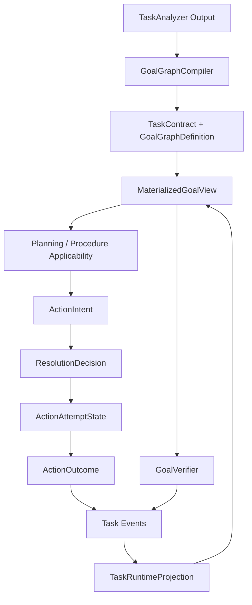

# 核心运行时模型内聚性重构

## 落地结果（2026-07-15）

本设计已直接落地到当前代码，不提供旧模型兼容层。本文后续“问题”章节保留为重构前基线，目标模型与强制不变量作为后续演进约束。

已完成的核心边界如下：

- Task/Goal：删除 `TaskSpec`、`ExecutionLedger` 与 `ExecutionLedgerItem`，由不可变 `TaskContract + GoalGraphDefinition` 拥有静态定义，`TaskRuntimeProjection` 只拥有运行状态，统一通过 `MaterializedGoalView` 组合读取；Task 级资源改为 `shared_resources`，不再使用 `goal_id=""` 通配符。
- Planning：拆分 `PlanningLimits / PlanningUsage` 与 `PlanDefinition / PlanRuntimeProjection / PlanEvent`；checkpoint 不再把 plan event log 嵌入运行投影，projector 显式接收 definition。
- Context：删除 `ContextEnvelope` 的多分类集合，使用单一 `ContextInventory.items` 与带 `RuntimeSnapshotRef` 的 `ContextProjection`；模型上下文只在调用边界临时物化，不写入 checkpoint。
- Resource/Capability：`ResourceRequirement`、`CapabilityRequirement`、`Capability` 组合统一的 `ResourceSelector`、`OperationScope`、`ProviderConstraint`，Resolver 与 Validator 共享 canonical matcher。
- Capability resolution：拆分 immutable request、run projection、decision 与外部 event；decision 不再嵌入 request 或 lifecycle event log。
- Invocation：删除 `ExecutionStep / StepRunState` 镜像，以 `ExecutableInvocation + InvocationAttemptState` 作为唯一 checkpoint 表达；procedure node 使用嵌套的 `ProcedureNodeInvocation`。
- Procedure：拆分 `ProcedureDefinition / ProcedureInvocation / ProcedureRunProjection / ProcedureEvent / ProcedureOutcome`；projection 不再复制调用 input、task id 或 goal id，definition 与 invocation 通过不可变 `ProcedureRef` 关联。
- Run checkpoint：`AgentGraphState` 已删除并更名为 `RunCheckpoint`；`answer_completed`、`execution_trace`、selected plan step、single current action、single resolved action 与 procedure id/version 均为只读派生值，不再持久化双份；confirmation 与 control route 已类型化。
- Research：拆分 subscription spec/cursor、run definition/projection、decision intent/outcome、canonical event/assessment、limits/usage；静态 definition、decision intent 与 canonical event 均不可变。
- A2A：拆分 child run definition、projection、artifact index、event、record 与 outcome，消除 run/result 对 artifacts 和 events 的重复保存。
- 公共契约：Research 与 Review 共用唯一 `DeliveryTarget`；interaction、resource 等小型值对象按语义边界独立放置，不建立无边界 `common.py`。
- 防回退：`tests/test_runtime_model_cohesion.py` 对旧类型名、definition/runtime 镜像、资源维度重复字段与 procedure projection 重复字段做静态约束；checkpoint 导出协议统一为 `invocation_batch_v2`。

验证结果：全量 `pytest` 共 837 个测试通过。

## 定位

本文审查当前核心运行时及相邻领域 Model 的内聚性，目标是消除同一事实的多处保存、静态定义与动态状态混装、依赖空字符串或裸 ID 的隐式关联，以及事件源与派生投影同时可写的问题。

本文定义本轮运行时模型重构的目标状态与验收边界，不提供兼容层、旧字段保留、双写、数据迁移或灰度方案。2026-07-15 起，文中的核心命名与不变量已作为当前实现基线；当前事实由本文、核心 contracts 以及 `tests/test_runtime_model_cohesion.py` 共同约束。

### 已落地基线

- Task/Goal 已拆为 `TaskContract + GoalGraphDefinition` 与 `TaskRuntimeProjection + GoalRuntimeState`，统一由 `MaterializedGoalView` 组合读取；
- Task 全局资源改为 `shared_resources`，Goal 资源由嵌套 ownership 表达，不再使用空 `goal_id`；
- Planning、Research 的 limits 与 usage 已拆分，Plan projection 不再内嵌 event log；
- Context 使用单一 `ContextInventory.items`，Skill activation 只属于 Task runtime；
- capability resolution 已拆为 request、decision、run projection 与 event，Resolver/Validator 共用 canonical resource matcher；
- `ExecutionStep / StepRunState` 镜像已删除，checkpoint 使用 `ExecutableInvocation + InvocationAttemptState`；
- child-agent event/status/projection/outcome 使用独立类型空间，outcome 不再重复 artifacts；
- 旧 runtime Model 名称由静态回归测试禁止重新引入。

## 结论

当前最明显的问题不是 Model 数量多，而是部分 Model 没有稳定地区分以下四类角色：

```text
Definition / Contract   不可变定义与授权边界
Command / Proposal      一次有界变更请求
Event                   已接受的事实变化
Runtime Projection      从事件投影出的当前状态
```

由此形成六类重复：

1. 同一个 Goal 的静态定义分散在 `TaskSpec`、`ResourceRequirement`、`SuccessCriterion` 与 `ExecutionLedgerItem`；
2. `AgentGraphState` 同时保存源事实、派生视图、当前单值与集合镜像；
3. `ExecutionStep` 与 `StepRunState` 字段级镜像，并在同一对象中混合 step 定义和 attempt 状态；
4. `PlanningBudget`、`ResearchState` 等同时保存限制配置和消耗计数；
5. `PlanLedger`、`CapabilityResolution` 等同时保存事件日志和可由事件推导的状态；
6. 多个领域重复定义相同概念，或使用 `dict[str, Any]`、空字符串 ID 绕过明确的 aggregate 边界。

目标不是把所有内容合并成一个大 Model，而是让每个事实只有一个权威所有者，并通过显式投影组合读取视图。

## 审查准则

一个 Model 满足以下任一条件时，视为需要重构：

- 同时包含不可变定义和高频可变状态；
- 同一字段必须在两个 Model 中同步写入；
- 保存可从同一对象其他字段确定性推导的集合、计数或摘要；
- 依靠 `""` 表示全局、缺省、未知或未绑定；
- 依靠 `dict[str, Any]` 传递会影响授权、状态转换或完成判断的数据；
- 同时保存 event log、event cursor 和 event-derived projection；
- 为 checkpoint、API 或 provider 再复制一套业务 Model，并允许双向转换；
- 同名概念在不同模块具有不同身份语义或状态枚举。

合理的只读快照不属于问题，但必须满足：快照不可反向写入、携带来源 revision/cursor，并且不能与源状态同时成为决策依据。

## 当前问题清单

### P0：Task、Goal 与 ExecutionLedger 边界不完整

当前 `TaskSpec` 保存 task-level 字段，同时平铺保存所有 Goal 的 `ResourceRequirement` 和 `SuccessCriterion`；`ExecutionLedgerItem` 又保存 `goal_id`、description、result contract、dependency、criterion ids、output contract 及动态状态。一个完整 Goal 需要跨两个 aggregate 重新拼装。

```text
TaskSpec
  resource_requirements[goal_id]
  success_criteria[criterion_id]
  subjects[]

ExecutionLedgerItem
  goal_id
  description
  result_contract
  dependencies[]
  success_criterion_ids[]
  output_contract
  status / attempts / verification
```

直接后果包括：

- Procedure、Planner 和 Executive 各自实现 Goal 到资源的关联；
- `ResourceRequirement.goal_id=""` 被解释为 Task 全局资源，但正式编译路径没有生产者；
- ResourceRequirement 到 Goal 没有统一引用完整性校验；
- Procedure 与 AdaptivePlanner 使用 `goal_id in {"", current_goal_id}`，Executive 却在没有精确资源时回退整个 Task 的资源；
- `ExecutionLedger.active_goal_ids` 可由 item status 推导，却作为可写字段保存；
- `TaskSpec.lifecycle` 将运行状态放入名为 Spec 的契约对象。

相关实现：

- [`TaskSpec` 与 `ExecutionLedgerItem`](../../src/personal_agent/kernel/contracts/agentic.py)
- [`GoalGraphCompiler`](../../src/personal_agent/planning/goal_graph.py)
- [`ProcedureApplicabilityResolver`](../../src/personal_agent/planning/procedures.py)
- [`ExecutiveController._resources_for_goal`](../../src/personal_agent/planning/executive.py)

### P0：AgentGraphState 存在多组双写事实

`AgentGraphState` 是 checkpoint root，但当前同时承担 aggregate store、临时工作区、模型输入缓存、API read model 和 UI trace。下列字段存在明确重复：

| 重复字段 | 当前写法 | 风险 |
| --- | --- | --- |
| 当前 Action | `current_action` + `current_actions` | 每次 materialize 必须同时赋值 |
| 已解析 Action | `resolved_action_spec` + `resolved_action_specs` | 单值始终复制集合第一项 |
| Frontier 选择 | `frontier_decision.selected_step_ids` + `selected_plan_step_ids` | 选择变化需要双写 |
| Procedure 身份 | `procedure_id` + `procedure_version` + `active_procedure` | 身份可从 instance 推导 |
| 执行轨迹 | `events` + `execution_trace` | trace 已由 event 确定性生成 |
| 模型上下文 | `ContextProjection` + `planning_model_context/control_model_context` | materialized payload 被再次持久化 |
| 完成状态 | `TaskSpec.lifecycle` + `completion_report` + `answer_completed` | 多个字段共同决定 run status |
| Skill 激活 | `ExecutionLedger.active_skill_ids` + `ContextEnvelope.active_skill_ids` | ownership 不唯一 |

这些不是只读快照，因为节点会直接更新它们，后续节点也会从不同副本读取。当前只有生产 profile frontier width 为 1，单值/列表双轨仍然存在，增加并行能力后风险会进一步放大。

相关实现：

- [`AgentGraphState`](../../src/personal_agent/orchestration/orchestration_models.py)
- [`_executive` 节点写入逻辑](../../src/personal_agent/orchestration/orchestration_nodes/_executive.py)

### P0：ExecutionStep 与 StepRunState 是可漂移镜像

`ExecutionStep` 同时包含：

- step definition：description、dependency、output contract、risk、capability requirement；
- execution binding：tool name、agent id、procedure id/version/node id；
- mutable attempt state：status、retry count；
- projection payload：raw capability dict、subtask dict、conditional edge dict。

`StepRunState` 再镜像绝大部分字段用于 checkpoint，并通过手写 `from_execution_step` / `to_execution_step` 双向转换。新增字段时两边不会由类型系统强制同步，且两者已经拥有不对称字段。

更严重的是，`ProcedureNodeSpec.to_execution_step()` 将 `goal_id` 写入名为 `task_id` 的字段，step executor 随后又使用 `step.task_id` 与 `ResolvedActionSpec.goal_id` 比对。这说明扁平 step Model 已经失去稳定的身份语义。

相关实现：

- [`ExecutionStep`](../../src/personal_agent/kernel/contracts/execution.py)
- [`StepRunState`](../../src/personal_agent/orchestration/orchestration_models.py)
- [`ProcedureNodeSpec.to_execution_step`](../../src/personal_agent/kernel/contracts/procedure.py)
- [`_steps` action spec 关联](../../src/personal_agent/orchestration/orchestration_nodes/_steps.py)

### P1：PlanningBudget 混合限制与用量

`PlanningBudget` 同时保存：

```text
限制：max_planner_calls / max_semantic_monitor_calls / max_horizon_replacements
用量：planner_calls / semantic_monitor_calls / horizon_replacements
```

`PlannerExecutionProfile` 把完整 `PlanningBudget` 当作 profile 配置，`AgentGraphState` 又复制一份作为运行时可变预算。静态 profile 因而携带没有业务意义的零值 usage，运行代码通过 `model_copy` 同时维护限制和消耗。

相关实现：[`PlanningBudget` 与 `PlannerExecutionProfile`](../../src/personal_agent/kernel/contracts/planning.py)。

### P1：PlanLedger 同时保存事件源和投影

`PlanLedger` 同时保存：

```text
plan                 当前 Plan definition
events[]             完整 PlanEvent
step_statuses{}      从 events 推导的状态
last_event_sequence  从 events 推导的 cursor
seen_replan_signatures
```

这与 ExecutionLedger 的做法不一致：ExecutionLedger 保存 projection，ExecutionEvent 另存于 `AgentGraphState.execution_events`。两种 Ledger 对“事件是否属于状态对象”的答案不同。

如果 event 是事实源，projection 不应允许独立构造；如果 projection 是 checkpoint 状态，完整 event log 不应再嵌入其中。当前结构允许产生 `events` 与 `step_statuses` 不一致的 PlanLedger。

相关实现：[`PlanLedger`](../../src/personal_agent/kernel/contracts/planning.py) 与 [`PlanLedgerProjector`](../../src/personal_agent/planning/adaptive.py)。

### P1：Procedure 的 definition、invocation 与 projection 被再次扁平化

Procedure 核心类型本身已有较清晰的 `ProcedureSpec -> ProcedureCall -> ProcedureInstance -> ProcedureEvent -> ProcedureOutcome`，但进入通用 `ExecutionStep` 后再次复制 procedure id、version、node id、recovery policy、branch policy、conditional edges 和 capability requirement。

`AgentGraphState` 又同时保存 `procedure_id`、`procedure_version`、`active_procedure`。因此同一 Procedure 身份至少出现于：

```text
ProcedureCall
ProcedureInstance
BoundedAction.payload
ExecutionStep
StepRunState
AgentGraphState top-level fields
```

Procedure node 应由专用 executor 消费 typed node invocation，不应降级成携带大量 procedure 字段的通用 step。

### P1：ContextEnvelope 重复表达分类和 ownership

`ContextEnvelope` 使用五个 tuple 表示分类：

```text
run_context
working_memory
trusted_memory
evidence_context
untrusted_observations
```

`ContextItem` 自身又有 `kind`、`provenance`、`trust_tier`、`admitted`。同一个 item 的 tuple 位置与 item 字段可以冲突，当前 Model 没有保证：

```text
trusted_memory 中的 item 必须是 trusted
untrusted_observations 中的 item 必须是 untrusted
```

`active_skill_ids` 也不属于 Context inventory，却同时存在于 ContextEnvelope 和 ExecutionLedger。Context 应只拥有 content inventory 与 selection projection，skill activation 应属于 Task runtime。

相关实现：[`ContextItem`、`ContextEnvelope` 与 `ContextProjection`](../../src/personal_agent/kernel/contracts/agentic.py)。

### P1：ResourceRequirement、CapabilityRequirement 与 Capability 缺少共享值对象

三个 Model 重复声明：

```text
semantic domain(s)
resource type(s)
operation(s)
locator
freshness
provider preference / binding
side effect
```

它们分别代表 task resource contract、action capability need 和 provider descriptor，阶段语义不同，不能直接合并为一个 Model；但共同的匹配维度应由同一个 typed value object 表达。当前每次转换都手工复制字段，字段名还存在单复数和 locator 命名差异。

这已经导致多个独立 `_matches_requirement` 实现，以及 Planner、Executive、Goal decomposition 各自构造 CapabilityRequirement。

相关实现：

- [`ResourceRequirement`](../../src/personal_agent/kernel/contracts/agentic.py)
- [`CapabilityRequirement` 与 `Capability`](../../src/personal_agent/kernel/contracts/capability.py)
- [`CapabilityResolver`](../../src/personal_agent/planning/capability_resolver.py)
- [`ResolutionValidator`](../../src/personal_agent/planning/capability_validation.py)

### P1：CapabilityResolution 混合请求、事件日志和结果状态

`CapabilityResolution` 内嵌完整 request，同时保存 `lifecycle_state`、`lifecycle_events`、selected/denied capability、coverage、constraints 和 escalation。`lifecycle_state` 可以由 lifecycle events 推导，resolution result 与 resolution process 又没有明确边界。

目标态应区分不可变 `ResolutionRequest`、事件投影 `ResolutionRunState` 和最终 `ResolutionDecision`，防止执行后继续修改已经用于审计的 selection。

### P2：Research 领域存在相同的 Spec/State 重复

`ResearchSubscription` 同时保存 subscription 配置与可变 `last_window_end`；`ResearchState` 同时保存 run 输入、policy、budget、query plan、动态计数、decision history、timing、cache 和 satisfaction；`ResearchRun` 又重复 topic、instructions、window、policy、query plan、budget，并内嵌完整 ResearchState。

此外：

- `ResearchDecision` 同时表示决策意图、执行状态、结果数量和 timing；
- `ResearchEvent` 同时表示 canonical event、sources、评分、personal relevance 和 verification status；
- `ResearchBudget` 是纯 limits，但 usage 散落在 ResearchState 的多个 count 字段。

相关实现：[`research.py`](../../src/personal_agent/kernel/contracts/research.py)。

### P2：A2A Agent 与公共事件类型存在概念重复

`agent.py` 中的 `AgentRun` 同时嵌入 task、context、status、result、artifacts 和 events；`AgentRunResult` 又重复 artifacts。与此同时，代码库存在两个不同语义但同名的 `AgentEvent`：一个表示 A2A child run event，另一个表示 orchestration run event。`AgentRunStatus` 也同时以 Literal 和 Enum 存在。

这些类型应分别命名为 `ChildAgentRunEvent` 与 `OrchestrationEvent`，并将 child run definition、run projection、artifact index 和 event log 分离。

相关实现：

- [`agent.py`](../../src/personal_agent/kernel/contracts/agent.py)
- [`events.py`](../../src/personal_agent/kernel/contracts/events.py)
- [`AgentRunSnapshot`](../../src/personal_agent/orchestration/orchestration_models.py)

### P2：跨领域公共值对象重复

Research 与 Review 分别定义 `DeliveryTarget`，字段基本相同；多处 status、budget、artifact ref、provider ref 也使用独立字符串。此类重复应收敛到小型 value object，但不能建立一个无边界的 `common.py`。公共类型只在语义和不变量完全一致时复用。

## 目标模型

### 1. TaskContract 拥有完整 GoalGraphDefinition

```python
class TaskContract(BaseModel):
    task_id: TaskId
    revision: TaskRevision
    user_goal: str
    result_contract: TaskResultContract
    constraints: TaskConstraints
    shared_resources: tuple[ResourceRequirement, ...]
    goal_graph: GoalGraphDefinition


class GoalGraphDefinition(BaseModel):
    revision: GoalGraphRevision
    goals: dict[GoalId, GoalDefinition]


class GoalDefinition(BaseModel):
    goal_id: GoalId
    parent_goal_id: GoalId | None
    description: str
    result_contract: GoalResultContract
    output_contract: ArtifactContract
    dependencies: tuple[GoalDependency, ...]
    resources: tuple[ResourceRequirement, ...]
    criteria: tuple[SuccessCriterion, ...]
    origin: SemanticOrigin
    decomposition_depth: int
```

规则：

- Goal 的 description、resource、criterion、dependency 只存在于 GoalDefinition；
- `TaskContract.shared_resources` 显式表达 Task scope，不使用 `goal_id=""`；
- ResourceRequirement 不再携带 goal_id，因为 ownership 由嵌套位置确定；
- Task lifecycle 从 Contract 移出；
- Task requested operations、evidence summary 等聚合字段改为只读 property 或独立 projection，不持久化双份。

### 2. TaskRuntimeProjection 只保存动态状态

```python
class TaskRuntimeProjection(BaseModel):
    task_id: TaskId
    task_revision: TaskRevision
    lifecycle: TaskLifecycle
    goal_states: dict[GoalId, GoalRuntimeState]
    active_skill_ids: frozenset[SkillId]
    last_event_sequence: int


class GoalRuntimeState(BaseModel):
    status: GoalStatus
    attempts: tuple[AttemptRef, ...]
    evidence_gaps: tuple[VerificationGapRef, ...]
    coverage: tuple[CapabilityCoverage, ...]
    verification: VerificationReport | None
    replan_reason: str | None
```

`active_goal_ids`、verified goals、ready goals 均由 GoalGraphDefinition + GoalRuntimeState 确定性计算，不作为可写字段。

为消费者提供单一物化入口：

```python
class MaterializedGoalView(BaseModel):
    definition: GoalDefinition
    runtime: GoalRuntimeState
```

Procedure、Planner、Executive 和 Verifier 只消费 MaterializedGoalView，不再自行 join TaskSpec 与 Ledger。

### 3. 统一 Scope 与 Identity 类型

所有 identity 必须是非空强类型，禁止 `str = ""`：

```python
TaskId
GoalId
PlanId
PlanStepId
ActionId
AttemptId
ProcedureRunId
ArtifactId
ObservationId
```

跨 aggregate 引用使用 typed ref：

```python
class GoalRef(BaseModel):
    task_id: TaskId
    task_revision: TaskRevision
    goal_id: GoalId
    goal_graph_revision: GoalGraphRevision
```

资源 scope 使用显式 union，不使用空字符串通配符：

```python
ResourceScope = TaskResourceScope | GoalResourceScope | ActionResourceScope
```

### 4. PlanningLimits 与 PlanningUsage 分离

```python
class PlanningLimits(BaseModel):
    max_mode_assessor_calls: int
    max_planner_calls: int
    max_semantic_monitor_calls: int
    max_semantic_verifier_calls: int
    max_plan_patches_per_horizon: int
    max_horizon_replacements: int


class PlanningUsage(BaseModel):
    mode_assessor_calls: int = 0
    planner_calls: int = 0
    semantic_monitor_calls: int = 0
    semantic_verifier_calls: int = 0
    applied_patches: int = 0
    horizon_replacements: int = 0
```

PlannerExecutionProfile 只拥有 limits；TaskRuntime 的 planning substate 只拥有 usage 和 profile ref。剩余额度通过 `limits - usage` 计算。

### 5. PlanDefinition、PlanRuntimeProjection 与 PlanEventLog 分离

```text
PlanDefinition
  immutable steps / dependencies / strategy

PlanRuntimeProjection
  current_plan_ref
  step_states
  seen_replan_signatures
  last_event_sequence

PlanEvent
  external append-only event stream
```

checkpoint 保存 projection 和 cursor，不嵌入完整 events。Replay repository 保存 events，不允许绕过 projector 直接构造 step status。

### 6. Action pipeline 使用分阶段 typed Model

```text
ActionIntent
  goal_ref / objective / capability need / proposed access

ResolvedAction
  intent_ref / selected capability / resolved access / budget reservation

ActionAttemptState
  status / retry / timestamps / provider calls

ActionOutcome
  artifacts / observation / error classification
```

删除 `current_action` 与 `current_actions` 双轨，使用：

```python
class ActionBatchState(BaseModel):
    intents: dict[ActionId, ActionIntent]
    resolutions: dict[ActionId, ResolvedAction]
    attempts: dict[AttemptId, ActionAttemptState]
    active_action_ids: tuple[ActionId, ...]
```

即使 frontier width 为 1，也只使用集合模型；单个 Action 通过明确 helper 获取，不持久化第二份字段。

### 7. 删除 ExecutionStep / StepRunState 镜像

通用执行器只接收 typed invocation union：

```python
ExecutableInvocation = (
    ToolInvocation
    | ReactInvocation
    | AgentInvocation
    | ProcedureNodeInvocation
    | DeterministicHandlerInvocation
)
```

运行状态统一为 `InvocationAttemptState`，不复制 definition 字段。Procedure node 保留 `task_ref` 与 `goal_ref`，不得将 goal id 写入 task id 字段。Checkpoint 直接保存 canonical invocation 与 attempt state，不再双向转换。

### 8. Procedure 保持独立 aggregate

```text
ProcedureDefinition
ProcedureInvocation
ProcedureRunProjection
ProcedureEvent
ProcedureOutcome
```

ProcedureRunProjection 只保存 event-derived state；Procedure identity 只存在于 invocation/ref 和 run projection。Agent checkpoint 保存 `active_procedure_run_ids`，不再保存 procedure id/version 镜像。ProcedureNodeInvocation 直接引用 node definition，不展开 recovery、branch 和 conditional edge 字段到通用 step。

### 9. Context 使用单一 inventory 与 purpose projection

```python
class ContextInventory(BaseModel):
    items: dict[ContextItemId, ContextItem]


class ContextItem(BaseModel):
    item_id: ContextItemId
    category: ContextCategory
    provenance: Provenance
    trust: TrustClassification
    admission: AdmissionState
    artifact_ref: ArtifactRef | None


class ContextProjection(BaseModel):
    source_snapshot: RuntimeSnapshotRef
    purpose: ContextPurpose
    selected_item_ids: tuple[ContextItemId, ...]
    omitted: tuple[ProjectionExclusion, ...]
```

不再通过 tuple 位置重复表达 trust/category。Model payload 是 ContextProjectionMaterializer 的临时返回值，不进入 checkpoint。Skill activation 只属于 TaskRuntimeProjection。

### 10. ResourceSelector 统一匹配维度

```python
class ResourceSelector(BaseModel):
    semantic_domains: frozenset[SemanticDomain]
    resource_types: frozenset[ResourceType]
    locator: ResourceLocator | None


class OperationScope(BaseModel):
    operations: frozenset[CapabilityOperation]
    side_effect_class: SideEffectClass


class ProviderConstraint(BaseModel):
    required: frozenset[ProviderId]
    preferred: tuple[ProviderId, ...]
    freshness: FreshnessRequirement
    minimum_trust: CapabilityTrustLevel
```

ResourceRequirement、CapabilityRequirement 和 CapabilityDescriptor 组合这些 value object，但仍保留各自阶段语义。匹配逻辑只保留一个 canonical matcher，Resolver 和 Validator 共享结果类型。

### 11. Capability Resolution 分离 request、projection 与 decision

```text
CapabilityResolutionRequest   immutable input
ResolutionRunProjection       lifecycle / cursor / failure
CapabilityResolutionDecision  selected / denied / coverage / rationale
ResolutionEvent               external append-only facts
```

执行只能消费已经 validated 且 policy-clamped 的 immutable decision。Audit 通过 resolution id 关联 request、decision 和 events。

### 12. AgentGraphState 降级为组合 checkpoint root

目标 checkpoint root 只组合明确 ownership 的 substate：

```python
class RunCheckpoint(BaseModel):
    identity: RunIdentity
    entry: EntryState
    task: TaskRuntimeProjection
    planning: PlanningRuntimeState
    control: ControlRuntimeState
    actions: ActionBatchState
    procedures: ProcedureRuntimeState
    interaction: InteractionState
    presentation: PresentationRefs
    cursors: RuntimeCursors
```

约束：

- 每个 substate 只有一个 owner node group；
- 派生 facts、ControlState、model payload、run snapshot 和 execution trace 不进入 checkpoint；
- UI/API read model 从 checkpoint + event/artifact repository 投影；
- `answer_completed` 改为 Task lifecycle 的只读派生；
- pending confirmation 使用 typed `InteractionRequest`，不使用 dict；
- current route 使用图边或 typed control phase，不使用自由字符串。

### 13. Research 与 A2A 采用同一分层规则

Research：

```text
ResearchSubscriptionSpec + SubscriptionCursor
ResearchRunDefinition + ResearchRunProjection
ResearchDecisionIntent + ResearchDecisionOutcome
CanonicalResearchEvent + EventAssessment + PersonalRelevanceAssessment
ResearchLimits + ResearchUsage
```

A2A：

```text
ChildAgentRunDefinition
ChildAgentRunProjection
ChildAgentRunEvent
ChildAgentArtifactIndex
ChildAgentRunOutcome
```

`AgentRunResult` 不重复 artifacts；orchestration event 与 child agent event 使用不同名称和类型空间。

## 目标依赖方向



禁止反向依赖：

- TaskContract 不引用 runtime state；
- event 不嵌入 mutable projection；
- projection 不反向修改 definition；
- API/UI model 不进入 control decision；
- provider payload 不成为 canonical business contract。

## 删除项

目标态直接删除以下机制，不保留兼容别名：

- `ResourceRequirement.goal_id=""` Task-global sentinel；
- `TaskSpec.subjects`、task-level flat goal resources/criteria；
- `ExecutionLedgerItem` 中的静态 GoalDefinition 字段；
- 可写 `active_goal_ids`；
- `current_action` / `current_actions` 双轨；
- `resolved_action_spec` / `resolved_action_specs` 双轨；
- `selected_plan_step_ids` 镜像；
- top-level `procedure_id` / `procedure_version` 镜像；
- checkpoint 中的 materialized model payload；
- `ExecutionStep` 与 `StepRunState`；
- `PlanningBudget` 混合 Model；
- `PlanLedger.events` 内嵌日志；
- `ContextEnvelope` 分类 tuple；
- 裸 `dict[str, Any]` 的 confirmation、subtask、capability requirement 和 control payload；
- 两个同名 `AgentEvent` 及重复 AgentRunStatus；
- 重复的 DeliveryTarget。

## 强制不变量

1. 每个可变事实只有一个 owner 和一个写入口；
2. 所有 identity 非空且类型化，禁止使用空字符串表达 scope；
3. Definition 创建后不可原地修改，只能创建带 revision 的新 definition；
4. Runtime state 只能由 typed event projector 更新；
5. Projection 必须携带 source revision/cursor，过期 projection 不得参与决策；
6. Derived collection 和 summary 不作为可写 checkpoint 字段；
7. 跨 aggregate 引用必须同时包含 identity 与必要 revision；
8. Authorization、mutation、approval、completion 路径禁止 raw dict；
9. Provider/model 输出永远不能直接构造 trusted definition 或 runtime event；
10. 同一 canonical matcher 负责 resource/capability applicability，Validator 不复制匹配规则。

## 验收标准

### 静态契约

- core contracts 中不存在 identity `str = ""`；
- 不存在业务 Model 的字段级镜像转换；
- 不存在同时含 `max_*` 与对应 usage counter 的 Budget；
- 不存在同名不同语义的 Event、RunStatus、DeliveryTarget；
- control、approval、procedure、capability requirement 不使用 `dict[str, Any]`。

### 运行一致性

- 任一 Goal 的 definition 和 runtime 可通过一个 `MaterializedGoalView` 获取；
- Resource/criterion/dependency 不需要跨 flat list 扫描；
- terminal Goal 不可能获得新的 ActionIntent 或 ProcedureInvocation；
- Task、Plan、Procedure、Resolution 的状态都能仅由 definition + events 重建；
- checkpoint 删除任意派生缓存后，运行语义不变；
- CompletionVerifier 只读取 TaskContract、TaskRuntimeProjection 与 typed VerificationReport。

### 测试

- 对所有 projector 做 event sequence property test 与非法转换测试；
- 对 definition/runtime ref 做引用完整性和 revision stale 测试；
- 对 resource matcher 做单一 conformance suite，Resolver 与 Validator 共用；
- 对 checkpoint 做 round-trip 测试，不经过镜像 Model 转换；
- 增加静态检查，禁止新增空字符串 identity、raw control dict 和 singular/plural 双轨字段；
- 增加随机 event replay，验证 projection 与直接执行结果一致。

## 最终边界

目标态不再使用“一个大状态对象里保存所有方便读取的字段”作为 checkpoint 策略，也不通过更多 validator 维持重复字段的一致。核心原则是：

```text
Definition 只定义
Event 只记事实
Projection 只表达当前状态
View 只组合读取
Command 只请求有界变化
```

Goal 是 TaskContract 中的完整定义实体，GoalRuntimeState 是事件投影；二者通过 typed GoalRef 组合成唯一 MaterializedGoalView。其他 Task、Plan、Action、Procedure、Capability、Context、Research 和 A2A Model 采用同一分层，不再允许静态定义、动态状态、事件日志和 API 展示字段在一个 Model 中互相复制。
