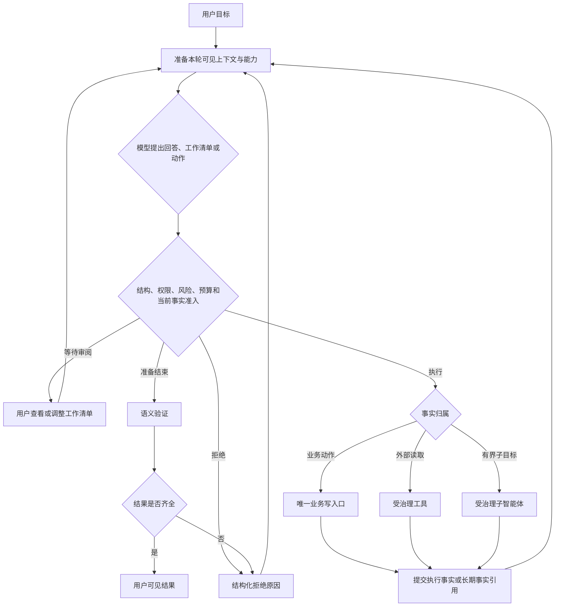

# 项目故事：可信的个人知识智能体

> **personalAgent 处理的不只是检索问答，而是让对话、个人知识、外部执行、周期研究和动态长任务共享一套可信边界。** 核心价值不是对象多，而是语义决策、权限、业务事实、执行事实和完成判断各有明确归属。

## 1. 为什么普通检索增强生成不够

**普通检索增强生成主要回答“找到什么文本、生成什么答案”；可信智能体还必须回答“谁能决定、谁能执行、什么已经发生、什么时候才算完成”。**

| 问题 | 设计结论 |
| --- | --- |
| 模型可以决定什么 | 用户目标、下一步动作、工具或子智能体选择，以及候选答案 |
| 确定性代码必须决定什么 | 数据结构、权限范围、合法状态迁移、幂等和预算 |
| 什么是业务事实 | 具体业务通过唯一写入口提交的事实 |
| 什么算完成 | 动作执行、语义验证和完成判断分开处理 |

因此，系统不是“提示词加向量库再加工具循环”，而是一个由新执行事实驱动、受确定性边界治理的智能体运行闭环，再加上各自拥有长期事实的具体业务。

## 2. 一条责任链讲清架构

**主干是智能体运行外壳：模型提出语义建议，确定性边界治理执行，业务责任主体提交事实，模型再依据新事实继续，最后由验证和完成门禁决定是否交付。**

运行外壳不拥有知识、订阅或后台项目；工具和子智能体也不拥有业务目标。这样既能复用建议、准入、执行和追踪协议，又不会制造通用任务系统或第二个事实源。完整闭环见[智能体运行外壳](03-capability-axes.md#1-运行外壳把模型建议变成可靠的用户结果)。

### 2.1 三种协调机制为什么不能合并

**当前对话、固定业务流程和后台项目解决不同生命周期问题，不能因为都含“步骤”就统一成一套通用计划或任务系统。**

| 协调方式 | 解决的问题 | 拥有的事实 | 主讲位置 |
| --- | --- | --- | --- |
| 当前对话的工作清单 | 短期复杂任务跨预算、上下文、进程或用户调整后继续交付 | 可验收工作项及其状态 | [工作清单能力](03-capability-axes.md#2-按需工作清单提升复杂任务的跨轮完成能力) |
| 固定业务流程 | 保存、删除、投递等稳定事务顺序 | 对应业务的冻结动作、状态迁移和回执 | [请求路径](02-request-walkthroughs.md#3-受治理事务保存删除与恢复) |
| 动态后台调查 | 离开当前请求后持续运行，并根据新事实调整路径 | 项目目标、规划、预算、证据和完成状态 | [领域设计](05-knowledge-and-domain-workflows.md#8-动态后台调查由新证据决定后续路径) |

前台工作清单不驱动队列或租约；后台调查规划不拥有对话审阅状态；固定流程也不需要模型动态重排。它们可以共享运行日志、执行网关和预算机制，但不能共享业务事实写入口。

## 3. 入口与生命周期不是同一维度

**自然语言对话、产品接口和后台工作进程可以进入同一个业务能力，但不能各自保存一份业务事实。**

| 请求入口 | 生命周期责任主体 | 典型结果 |
| --- | --- | --- |
| 对话接口 | 当前交互 | 最终结果、执行事实、后台项目引用 |
| 产品接口或界面 | 具体业务 | 冻结动作、长期知识、订阅或项目投影 |
| 定时器或工作进程 | 周期研究或后台调查 | 摘要、投递事实、项目进度和最终报告 |

例如，对话发起删除与直接知识接口最终都进入同一个知识写入口；对话创建后台调查后只保存受权限范围约束的项目引用，不复制项目规划。

## 4. 五个关键取舍

1. **工作清单按协调收益准入。** 用户明示或任务确实会跨真实边界时才保存；简单多动作请求不机械建清单。
2. **工具结构不等于授权。** 模型可见、当前获准和服务健康是三个不同事实。
3. **有证据的回答不会自动写入长期知识。** 回答可能包含推断；保存必须显式、可追溯并进入唯一写入口。
4. **恢复从已提交事实继续。** 已发生动作直接复用，结果不明的外部请求先查询对账，模型只处理尚未交付的结果。
5. **不为形式完整造对象。** 冻结动作、回执、动态规划、长期项目和投影都必须有生产消费者和对应证据。

这些取舍分别由[运行外壳与关键能力](03-capability-axes.md)、[智能体 Memory](04-memory-architecture.md)、[领域设计](05-knowledge-and-domain-workflows.md)和[证据与发布](06-evidence-and-release.md)完整展开，本篇只建立全局主线。

## 5. 两分钟介绍稿

> 我做的是一个可信的个人知识智能体。它覆盖自然对话、个人知识读写、外部 MCP/A2A 执行、周期研究和可恢复调查，而不只是把资料写进向量库再回答。
>
> 架构主线是决策权与事实归属：运行外壳把上下文组装、模型建议、确定性准入、动作执行、事实回注、语义验证和完成判断连成闭环；具体业务继续拥有长期事实。所以工具成功、子智能体结束或数据库新增记录，都不能直接代表用户目标完成。
>
> 当前对话在确有协调收益时保存可验收工作项，并在跨轮恢复时复用已经绑定的执行事实；保存、删除和订阅由具体业务状态机负责；只有需要跨请求持续运行和动态调整的调查才进入后台项目。知识侧把原始内容、证据位置和可维护陈述作为权威事实，向量和图只是检索投影；回答默认只读，写入必须显式且可追溯。
>
> 对效果我只陈述已执行证据：成对端到端测试可以证明具体边界修复了哪些用户错误，但不能把单个用例通过外推为所有模型和场景都可靠，更不能替代完整发布门禁。

## 6. 证据如何支撑故事

**每组证据只支撑一项能力判断，详细归档和发布资格统一由证据文档负责。**

| 能力判断 | 代表证据 | 直接证明 |
| --- | --- | --- |
| 个人证据可以进入同一答案且默认零写入 | `ASK-001A/B` | 仅个人证据、个人证据结合官方网页的回答 |
| 前台清单提供显式审阅、纠偏、跨轮恢复和完整交付 | `CONV-001`、`CONV-004`、`HARNESS-003` 的局部单变量证据；`PLAN-REPLAN-001` v4 baseline 与 v51 目标组 | 局部证据分别证明控制面、证据先于计划和冻结服务提供方下避免重复读取；v51 为 `15/15 delivered`，但不外推其他模型、任务分布和成本收益 |
| 后台项目引用与规划事实不由对话复制 | `PLAN-001` | 查询、调整和网页服务重启后仍指向同一项目 |
| 权限、上下文和预算失败可诊断 | `DUR-001`、`CTX-001`、`RUN-001` | 作用域恢复、有界重读和批次预算上限 |

准确分类见[证据与发布](06-evidence-and-release.md)。

## 7. 当前实现坐标

**类名只用于进入代码，不承担架构论证。** 一次模型语义建议、前台工作清单和后台调查规划当前分别落在 `AgentTurnDecision`、`ConversationWorkingPlan` 与 `AcceptedPlanVersion`；完整实现关系以[当前架构说明](../summary/core-architecture-current-state.md)为准。
