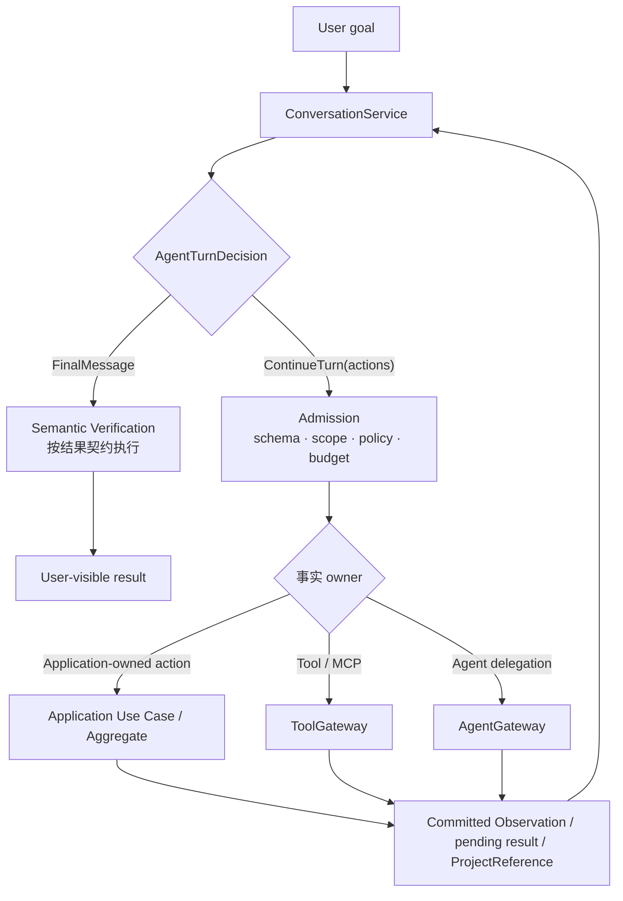

# 项目故事：可信的个人知识 Agent

> **personalAgent 处理的不只是检索问答，而是对话、个人知识、外部执行、周期研究和动态长任务如何共享一套可信边界。** 核心价值不是对象多，而是语义提议、权限、业务事实、执行事实和完成判断各有 owner。

## 1. 为什么普通 RAG 不够

**普通 RAG 主要回答“找到什么文本、生成什么答案”；可信 Agent 还必须划分语义、权力、事实和完成。**

| 问题 | 设计结论 |
| --- | --- |
| 模型可以决定什么 | Goal、下一步 action、Tool/Agent 选择和候选答案 |
| 代码必须决定什么 | schema、权限、scope、状态迁移、幂等与预算 |
| 什么是业务事实 | Application/Domain 经唯一写入口提交的事实 |
| 什么算完成 | Execution、Semantic Verification、Completion 分开判断 |

因此它不是“Prompt + Vector DB + Tool loop”，而是一个以 Observation 驱动、受治理执行的 Agent runtime，加上各自拥有长期事实的业务 Application。

## 2. 一条责任链讲清架构

**所有模型动作先经过 Admission，再交给真实 owner；任何执行结果都要回到 Observation，模型才能继续或结束。**

模型侧统一使用 callable schema，减少协议分支；执行侧仍按 owner 分流：保存、删除和 Project steering 进入对应 Application 写入口，普通只读 Tool/MCP 进入 ToolGateway，子任务进入 AgentGateway。**Application Capability 是业务所有权分类，不是绕过 Admission 的另一条模型控制流。**

## 3. 入口与生命周期不是同一维度

**Conversation、固定事务和 InvestigationProject 不是三个互斥入口。** Conversation 可以调用后两者，但不会接管它们的长期事实。

| 请求入口 | 生命周期 owner | 典型结果 |
| --- | --- | --- |
| Conversation API | Conversation Interaction | FinalMessage、Observation、ProjectReference |
| Product API/UI | 具体 Application / Aggregate | Command、Claim、Subscription、Project projection |
| Scheduler/Worker | ResearchRun / InvestigationProject | Digest、Delivery、Project progress/report |

多个入口必须汇入同一 Application 写入口。例如 Conversation 发起删除与直接 lifecycle API 最终都由 KnowledgeLifecycleService 迁移状态；Conversation 创建调查后只保存 scoped `ProjectReference`，Plan、进度和完成仍归 InvestigationProject。

## 4. 五个关键取舍

1. **不强制每次产生持久化 Plan。** Conversation 逐轮基于 Goal 和 Observation 决定下一步；固定步骤归 Use Case/Workflow；只有 InvestigationProject 的 ready set、steering、恢复和 Completion 真正消费 accepted Plan。
2. **Tool schema 不是授权。** 模型可见、当前获准、Provider 健康是三个事实。
3. **Grounded Ask 不自动写回。** 回答可能含推断；长期知识必须由显式保存和来源约束进入唯一写入口。
4. **恢复不重算已提交事实。** immutable Command、committed Observation、Receipt 和 stable submission key 要复用或 reconcile。
5. **不为形式完整造对象。** Command、Receipt、Planner、Workflow、Project 和投影都必须有生产消费者与可执行基线。

这些取舍的机制见[能力设计](03-capability-axes.md)，领域事实见[领域设计](04-knowledge-and-domain-workflows.md)，证据强度见[证据与发布](05-evidence-and-release.md)。

## 5. 两分钟介绍稿

> 我做的是一个可信个人知识 Agent。它覆盖自然对话、个人知识读写、外部 MCP/A2A、周期研究和可恢复调查，而不只是把资料写进向量库再回答。
>
> 架构主线是决策与事实所有权：模型提出目标和动作；Admission 与 Policy 校验 schema、scope、权限和预算；ToolGateway 或具体 Application 产生执行事实；Verifier 判断语义是否满足；Completion Gate 检查 required result 是否齐全。所以 Tool 成功、子 Agent completed 或数据库新增记录，都不能直接代表用户目标完成。
>
> 我没有用一个通用 Task 抹平所有生命周期。Conversation 按 Observation 逐轮运行；保存、删除、订阅由各自 Use Case 和状态机拥有；动态跨进程调查才进入 InvestigationProject。知识侧以 Artifact、Evidence、Claim 为权威事实，向量和图只是检索投影；回答默认只读，写入必须显式且可追溯。
>
> 对效果我只陈述已经执行的范围：paired E2E 可以证明具体边界修复了哪些用户错误，但没有同输入的外部框架 A/B，也不能把定向用例通过说成当前 revision 可发布。发布资格由机器 catalog 和 release gate 单独派生。

## 6. 证据如何支撑故事

**项目故事由产品问答、跨轮 Project 和运行边界三类证据支撑，但每类只能证明自己的范围：**

- `ASK-001A`、`ASK-001B`：Conversation 分别完成 personal-only 与 personal + official web grounded answer，并保持零知识写入；
- `PLAN-001`：同一 Conversation 读取、steer 并在 Web 重启后恢复同一 InvestigationProject，不复制 Plan 或创建第二个 Project；
- `DUR-001`、`CTX-001`、`RUN-001` 等：分别约束 scope 恢复、有界 Context 和 batch budget，但每条证据只支持自己的边界。

准确用例分类、archive 与发布结论统一见[证据与发布](05-evidence-and-release.md)。
