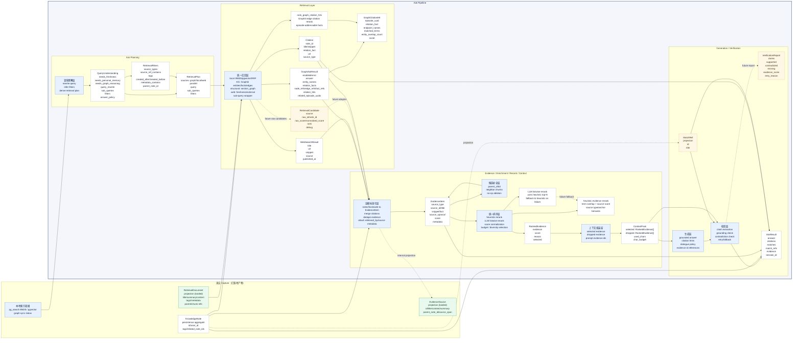

# Ask 依赖图

```mermaid
flowchart LR
    classDef layer fill:#e8f1ff,stroke:#4f7ccf,stroke-width:1px,color:#10233f
    classDef model fill:#ffffff,stroke:#9aa4b2,stroke-width:1px,color:#172033
    classDef projection fill:#e9f9ee,stroke:#2e9e5b,stroke-width:1px,color:#0c3b22
    classDef future fill:#fff7e6,stroke:#d08b00,stroke-dasharray: 5 3,color:#3b2a00
    classDef pipeline fill:#f4f6fb,stroke:#3a4f7a,stroke-width:2px,color:#10233f

    subgraph FromCapture["来自 Capture（已落地产物）"]
        direction TB
        KnowledgeNote["KnowledgeNote<br/>persistence aggregate<br/>id/user_id<br/>tags/related_note_ids"]:::model
        RetrievalDocument["RetrievalDocument<br/>projection (landed)<br/>title/summary/content<br/>tags/metadata<br/>parent/chunk refs"]:::projection
        EvidenceSource["EvidenceSource<br/>projection (landed)<br/>id/title/content/summary<br/>parent_note_id/source_span"]:::projection
        CaptureIndexReady["本地索引就绪<br/>pg_search BM25 / pgvector<br/>graph sync status"]:::layer
    end

    subgraph Ask["Ask Pipeline"]
        direction TB

        subgraph QueryPlan["Ask Planning"]
            direction TB
            QueryLayer["查询理解层<br/>rewrite query<br/>infer filters<br/>derive retrieval plan"]:::layer
            QueryUnderstanding["QueryUnderstanding<br/>needs_freshness<br/>needs_personal_memory<br/>needs_graph_reasoning<br/>query_rewrite<br/>sub_queries<br/>filters<br/>answer_policy"]:::model
            RetrievalFilters["RetrievalFilters<br/>source_types<br/>source_ref_contains<br/>tags<br/>created_after/created_before<br/>metadata_contains<br/>parent_note_id"]:::model
            RetrievalPlan["RetrievalPlan<br/>sources: graph/local/web<br/>parallel<br/>query<br/>sub_queries<br/>filters"]:::model

            QueryLayer --> QueryUnderstanding
            QueryUnderstanding --> RetrievalFilters
            QueryUnderstanding --> RetrievalPlan
            RetrievalFilters --> RetrievalPlan
        end

        subgraph Retrieval["Retrieval Layer"]
            direction TB
            RetrievalLayer["统一召回层<br/>local: BM25/pgvector/RRF<br/>KG: Graphiti entities/facts/edges<br/>structural: section_graph<br/>web: freshness/external<br/>sub-query wrapper"]:::layer
            GraphAskResult["GraphAskResult<br/>enabled/error<br/>answer<br/>entity_names<br/>relation_facts<br/>node_refs/edge_refs/fact_refs<br/>citation_hits<br/>related_episode_uuids"]:::model
            GraphCitationRerankStrategy["rank_graph_citation_hits<br/>Graphiti edge citation rerank<br/>episode-addressable facts"]:::model
            GraphCitationHit["GraphCitationHit<br/>episode_uuid<br/>relation_fact<br/>endpoint_names<br/>matched_terms<br/>entity_overlap_count<br/>score"]:::model
            WebSearchResult["WebSearchResult<br/>title<br/>url<br/>snippet<br/>source<br/>published_at"]:::model
            RetrievalCandidate["RetrievalCandidate<br/>source<br/>raw_id/note_id<br/>raw_score/normalized_score<br/>rank<br/>debug"]:::future
            Citation["Citation<br/>note_id<br/>title/snippet<br/>relation_fact<br/>url<br/>source_type"]:::model

            RetrievalLayer --> GraphAskResult
            GraphAskResult --> GraphCitationHit
            RetrievalLayer --> WebSearchResult
            RetrievalLayer -. future raw candidates .-> RetrievalCandidate
            RetrievalLayer --> Citation
            RetrievalLayer --> GraphCitationRerankStrategy
            GraphCitationRerankStrategy --> GraphCitationHit
        end

        subgraph EvidenceContext["Evidence / Enrichment / Rerank / Context"]
            direction TB
            NormalizeLayer["证据标准化层<br/>notes/facts/web to EvidenceItem<br/>merge citations<br/>dedupe evidence<br/>attach retrieved_by/source metadata"]:::layer
            EvidenceItem["EvidenceItem<br/>source_type<br/>source_id/title<br/>snippet/fact<br/>source_span/url<br/>score<br/>metadata"]:::model
            EnrichmentLayer["候选补全层<br/>parent_child<br/>neighbor chunks<br/>no-op ablation"]:::layer
            RerankLayer["统一排序层<br/>heuristic rerank<br/>LLM listwise rerank<br/>score normalization<br/>budget / diversity selection"]:::layer
            HeuristicRerankStrategy["heuristic evidence rerank<br/>term overlap + source score<br/>source type/anchor bonuses"]:::model
            LlmListwiseRerankStrategy["LLM listwise rerank<br/>uses heuristic top-N<br/>fallback to heuristic on failure"]:::model
            RankedEvidence["RankedEvidence<br/>evidence<br/>score<br/>reason<br/>selected"]:::model
            ContextLayer["上下文组装层<br/>selected evidence<br/>dropped evidence<br/>prompt evidence ids"]:::layer
            ContextPack["ContextPack<br/>selected: RankedEvidence[]<br/>dropped: RankedEvidence[]<br/>used_chars<br/>char_budget"]:::model

            NormalizeLayer --> EvidenceItem
            EvidenceItem --> EnrichmentLayer
            EnrichmentLayer --> EvidenceItem
            EvidenceItem --> RerankLayer
            RerankLayer --> RankedEvidence
            RankedEvidence --> ContextLayer
            ContextLayer --> ContextPack
            RerankLayer --> HeuristicRerankStrategy
            RerankLayer --> LlmListwiseRerankStrategy
            LlmListwiseRerankStrategy -. failure fallback .-> HeuristicRerankStrategy
        end

        subgraph Answering["Generation / Verification"]
            direction TB
            GenerationLayer["生成层<br/>grounded answer<br/>citation hints<br/>dialogue policy<br/>evidence id references"]:::layer
            VerificationLayer["校验层<br/>claim extraction<br/>grounding check<br/>contradiction check<br/>retry/fallback"]:::layer
            VerificationReport["VerificationReport<br/>claims<br/>supported<br/>contradicted<br/>missing<br/>evidence_score<br/>retry_reason"]:::future
            MatchRef["MatchRef<br/>projection<br/>id<br/>title"]:::future
            AskResult["AskResult<br/>answer<br/>citations<br/>matches<br/>match_refs<br/>evidence<br/>session_id"]:::model

            GenerationLayer --> VerificationLayer
            MatchRef --> VerificationLayer
            VerificationLayer -. future report .-> VerificationReport
            VerificationLayer --> AskResult
        end
    end

    class Ask pipeline

    %% capture 落地产物 → ask 消费
    CaptureIndexReady --> QueryLayer
    KnowledgeNote --> RetrievalLayer
    RetrievalDocument --> RetrievalLayer
    KnowledgeNote --> NormalizeLayer
    NormalizeLayer -. internal projection .-> EvidenceSource
    KnowledgeNote -. projection .-> MatchRef
    KnowledgeNote --> AskResult

    %% ask 内部跨子图数据流
    RetrievalPlan --> RetrievalLayer
    GraphAskResult --> NormalizeLayer
    WebSearchResult --> NormalizeLayer
    RetrievalCandidate -. future adapter .-> NormalizeLayer
    Citation --> NormalizeLayer
    ContextPack --> GenerationLayer
    ContextPack --> VerificationLayer
    EvidenceItem --> AskResult
    Citation --> AskResult
    MatchRef --> AskResult
```
