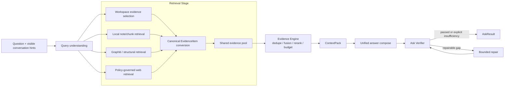

# Ask 当前依赖图

Workspace 和 Graph 在该路径只返回 evidence。它们不生成内部候选答案，不运行自己的 Completion，
也不把 Provider answer 投影成 fact。独立 Workspace Answer 产品入口的验证边界见
[Verification 与 Completion](../topics/verification-and-completion.md)。
