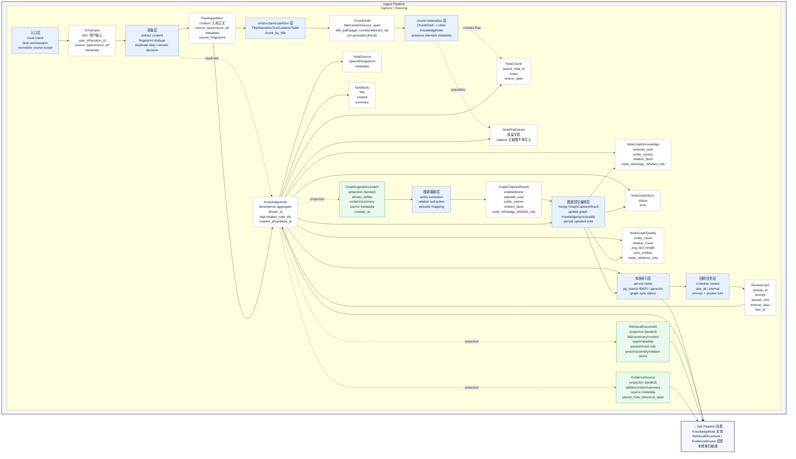

# Capture / Indexing 依赖图

```mermaid
flowchart LR
    classDef layer fill:#e8f1ff,stroke:#4f7ccf,stroke-width:1px,color:#10233f
    classDef model fill:#ffffff,stroke:#9aa4b2,stroke-width:1px,color:#172033
    classDef projection fill:#e9f9ee,stroke:#2e9e5b,stroke-width:1px,color:#0c3b22
    classDef future fill:#fff7e6,stroke:#d08b00,stroke-dasharray: 5 3,color:#3b2a00
    classDef pipeline fill:#f4f6fb,stroke:#3a4f7a,stroke-width:2px,color:#10233f

    subgraph Ingest["Ingest Pipeline"]
        direction TB

        subgraph Capture["Capture / Indexing"]
            direction TB
            EntryLayer["入口层<br/>route intent<br/>bind user/session<br/>normalize source scope"]:::layer
            EntryInput["EntryInput<br/>text: 用户输入<br/>user_id/session_id<br/>source_type/source_ref<br/>metadata"]:::model
            CaptureLayer["采集层<br/>extract content<br/>fingerprint dedupe<br/>duplicate skip / version decision"]:::layer
            RawIngestItem["RawIngestItem<br/>content: 入库正文<br/>source_type/source_ref<br/>metadata<br/>source_fingerprint"]:::model
            StructuralChunkLayer["Unstructured partition 层<br/>Title/NarrativeText/ListItem/Table<br/>chunk_by_title"]:::layer
            ChunkDraft["ChunkDraft<br/>title/content/source_span<br/>title_path/page_number/element_ids<br/>not persisted directly"]:::model
            ChunkReconcileLayer["chunk materialize 层<br/>ChunkDraft -> child KnowledgeNote<br/>preserve element metadata"]:::layer
            KnowledgeNote["KnowledgeNote<br/>persistence aggregate<br/>id/user_id<br/>tags/related_note_ids<br/>created_at/updated_at"]:::model
            NoteSource["NoteSource<br/>type/ref/fingerprint<br/>metadata"]:::model
            NoteBody["NoteBody<br/>title<br/>content<br/>summary"]:::model
            NoteChunk["NoteChunk<br/>parent_note_id<br/>index<br/>source_span"]:::model
            NotePreExtract["NotePreExtract<br/>保留字段<br/>capture 主链路不再写入"]:::model
            NoteGraphKnowledge["NoteGraphKnowledge<br/>episode_uuid<br/>entity_names<br/>relation_facts<br/>node_refs/edge_refs/fact_refs"]:::model
            NoteGraphSync["NoteGraphSync<br/>status<br/>error"]:::model
            NoteGraphQuality["NoteGraphQuality<br/>entity_count<br/>relation_count<br/>avg_fact_length<br/>zero_entities<br/>weak_relations_only"]:::model
            EvidenceSource["EvidenceSource<br/>projection (landed)<br/>id/title/content/summary<br/>source metadata<br/>parent_note_id/source_span"]:::projection
            RetrievalDocument["RetrievalDocument<br/>projection (landed)<br/>title/summary/content<br/>tags/metadata<br/>parent/chunk refs<br/>preextract/entity/relation terms"]:::projection
            GraphIngestDocument["GraphIngestDocument<br/>projection (landed)<br/>id/user_id/title<br/>content/summary<br/>source metadata<br/>created_at"]:::projection
            IndexLayer["本地索引层<br/>persist notes<br/>pg_search BM25 / pgvector<br/>graph sync status"]:::layer
            ReviewLayer["回顾任务层<br/>schedule review<br/>due_at / interval<br/>prompt + answer hint"]:::layer
            ReviewCard["ReviewCard<br/>id/note_id<br/>prompt<br/>answer_hint<br/>interval_days<br/>due_at"]:::model
            GraphIngestLayer["图谱摄取层<br/>entity extraction<br/>relation extraction<br/>episode mapping"]:::layer
            GraphCaptureResult["GraphCaptureResult<br/>enabled/error<br/>episode_uuid<br/>entity_names<br/>relation_facts<br/>node_refs/edge_refs/fact_refs"]:::model
            GraphWritebackLayer["图谱回写编排层<br/>merge GraphCaptureResult<br/>update graph knowledge/sync/quality<br/>persist updated note"]:::layer

            EntryLayer --> EntryInput
            EntryInput --> CaptureLayer
            CaptureLayer --> RawIngestItem
            CaptureLayer -. duplicate .-> KnowledgeNote
            RawIngestItem --> StructuralChunkLayer
            StructuralChunkLayer --> ChunkDraft
            ChunkDraft --> ChunkReconcileLayer
            ChunkReconcileLayer -. populates .-> NotePreExtract
            ChunkReconcileLayer -. creates final .-> NoteChunk
            RawIngestItem --> KnowledgeNote
            KnowledgeNote --> NoteSource
            KnowledgeNote --> NoteBody
            KnowledgeNote --> NoteChunk
            KnowledgeNote --> NotePreExtract
            KnowledgeNote --> NoteGraphKnowledge
            KnowledgeNote --> NoteGraphSync
            KnowledgeNote --> NoteGraphQuality
            KnowledgeNote -. projection .-> EvidenceSource
            KnowledgeNote -. projection .-> RetrievalDocument
            KnowledgeNote -. projection .-> GraphIngestDocument
            KnowledgeNote --> IndexLayer
            IndexLayer --> ReviewLayer
            ReviewLayer --> ReviewCard
            ReviewCard --> KnowledgeNote
            GraphIngestDocument --> GraphIngestLayer
            GraphIngestLayer --> GraphCaptureResult
            GraphCaptureResult --> GraphWritebackLayer
            KnowledgeNote --> GraphWritebackLayer
            GraphWritebackLayer --> NoteGraphKnowledge
            GraphWritebackLayer --> NoteGraphSync
            GraphWritebackLayer --> NoteGraphQuality
            GraphWritebackLayer --> IndexLayer
        end
    end

    AskHandoff["→ Ask Pipeline 消费<br/>KnowledgeNote 实体<br/>RetrievalDocument / EvidenceSource 投影<br/>本地索引就绪"]:::pipeline
    IndexLayer --> AskHandoff
    KnowledgeNote --> AskHandoff
    RetrievalDocument --> AskHandoff
    EvidenceSource --> AskHandoff

    class Ingest pipeline
```
