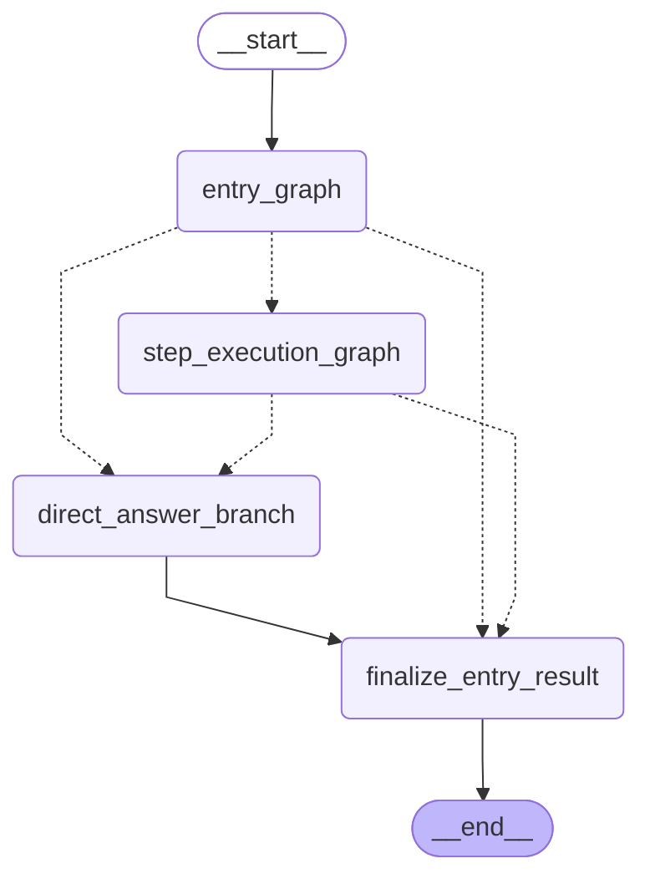
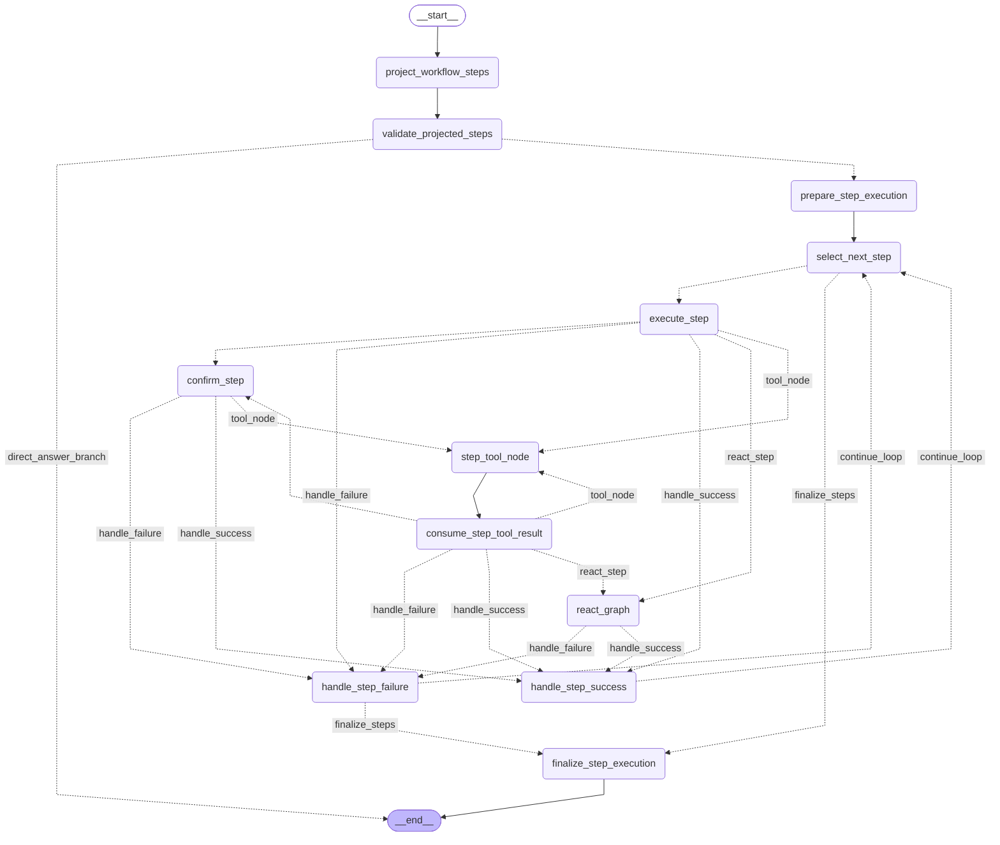
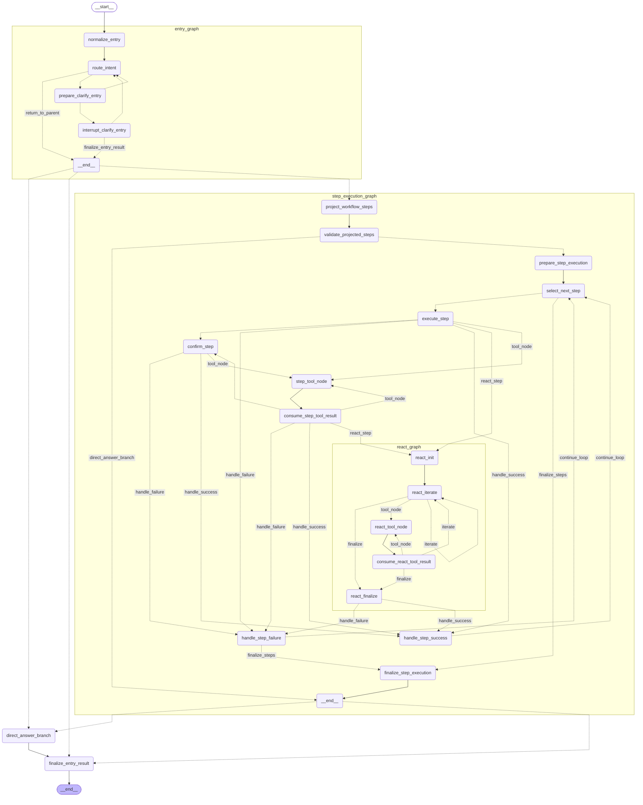

# Entry Orchestration Graph (Top Level)

```mermaid
---
config:
  flowchart:
    curve: linear
---
graph TD;
	__start__([<p>__start__</p>]):::first
	entry_graph(entry_graph)
	direct_answer_branch(direct_answer_branch)
	finalize_entry_result(finalize_entry_result)
	step_execution_graph(step_execution_graph)
	__end__([<p>__end__</p>]):::last
	__start__ --> entry_graph;
	direct_answer_branch --> finalize_entry_result;
	entry_graph -.-> direct_answer_branch;
	entry_graph -.-> finalize_entry_result;
	entry_graph -.-> step_execution_graph;
	step_execution_graph -.-> direct_answer_branch;
	step_execution_graph -.-> finalize_entry_result;
	finalize_entry_result --> __end__;
	classDef default fill:#f2f0ff,line-height:1.2
	classDef first fill-opacity:0
	classDef last fill:#bfb6fc

```

## Subgraph: entry_graph

```mermaid
---
config:
  flowchart:
    curve: linear
---
graph TD;
	__start__([<p>__start__</p>]):::first
	normalize_entry(normalize_entry)
	route_intent(route_intent)
	prepare_clarify_entry(prepare_clarify_entry)
	interrupt_clarify_entry(interrupt_clarify_entry)
	__end__([<p>__end__</p>]):::last
	__start__ --> normalize_entry;
	interrupt_clarify_entry -. &nbsp;finalize_entry_result&nbsp; .-> __end__;
	interrupt_clarify_entry -.-> route_intent;
	normalize_entry --> route_intent;
	prepare_clarify_entry -.-> interrupt_clarify_entry;
	prepare_clarify_entry -.-> route_intent;
	route_intent -. &nbsp;return_to_parent&nbsp; .-> __end__;
	route_intent -.-> prepare_clarify_entry;
	classDef default fill:#f2f0ff,line-height:1.2
	classDef first fill-opacity:0
	classDef last fill:#bfb6fc

```

## Subgraph: step_execution_graph

```mermaid
---
config:
  flowchart:
    curve: linear
---
graph TD;
	__start__([<p>__start__</p>]):::first
	project_workflow_steps(project_workflow_steps)
	validate_projected_steps(validate_projected_steps)
	prepare_step_execution(prepare_step_execution)
	select_next_step(select_next_step)
	execute_step(execute_step)
	handle_step_success(handle_step_success)
	handle_step_failure(handle_step_failure)
	confirm_step(confirm_step)
	step_tool_node(step_tool_node)
	consume_step_tool_result(consume_step_tool_result)
	react_graph(react_graph)
	finalize_step_execution(finalize_step_execution)
	__end__([<p>__end__</p>]):::last
	__start__ --> project_workflow_steps;
	confirm_step -. &nbsp;handle_failure&nbsp; .-> handle_step_failure;
	confirm_step -. &nbsp;handle_success&nbsp; .-> handle_step_success;
	confirm_step -. &nbsp;tool_node&nbsp; .-> step_tool_node;
	consume_step_tool_result -.-> confirm_step;
	consume_step_tool_result -. &nbsp;handle_failure&nbsp; .-> handle_step_failure;
	consume_step_tool_result -. &nbsp;handle_success&nbsp; .-> handle_step_success;
	consume_step_tool_result -. &nbsp;react_step&nbsp; .-> react_graph;
	consume_step_tool_result -. &nbsp;tool_node&nbsp; .-> step_tool_node;
	execute_step -.-> confirm_step;
	execute_step -. &nbsp;handle_failure&nbsp; .-> handle_step_failure;
	execute_step -. &nbsp;handle_success&nbsp; .-> handle_step_success;
	execute_step -. &nbsp;react_step&nbsp; .-> react_graph;
	execute_step -. &nbsp;tool_node&nbsp; .-> step_tool_node;
	handle_step_failure -. &nbsp;finalize_steps&nbsp; .-> finalize_step_execution;
	handle_step_failure -. &nbsp;continue_loop&nbsp; .-> select_next_step;
	handle_step_success -. &nbsp;continue_loop&nbsp; .-> select_next_step;
	prepare_step_execution --> select_next_step;
	project_workflow_steps --> validate_projected_steps;
	react_graph -. &nbsp;handle_failure&nbsp; .-> handle_step_failure;
	react_graph -. &nbsp;handle_success&nbsp; .-> handle_step_success;
	select_next_step -.-> execute_step;
	select_next_step -. &nbsp;finalize_steps&nbsp; .-> finalize_step_execution;
	step_tool_node --> consume_step_tool_result;
	validate_projected_steps -. &nbsp;direct_answer_branch&nbsp; .-> __end__;
	validate_projected_steps -.-> prepare_step_execution;
	finalize_step_execution --> __end__;
	classDef default fill:#f2f0ff,line-height:1.2
	classDef first fill-opacity:0
	classDef last fill:#bfb6fc

```

## Subgraph: react_graph

```mermaid
---
config:
  flowchart:
    curve: linear
---
graph TD;
	__start__([<p>__start__</p>]):::first
	react_init(react_init)
	react_iterate(react_iterate)
	react_tool_node(react_tool_node)
	consume_react_tool_result(consume_react_tool_result)
	react_finalize(react_finalize)
	__end__([<p>__end__</p>]):::last
	__start__ --> react_init;
	consume_react_tool_result -. &nbsp;finalize&nbsp; .-> react_finalize;
	consume_react_tool_result -. &nbsp;iterate&nbsp; .-> react_iterate;
	consume_react_tool_result -. &nbsp;tool_node&nbsp; .-> react_tool_node;
	react_init --> react_iterate;
	react_iterate -. &nbsp;finalize&nbsp; .-> react_finalize;
	react_iterate -. &nbsp;tool_node&nbsp; .-> react_tool_node;
	react_tool_node --> consume_react_tool_result;
	react_finalize --> __end__;
	react_iterate -. &nbsp;iterate&nbsp; .-> react_iterate;
	classDef default fill:#f2f0ff,line-height:1.2
	classDef first fill-opacity:0
	classDef last fill:#bfb6fc

```

# Entry Orchestration Graph (X-Ray depth=2)

```mermaid
---
config:
  flowchart:
    curve: linear
---
graph TD;
	__start__([<p>__start__</p>]):::first
	direct_answer_branch(direct_answer_branch)
	finalize_entry_result(finalize_entry_result)
	__end__([<p>__end__</p>]):::last
	__start__ --> entry_graph\3anormalize_entry;
	direct_answer_branch --> finalize_entry_result;
	entry_graph\3a__end__ -.-> direct_answer_branch;
	entry_graph\3a__end__ -.-> finalize_entry_result;
	entry_graph\3a__end__ -.-> step_execution_graph\3aproject_workflow_steps;
	step_execution_graph\3a__end__ -.-> direct_answer_branch;
	step_execution_graph\3a__end__ -.-> finalize_entry_result;
	finalize_entry_result --> __end__;
	subgraph entry_graph
	entry_graph\3anormalize_entry(normalize_entry)
	entry_graph\3aroute_intent(route_intent)
	entry_graph\3aprepare_clarify_entry(prepare_clarify_entry)
	entry_graph\3ainterrupt_clarify_entry(interrupt_clarify_entry)
	entry_graph\3a__end__(<p>__end__</p>)
	entry_graph\3ainterrupt_clarify_entry -. &nbsp;finalize_entry_result&nbsp; .-> entry_graph\3a__end__;
	entry_graph\3ainterrupt_clarify_entry -.-> entry_graph\3aroute_intent;
	entry_graph\3anormalize_entry --> entry_graph\3aroute_intent;
	entry_graph\3aprepare_clarify_entry -.-> entry_graph\3ainterrupt_clarify_entry;
	entry_graph\3aprepare_clarify_entry -.-> entry_graph\3aroute_intent;
	entry_graph\3aroute_intent -. &nbsp;return_to_parent&nbsp; .-> entry_graph\3a__end__;
	entry_graph\3aroute_intent -.-> entry_graph\3aprepare_clarify_entry;
	end
	subgraph step_execution_graph
	step_execution_graph\3aproject_workflow_steps(project_workflow_steps)
	step_execution_graph\3avalidate_projected_steps(validate_projected_steps)
	step_execution_graph\3aprepare_step_execution(prepare_step_execution)
	step_execution_graph\3aselect_next_step(select_next_step)
	step_execution_graph\3aexecute_step(execute_step)
	step_execution_graph\3ahandle_step_success(handle_step_success)
	step_execution_graph\3ahandle_step_failure(handle_step_failure)
	step_execution_graph\3aconfirm_step(confirm_step)
	step_execution_graph\3astep_tool_node(step_tool_node)
	step_execution_graph\3aconsume_step_tool_result(consume_step_tool_result)
	step_execution_graph\3afinalize_step_execution(finalize_step_execution)
	step_execution_graph\3a__end__(<p>__end__</p>)
	step_execution_graph\3aconfirm_step -. &nbsp;handle_failure&nbsp; .-> step_execution_graph\3ahandle_step_failure;
	step_execution_graph\3aconfirm_step -. &nbsp;handle_success&nbsp; .-> step_execution_graph\3ahandle_step_success;
	step_execution_graph\3aconfirm_step -. &nbsp;tool_node&nbsp; .-> step_execution_graph\3astep_tool_node;
	step_execution_graph\3aconsume_step_tool_result -.-> step_execution_graph\3aconfirm_step;
	step_execution_graph\3aconsume_step_tool_result -. &nbsp;handle_failure&nbsp; .-> step_execution_graph\3ahandle_step_failure;
	step_execution_graph\3aconsume_step_tool_result -. &nbsp;handle_success&nbsp; .-> step_execution_graph\3ahandle_step_success;
	step_execution_graph\3aconsume_step_tool_result -. &nbsp;react_step&nbsp; .-> step_execution_graph\3areact_graph\3areact_init;
	step_execution_graph\3aconsume_step_tool_result -. &nbsp;tool_node&nbsp; .-> step_execution_graph\3astep_tool_node;
	step_execution_graph\3aexecute_step -.-> step_execution_graph\3aconfirm_step;
	step_execution_graph\3aexecute_step -. &nbsp;handle_failure&nbsp; .-> step_execution_graph\3ahandle_step_failure;
	step_execution_graph\3aexecute_step -. &nbsp;handle_success&nbsp; .-> step_execution_graph\3ahandle_step_success;
	step_execution_graph\3aexecute_step -. &nbsp;react_step&nbsp; .-> step_execution_graph\3areact_graph\3areact_init;
	step_execution_graph\3aexecute_step -. &nbsp;tool_node&nbsp; .-> step_execution_graph\3astep_tool_node;
	step_execution_graph\3ahandle_step_failure -. &nbsp;finalize_steps&nbsp; .-> step_execution_graph\3afinalize_step_execution;
	step_execution_graph\3ahandle_step_failure -. &nbsp;continue_loop&nbsp; .-> step_execution_graph\3aselect_next_step;
	step_execution_graph\3ahandle_step_success -. &nbsp;continue_loop&nbsp; .-> step_execution_graph\3aselect_next_step;
	step_execution_graph\3aprepare_step_execution --> step_execution_graph\3aselect_next_step;
	step_execution_graph\3aproject_workflow_steps --> step_execution_graph\3avalidate_projected_steps;
	step_execution_graph\3areact_graph\3areact_finalize -. &nbsp;handle_failure&nbsp; .-> step_execution_graph\3ahandle_step_failure;
	step_execution_graph\3areact_graph\3areact_finalize -. &nbsp;handle_success&nbsp; .-> step_execution_graph\3ahandle_step_success;
	step_execution_graph\3aselect_next_step -.-> step_execution_graph\3aexecute_step;
	step_execution_graph\3aselect_next_step -. &nbsp;finalize_steps&nbsp; .-> step_execution_graph\3afinalize_step_execution;
	step_execution_graph\3astep_tool_node --> step_execution_graph\3aconsume_step_tool_result;
	step_execution_graph\3avalidate_projected_steps -. &nbsp;direct_answer_branch&nbsp; .-> step_execution_graph\3a__end__;
	step_execution_graph\3avalidate_projected_steps -.-> step_execution_graph\3aprepare_step_execution;
	step_execution_graph\3afinalize_step_execution --> step_execution_graph\3a__end__;
	subgraph react_graph
	step_execution_graph\3areact_graph\3areact_init(react_init)
	step_execution_graph\3areact_graph\3areact_iterate(react_iterate)
	step_execution_graph\3areact_graph\3areact_tool_node(react_tool_node)
	step_execution_graph\3areact_graph\3aconsume_react_tool_result(consume_react_tool_result)
	step_execution_graph\3areact_graph\3areact_finalize(react_finalize)
	step_execution_graph\3areact_graph\3aconsume_react_tool_result -. &nbsp;finalize&nbsp; .-> step_execution_graph\3areact_graph\3areact_finalize;
	step_execution_graph\3areact_graph\3aconsume_react_tool_result -. &nbsp;iterate&nbsp; .-> step_execution_graph\3areact_graph\3areact_iterate;
	step_execution_graph\3areact_graph\3aconsume_react_tool_result -. &nbsp;tool_node&nbsp; .-> step_execution_graph\3areact_graph\3areact_tool_node;
	step_execution_graph\3areact_graph\3areact_init --> step_execution_graph\3areact_graph\3areact_iterate;
	step_execution_graph\3areact_graph\3areact_iterate -. &nbsp;finalize&nbsp; .-> step_execution_graph\3areact_graph\3areact_finalize;
	step_execution_graph\3areact_graph\3areact_iterate -. &nbsp;tool_node&nbsp; .-> step_execution_graph\3areact_graph\3areact_tool_node;
	step_execution_graph\3areact_graph\3areact_tool_node --> step_execution_graph\3areact_graph\3aconsume_react_tool_result;
	step_execution_graph\3areact_graph\3areact_iterate -. &nbsp;iterate&nbsp; .-> step_execution_graph\3areact_graph\3areact_iterate;
	end
	end
	classDef default fill:#f2f0ff,line-height:1.2
	classDef first fill-opacity:0
	classDef last fill:#bfb6fc

```
