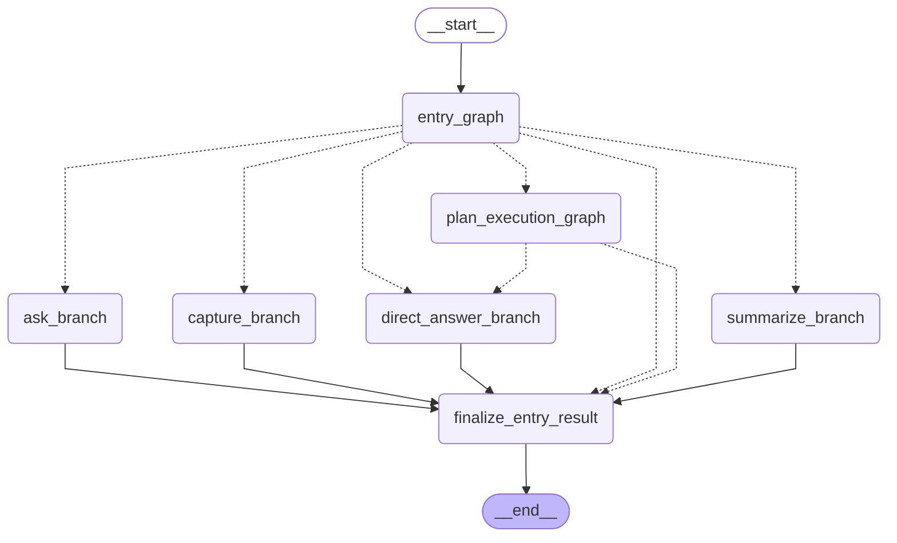
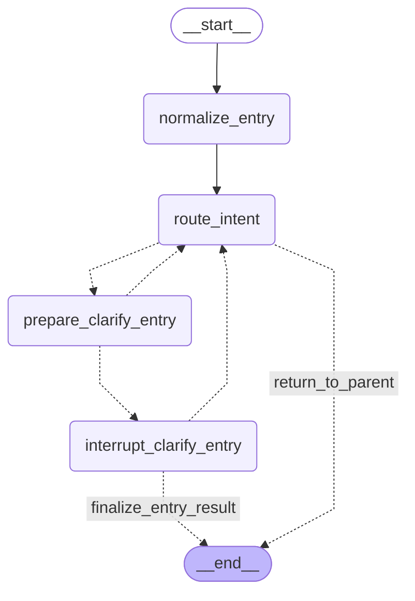
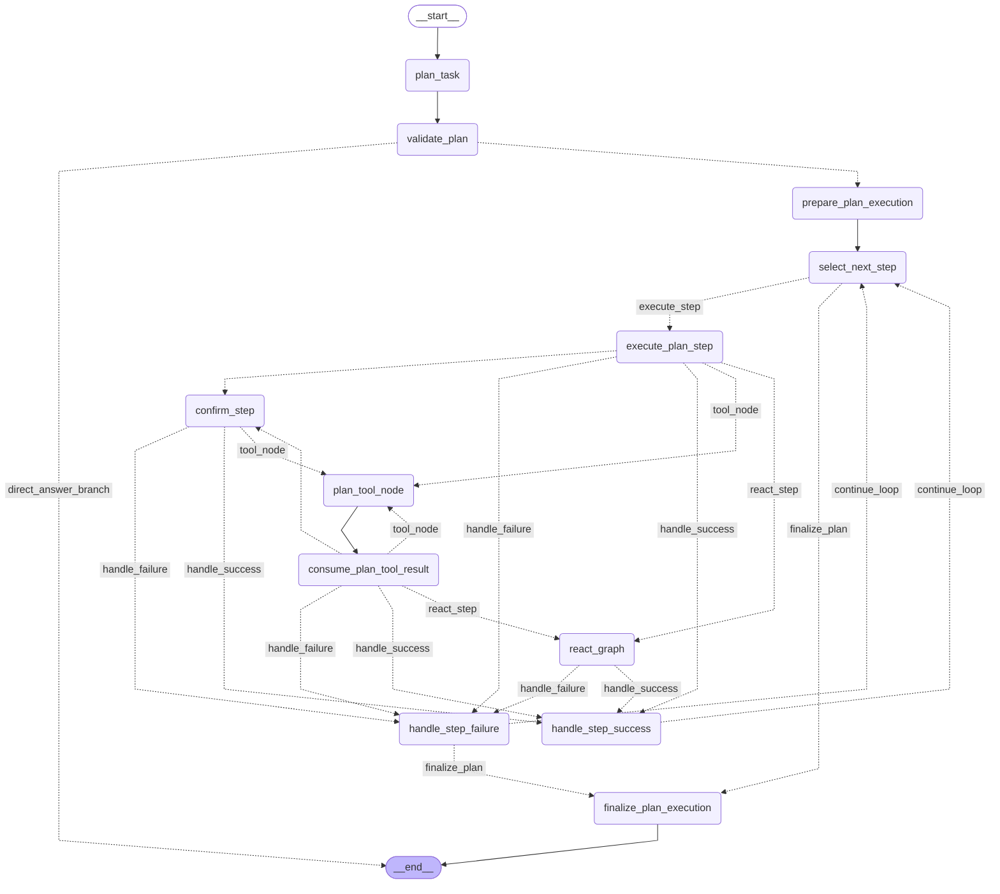
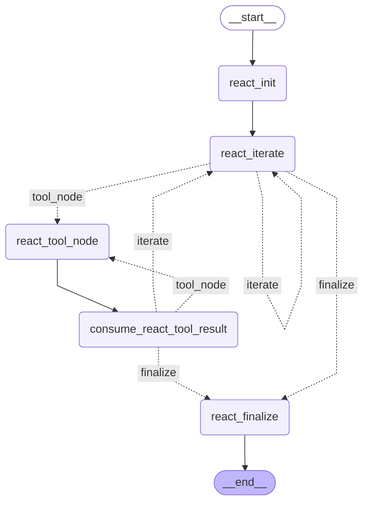
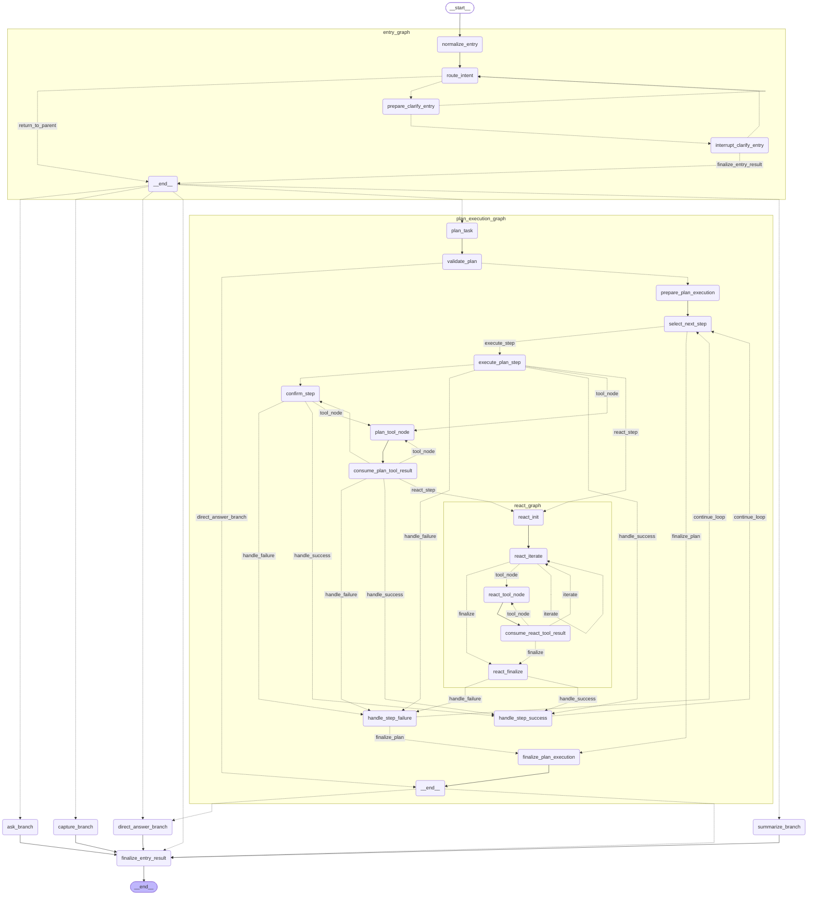

# Entry Orchestration Graph (Top Level)

```mermaid
---
config:
  flowchart:
    curve: linear
---
graph TD;
	__start__([<p>__start__</p>]):::first
	entry_graph(entry_graph)
	capture_branch(capture_branch)
	ask_branch(ask_branch)
	summarize_branch(summarize_branch)
	direct_answer_branch(direct_answer_branch)
	finalize_entry_result(finalize_entry_result)
	plan_execution_graph(plan_execution_graph)
	__end__([<p>__end__</p>]):::last
	__start__ --> entry_graph;
	ask_branch --> finalize_entry_result;
	capture_branch --> finalize_entry_result;
	direct_answer_branch --> finalize_entry_result;
	entry_graph -.-> ask_branch;
	entry_graph -.-> capture_branch;
	entry_graph -.-> direct_answer_branch;
	entry_graph -.-> finalize_entry_result;
	entry_graph -.-> plan_execution_graph;
	entry_graph -.-> summarize_branch;
	plan_execution_graph -.-> direct_answer_branch;
	plan_execution_graph -.-> finalize_entry_result;
	summarize_branch --> finalize_entry_result;
	finalize_entry_result --> __end__;
	classDef default fill:#f2f0ff,line-height:1.2
	classDef first fill-opacity:0
	classDef last fill:#bfb6fc

```

## Subgraph: entry_graph

```mermaid
---
config:
  flowchart:
    curve: linear
---
graph TD;
	__start__([<p>__start__</p>]):::first
	normalize_entry(normalize_entry)
	route_intent(route_intent)
	prepare_clarify_entry(prepare_clarify_entry)
	interrupt_clarify_entry(interrupt_clarify_entry)
	__end__([<p>__end__</p>]):::last
	__start__ --> normalize_entry;
	interrupt_clarify_entry -. &nbsp;finalize_entry_result&nbsp; .-> __end__;
	interrupt_clarify_entry -.-> route_intent;
	normalize_entry --> route_intent;
	prepare_clarify_entry -.-> interrupt_clarify_entry;
	prepare_clarify_entry -.-> route_intent;
	route_intent -. &nbsp;return_to_parent&nbsp; .-> __end__;
	route_intent -.-> prepare_clarify_entry;
	classDef default fill:#f2f0ff,line-height:1.2
	classDef first fill-opacity:0
	classDef last fill:#bfb6fc

```

## Subgraph: plan_execution_graph

```mermaid
---
config:
  flowchart:
    curve: linear
---
graph TD;
	__start__([<p>__start__</p>]):::first
	plan_task(plan_task)
	validate_plan(validate_plan)
	prepare_plan_execution(prepare_plan_execution)
	select_next_step(select_next_step)
	execute_plan_step(execute_plan_step)
	handle_step_success(handle_step_success)
	handle_step_failure(handle_step_failure)
	confirm_step(confirm_step)
	plan_tool_node(plan_tool_node)
	consume_plan_tool_result(consume_plan_tool_result)
	react_graph(react_graph)
	finalize_plan_execution(finalize_plan_execution)
	__end__([<p>__end__</p>]):::last
	__start__ --> plan_task;
	confirm_step -. &nbsp;handle_failure&nbsp; .-> handle_step_failure;
	confirm_step -. &nbsp;handle_success&nbsp; .-> handle_step_success;
	confirm_step -. &nbsp;tool_node&nbsp; .-> plan_tool_node;
	consume_plan_tool_result -.-> confirm_step;
	consume_plan_tool_result -. &nbsp;handle_failure&nbsp; .-> handle_step_failure;
	consume_plan_tool_result -. &nbsp;handle_success&nbsp; .-> handle_step_success;
	consume_plan_tool_result -. &nbsp;tool_node&nbsp; .-> plan_tool_node;
	consume_plan_tool_result -. &nbsp;react_step&nbsp; .-> react_graph;
	execute_plan_step -.-> confirm_step;
	execute_plan_step -. &nbsp;handle_failure&nbsp; .-> handle_step_failure;
	execute_plan_step -. &nbsp;handle_success&nbsp; .-> handle_step_success;
	execute_plan_step -. &nbsp;tool_node&nbsp; .-> plan_tool_node;
	execute_plan_step -. &nbsp;react_step&nbsp; .-> react_graph;
	handle_step_failure -. &nbsp;finalize_plan&nbsp; .-> finalize_plan_execution;
	handle_step_failure -. &nbsp;continue_loop&nbsp; .-> select_next_step;
	handle_step_success -. &nbsp;continue_loop&nbsp; .-> select_next_step;
	plan_task --> validate_plan;
	plan_tool_node --> consume_plan_tool_result;
	prepare_plan_execution --> select_next_step;
	react_graph -. &nbsp;handle_failure&nbsp; .-> handle_step_failure;
	react_graph -. &nbsp;handle_success&nbsp; .-> handle_step_success;
	select_next_step -. &nbsp;execute_step&nbsp; .-> execute_plan_step;
	select_next_step -. &nbsp;finalize_plan&nbsp; .-> finalize_plan_execution;
	validate_plan -. &nbsp;direct_answer_branch&nbsp; .-> __end__;
	validate_plan -.-> prepare_plan_execution;
	finalize_plan_execution --> __end__;
	classDef default fill:#f2f0ff,line-height:1.2
	classDef first fill-opacity:0
	classDef last fill:#bfb6fc

```

## Subgraph: react_graph

```mermaid
---
config:
  flowchart:
    curve: linear
---
graph TD;
	__start__([<p>__start__</p>]):::first
	react_init(react_init)
	react_iterate(react_iterate)
	react_tool_node(react_tool_node)
	consume_react_tool_result(consume_react_tool_result)
	react_finalize(react_finalize)
	__end__([<p>__end__</p>]):::last
	__start__ --> react_init;
	consume_react_tool_result -. &nbsp;finalize&nbsp; .-> react_finalize;
	consume_react_tool_result -. &nbsp;iterate&nbsp; .-> react_iterate;
	consume_react_tool_result -. &nbsp;tool_node&nbsp; .-> react_tool_node;
	react_init --> react_iterate;
	react_iterate -. &nbsp;finalize&nbsp; .-> react_finalize;
	react_iterate -. &nbsp;tool_node&nbsp; .-> react_tool_node;
	react_tool_node --> consume_react_tool_result;
	react_finalize --> __end__;
	react_iterate -. &nbsp;iterate&nbsp; .-> react_iterate;
	classDef default fill:#f2f0ff,line-height:1.2
	classDef first fill-opacity:0
	classDef last fill:#bfb6fc

```

# Entry Orchestration Graph (X-Ray depth=2)

```mermaid
---
config:
  flowchart:
    curve: linear
---
graph TD;
	__start__([<p>__start__</p>]):::first
	capture_branch(capture_branch)
	ask_branch(ask_branch)
	summarize_branch(summarize_branch)
	direct_answer_branch(direct_answer_branch)
	finalize_entry_result(finalize_entry_result)
	__end__([<p>__end__</p>]):::last
	__start__ --> entry_graph\3anormalize_entry;
	ask_branch --> finalize_entry_result;
	capture_branch --> finalize_entry_result;
	direct_answer_branch --> finalize_entry_result;
	entry_graph\3a__end__ -.-> ask_branch;
	entry_graph\3a__end__ -.-> capture_branch;
	entry_graph\3a__end__ -.-> direct_answer_branch;
	entry_graph\3a__end__ -.-> finalize_entry_result;
	entry_graph\3a__end__ -.-> plan_execution_graph\3aplan_task;
	entry_graph\3a__end__ -.-> summarize_branch;
	plan_execution_graph\3a__end__ -.-> direct_answer_branch;
	plan_execution_graph\3a__end__ -.-> finalize_entry_result;
	summarize_branch --> finalize_entry_result;
	finalize_entry_result --> __end__;
	subgraph entry_graph
	entry_graph\3anormalize_entry(normalize_entry)
	entry_graph\3aroute_intent(route_intent)
	entry_graph\3aprepare_clarify_entry(prepare_clarify_entry)
	entry_graph\3ainterrupt_clarify_entry(interrupt_clarify_entry)
	entry_graph\3a__end__(<p>__end__</p>)
	entry_graph\3ainterrupt_clarify_entry -. &nbsp;finalize_entry_result&nbsp; .-> entry_graph\3a__end__;
	entry_graph\3ainterrupt_clarify_entry -.-> entry_graph\3aroute_intent;
	entry_graph\3anormalize_entry --> entry_graph\3aroute_intent;
	entry_graph\3aprepare_clarify_entry -.-> entry_graph\3ainterrupt_clarify_entry;
	entry_graph\3aprepare_clarify_entry -.-> entry_graph\3aroute_intent;
	entry_graph\3aroute_intent -. &nbsp;return_to_parent&nbsp; .-> entry_graph\3a__end__;
	entry_graph\3aroute_intent -.-> entry_graph\3aprepare_clarify_entry;
	end
	subgraph plan_execution_graph
	plan_execution_graph\3aplan_task(plan_task)
	plan_execution_graph\3avalidate_plan(validate_plan)
	plan_execution_graph\3aprepare_plan_execution(prepare_plan_execution)
	plan_execution_graph\3aselect_next_step(select_next_step)
	plan_execution_graph\3aexecute_plan_step(execute_plan_step)
	plan_execution_graph\3ahandle_step_success(handle_step_success)
	plan_execution_graph\3ahandle_step_failure(handle_step_failure)
	plan_execution_graph\3aconfirm_step(confirm_step)
	plan_execution_graph\3aplan_tool_node(plan_tool_node)
	plan_execution_graph\3aconsume_plan_tool_result(consume_plan_tool_result)
	plan_execution_graph\3afinalize_plan_execution(finalize_plan_execution)
	plan_execution_graph\3a__end__(<p>__end__</p>)
	plan_execution_graph\3aconfirm_step -. &nbsp;handle_failure&nbsp; .-> plan_execution_graph\3ahandle_step_failure;
	plan_execution_graph\3aconfirm_step -. &nbsp;handle_success&nbsp; .-> plan_execution_graph\3ahandle_step_success;
	plan_execution_graph\3aconfirm_step -. &nbsp;tool_node&nbsp; .-> plan_execution_graph\3aplan_tool_node;
	plan_execution_graph\3aconsume_plan_tool_result -.-> plan_execution_graph\3aconfirm_step;
	plan_execution_graph\3aconsume_plan_tool_result -. &nbsp;handle_failure&nbsp; .-> plan_execution_graph\3ahandle_step_failure;
	plan_execution_graph\3aconsume_plan_tool_result -. &nbsp;handle_success&nbsp; .-> plan_execution_graph\3ahandle_step_success;
	plan_execution_graph\3aconsume_plan_tool_result -. &nbsp;tool_node&nbsp; .-> plan_execution_graph\3aplan_tool_node;
	plan_execution_graph\3aconsume_plan_tool_result -. &nbsp;react_step&nbsp; .-> plan_execution_graph\3areact_graph\3areact_init;
	plan_execution_graph\3aexecute_plan_step -.-> plan_execution_graph\3aconfirm_step;
	plan_execution_graph\3aexecute_plan_step -. &nbsp;handle_failure&nbsp; .-> plan_execution_graph\3ahandle_step_failure;
	plan_execution_graph\3aexecute_plan_step -. &nbsp;handle_success&nbsp; .-> plan_execution_graph\3ahandle_step_success;
	plan_execution_graph\3aexecute_plan_step -. &nbsp;tool_node&nbsp; .-> plan_execution_graph\3aplan_tool_node;
	plan_execution_graph\3aexecute_plan_step -. &nbsp;react_step&nbsp; .-> plan_execution_graph\3areact_graph\3areact_init;
	plan_execution_graph\3ahandle_step_failure -. &nbsp;finalize_plan&nbsp; .-> plan_execution_graph\3afinalize_plan_execution;
	plan_execution_graph\3ahandle_step_failure -. &nbsp;continue_loop&nbsp; .-> plan_execution_graph\3aselect_next_step;
	plan_execution_graph\3ahandle_step_success -. &nbsp;continue_loop&nbsp; .-> plan_execution_graph\3aselect_next_step;
	plan_execution_graph\3aplan_task --> plan_execution_graph\3avalidate_plan;
	plan_execution_graph\3aplan_tool_node --> plan_execution_graph\3aconsume_plan_tool_result;
	plan_execution_graph\3aprepare_plan_execution --> plan_execution_graph\3aselect_next_step;
	plan_execution_graph\3areact_graph\3areact_finalize -. &nbsp;handle_failure&nbsp; .-> plan_execution_graph\3ahandle_step_failure;
	plan_execution_graph\3areact_graph\3areact_finalize -. &nbsp;handle_success&nbsp; .-> plan_execution_graph\3ahandle_step_success;
	plan_execution_graph\3aselect_next_step -. &nbsp;execute_step&nbsp; .-> plan_execution_graph\3aexecute_plan_step;
	plan_execution_graph\3aselect_next_step -. &nbsp;finalize_plan&nbsp; .-> plan_execution_graph\3afinalize_plan_execution;
	plan_execution_graph\3avalidate_plan -. &nbsp;direct_answer_branch&nbsp; .-> plan_execution_graph\3a__end__;
	plan_execution_graph\3avalidate_plan -.-> plan_execution_graph\3aprepare_plan_execution;
	plan_execution_graph\3afinalize_plan_execution --> plan_execution_graph\3a__end__;
	subgraph react_graph
	plan_execution_graph\3areact_graph\3areact_init(react_init)
	plan_execution_graph\3areact_graph\3areact_iterate(react_iterate)
	plan_execution_graph\3areact_graph\3areact_tool_node(react_tool_node)
	plan_execution_graph\3areact_graph\3aconsume_react_tool_result(consume_react_tool_result)
	plan_execution_graph\3areact_graph\3areact_finalize(react_finalize)
	plan_execution_graph\3areact_graph\3aconsume_react_tool_result -. &nbsp;finalize&nbsp; .-> plan_execution_graph\3areact_graph\3areact_finalize;
	plan_execution_graph\3areact_graph\3aconsume_react_tool_result -. &nbsp;iterate&nbsp; .-> plan_execution_graph\3areact_graph\3areact_iterate;
	plan_execution_graph\3areact_graph\3aconsume_react_tool_result -. &nbsp;tool_node&nbsp; .-> plan_execution_graph\3areact_graph\3areact_tool_node;
	plan_execution_graph\3areact_graph\3areact_init --> plan_execution_graph\3areact_graph\3areact_iterate;
	plan_execution_graph\3areact_graph\3areact_iterate -. &nbsp;finalize&nbsp; .-> plan_execution_graph\3areact_graph\3areact_finalize;
	plan_execution_graph\3areact_graph\3areact_iterate -. &nbsp;tool_node&nbsp; .-> plan_execution_graph\3areact_graph\3areact_tool_node;
	plan_execution_graph\3areact_graph\3areact_tool_node --> plan_execution_graph\3areact_graph\3aconsume_react_tool_result;
	plan_execution_graph\3areact_graph\3areact_iterate -. &nbsp;iterate&nbsp; .-> plan_execution_graph\3areact_graph\3areact_iterate;
	end
	end
	classDef default fill:#f2f0ff,line-height:1.2
	classDef first fill-opacity:0
	classDef last fill:#bfb6fc

```
