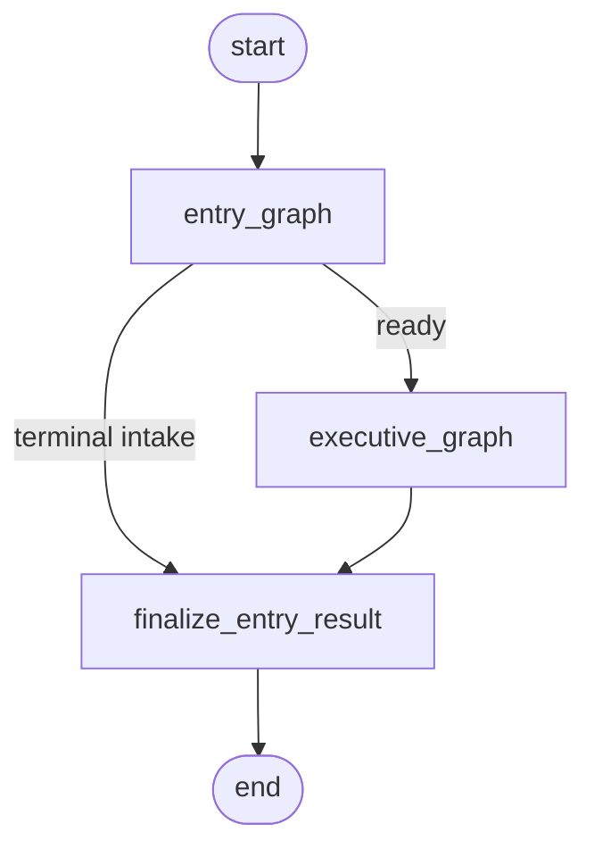
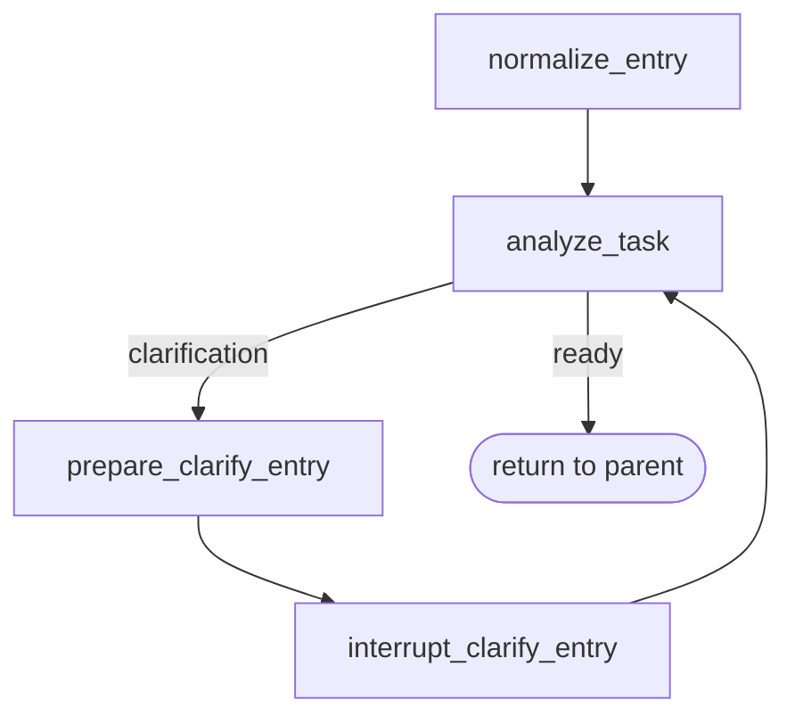
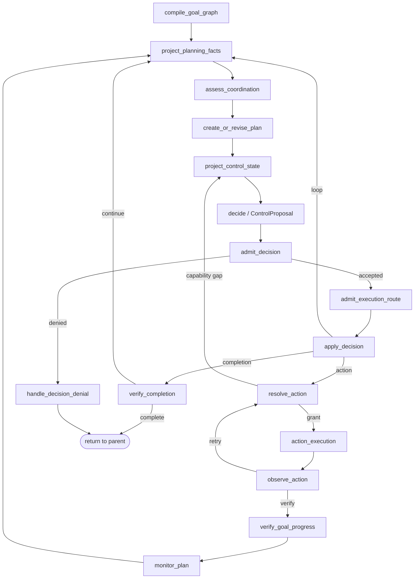
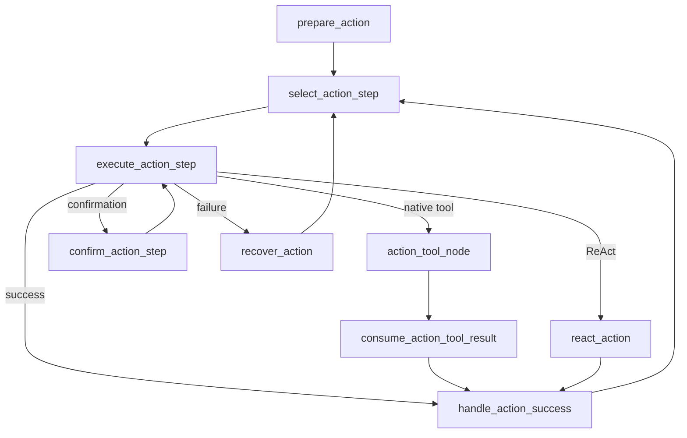

# Entry Orchestration Graph

## entry_graph

## executive_graph

## action_execution

该图只表达节点与条件边。Admission、Grant、Journal/outbox、Evidence 与 Verification 的业务边界见 [当前核心架构](../summary/core-architecture-current-state.md)。
