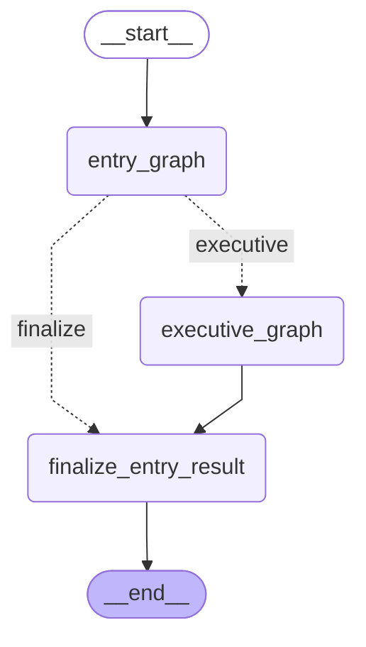
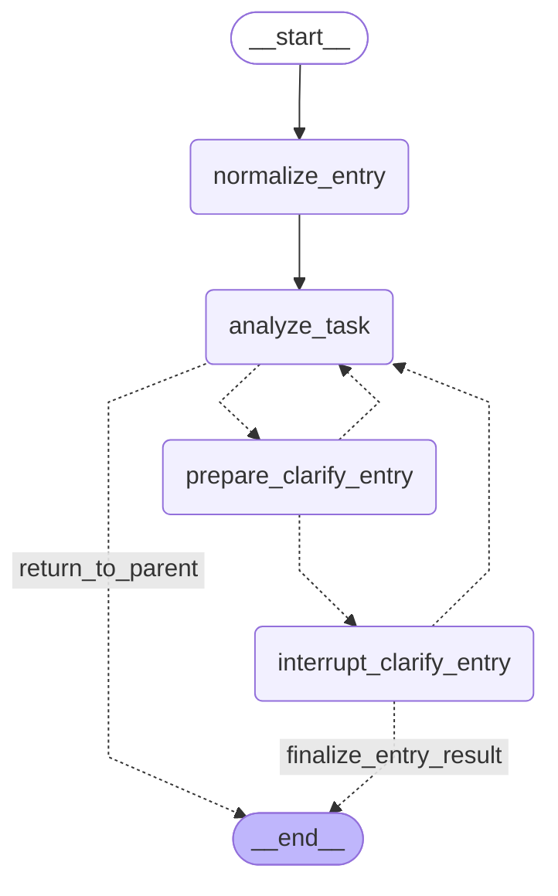
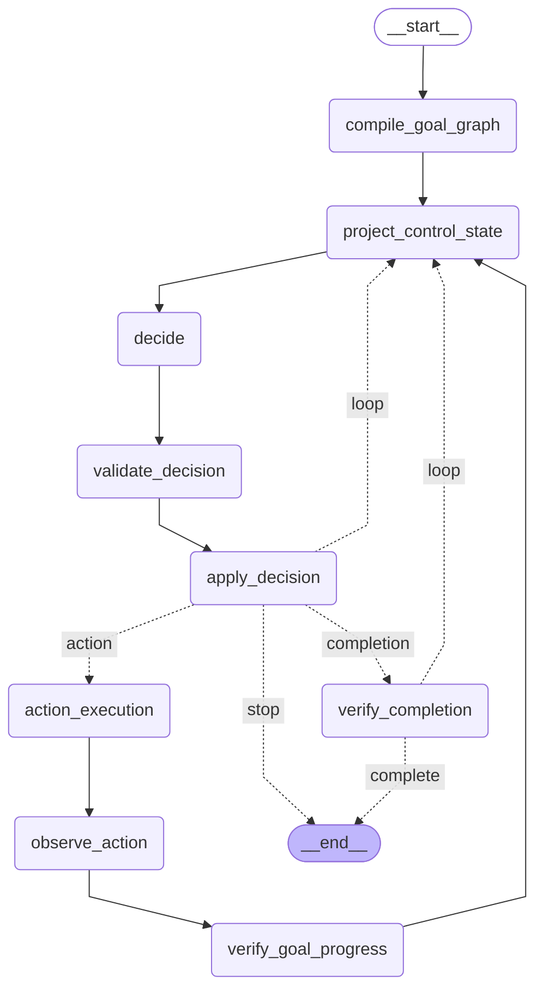
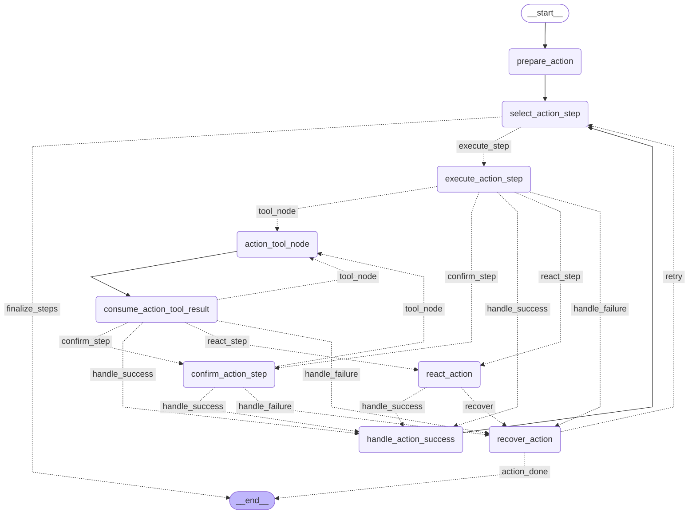
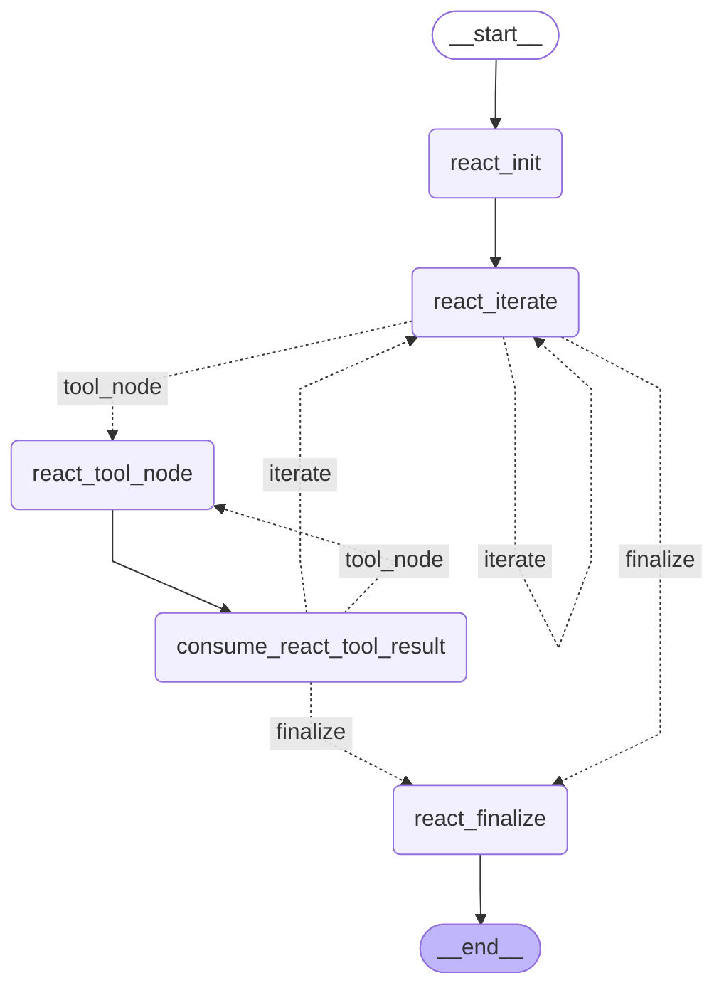
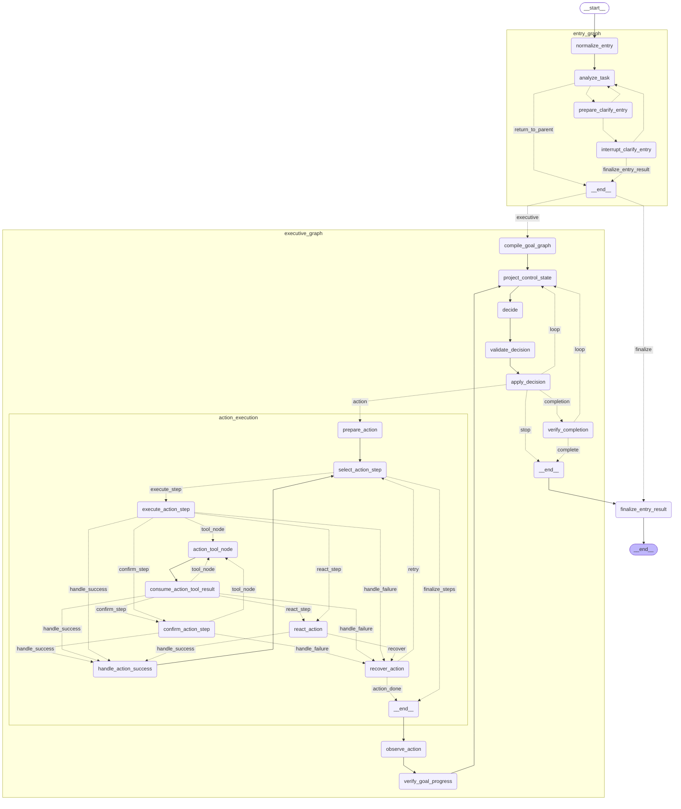

# Entry Orchestration Graph (Top Level)

## Subgraph: entry_graph

## Subgraph: executive_graph

## Subgraph: action_execution

## Subgraph: react_action

# Entry Orchestration Graph (X-Ray depth=2)

