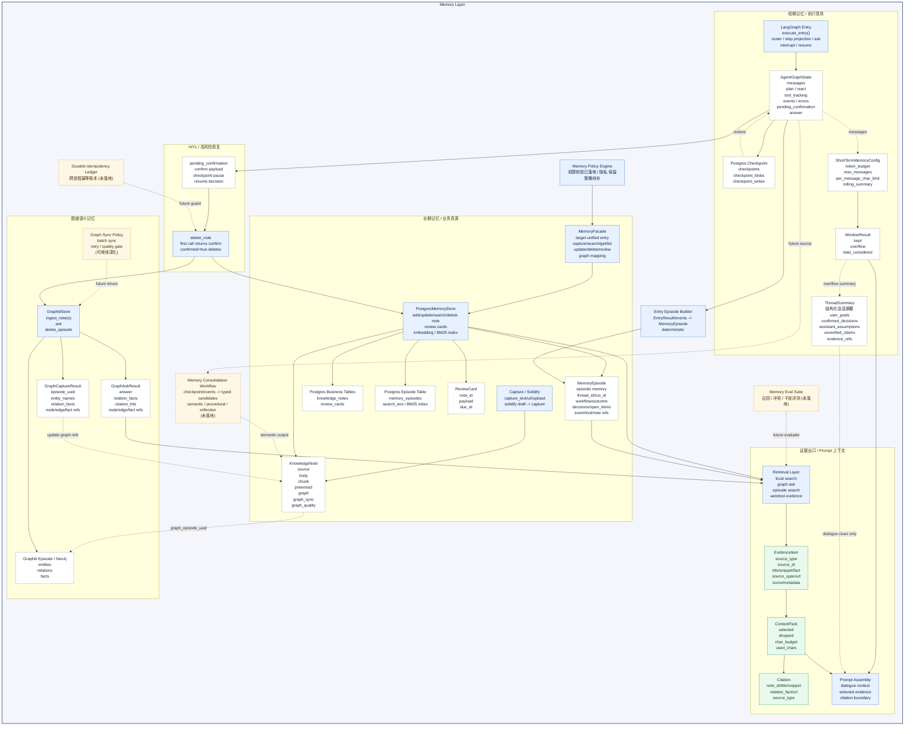

# Memory Model / Layer 依赖类图

```mermaid
flowchart LR
    classDef layer fill:#e8f1ff,stroke:#4f7ccf,stroke-width:1px,color:#10233f
    classDef model fill:#ffffff,stroke:#9aa4b2,stroke-width:1px,color:#172033
    classDef projection fill:#e9f9ee,stroke:#2e9e5b,stroke-width:1px,color:#0c3b22
    classDef future fill:#fff7e6,stroke:#d08b00,stroke-dasharray: 5 3,color:#3b2a00
    classDef pipeline fill:#f4f6fb,stroke:#3a4f7a,stroke-width:2px,color:#10233f

    subgraph MemoryLayer["Memory Layer"]
        direction TB

        subgraph ShortTerm["短期记忆 / 执行现场"]
            direction TB
            EntryLayer["LangGraph Entry<br/>execute_entry()<br/>router / step projection / ask<br/>interrupt / resume"]:::layer
            AgentGraphState["AgentGraphState<br/>messages<br/>plan / react<br/>tool_tracking<br/>events / errors<br/>pending_confirmation<br/>answer"]:::model
            CheckpointStore["Postgres Checkpoint<br/>checkpoints<br/>checkpoint_blobs<br/>checkpoint_writes"]:::model
            ShortTermConfig["ShortTermMemoryConfig<br/>token_budget<br/>max_messages<br/>per_message_char_limit<br/>rolling_summary"]:::model
            WindowResult["WindowResult<br/>kept<br/>overflow<br/>total_considered"]:::model
            ThreadSummary["ThreadSummary<br/>结构化会话摘要<br/>user_goals<br/>confirmed_decisions<br/>assistant_assumptions<br/>unverified_claims<br/>evidence_refs"]:::model
            EntryLayer --> AgentGraphState
            AgentGraphState --> CheckpointStore
            CheckpointStore -. restore .-> AgentGraphState
            AgentGraphState -. messages .-> ShortTermConfig
            ShortTermConfig --> WindowResult
            WindowResult -. overflow summary .-> ThreadSummary
        end

        subgraph LongTerm["长期记忆 / 业务真源"]
            direction TB
            CaptureLayer["Capture / Solidify<br/>capture_text/url/upload<br/>solidify draft -> capture"]:::layer
            MemoryFacade["MemoryFacade<br/>target unified entry<br/>capture/search/get/list<br/>update/delete/review<br/>graph mapping"]:::layer
            PostgresMemoryStore["PostgresMemoryStore<br/>add/update/search/delete note<br/>review cards<br/>embedding / BM25 index"]:::layer
            KnowledgeNote["KnowledgeNote<br/>source<br/>body<br/>chunk<br/>preextract<br/>graph<br/>graph_sync<br/>graph_quality"]:::model
            ReviewCard["ReviewCard<br/>note_id<br/>payload<br/>due_at"]:::model
            MemoryEpisode["MemoryEpisode<br/>episodic memory<br/>thread_id/run_id<br/>workflow/outcome<br/>decisions/open_items<br/>event/tool/note refs"]:::model
            KnowledgeTables["Postgres Business Tables<br/>knowledge_notes<br/>review_cards"]:::model
            EpisodeTables["Postgres Episode Table<br/>memory_episodes<br/>search_text / BM25 index"]:::model
            CaptureLayer --> KnowledgeNote
            MemoryFacade --> PostgresMemoryStore
            PostgresMemoryStore --> KnowledgeTables
            PostgresMemoryStore --> EpisodeTables
            PostgresMemoryStore --> KnowledgeNote
            PostgresMemoryStore --> ReviewCard
            PostgresMemoryStore --> MemoryEpisode
        end

        subgraph GraphMemory["图谱语义记忆"]
            direction TB
            GraphitiStore["GraphitiStore<br/>ingest_note(s)<br/>ask<br/>delete_episode"]:::layer
            GraphCaptureResult["GraphCaptureResult<br/>episode_uuid<br/>entity_names<br/>relation_facts<br/>node/edge/fact refs"]:::model
            GraphAskResult["GraphAskResult<br/>answer<br/>relation_facts<br/>citation_hits<br/>node/edge/fact refs"]:::model
            GraphEpisode["Graphiti Episode / Neo4j<br/>entities<br/>relations<br/>facts"]:::model
            GraphSyncPolicy["Graph Sync Policy<br/>batch sync<br/>retry / quality gate<br/>(可继续深化)"]:::future
            KnowledgeNote -. graph_episode_uuid .-> GraphEpisode
            GraphitiStore --> GraphEpisode
            GraphitiStore --> GraphCaptureResult
            GraphitiStore --> GraphAskResult
            GraphCaptureResult -. update graph refs .-> KnowledgeNote
            GraphSyncPolicy -. future drives .-> GraphitiStore
        end

        subgraph EvidenceFlow["证据出口 / Prompt 上下文"]
            direction TB
            RetrievalLayer["Retrieval Layer<br/>local search<br/>graph ask<br/>episode search<br/>web/tool evidence"]:::layer
            EvidenceItem["EvidenceItem<br/>source_type<br/>source_id<br/>title/snippet/fact<br/>source_span/url<br/>score/metadata"]:::projection
            ContextPack["ContextPack<br/>selected<br/>dropped<br/>char_budget<br/>used_chars"]:::projection
            Citation["Citation<br/>note_id/title/snippet<br/>relation_fact/url<br/>source_type"]:::projection
            PromptLayer["Prompt Assembly<br/>dialogue context<br/>selected evidence<br/>citation boundary"]:::layer
            PostgresMemoryStore --> RetrievalLayer
            MemoryEpisode --> RetrievalLayer
            GraphAskResult --> RetrievalLayer
            RetrievalLayer --> EvidenceItem
            EvidenceItem --> ContextPack
            ContextPack --> Citation
            WindowResult --> PromptLayer
            ThreadSummary -. dialogue clues only .-> PromptLayer
            ContextPack --> PromptLayer
        end

        subgraph Hitl["HITL / 高风险恢复"]
            direction TB
            PendingConfirmation["pending_confirmation<br/>confirm payload<br/>checkpoint pause<br/>resume decision"]:::model
            DeleteTool["delete_note<br/>first call returns confirm<br/>confirmed=true deletes"]:::layer
            AgentGraphState --> PendingConfirmation
            PendingConfirmation --> DeleteTool
            DeleteTool --> PostgresMemoryStore
            DeleteTool --> GraphitiStore
        end

        DurableIdempotency["Durable Idempotency Ledger<br/>跨进程幂等账本 (未落地)"]:::future
        EntryEpisodeBuilder["Entry Episode Builder<br/>EntryResult/events -> MemoryEpisode<br/>deterministic"]:::layer
        MemoryConsolidation["Memory Consolidation Workflow<br/>checkpoint/events -> typed candidates<br/>semantic / procedural / reflection<br/>(未落地)"]:::future
        MemoryPolicyEngine["Memory Policy Engine<br/>权限校验已落地 / 隐私·保留策略待补"]:::layer
        MemoryEval["Memory Eval Suite<br/>召回 / 冲突 / 干扰评测 (未落地)"]:::future
        DurableIdempotency -. future guard .-> DeleteTool
        AgentGraphState --> EntryEpisodeBuilder
        EntryEpisodeBuilder --> MemoryEpisode
        AgentGraphState -. future source .-> MemoryConsolidation
        MemoryConsolidation -. semantic output .-> KnowledgeNote
        MemoryPolicyEngine --> MemoryFacade
        MemoryEval -. future evaluate .-> RetrievalLayer
    end

    class MemoryLayer pipeline
```
