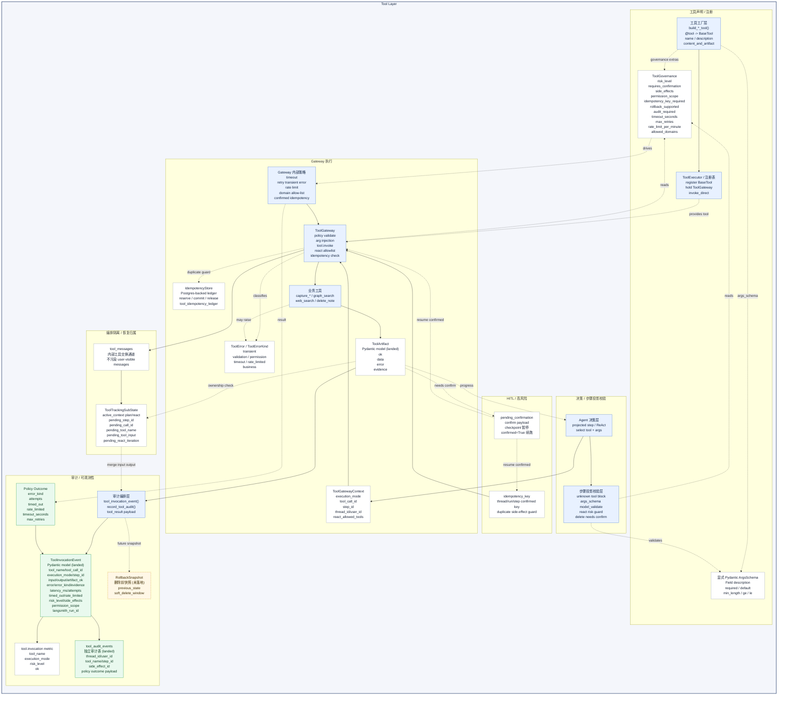

# Tools Model / Layer 依赖类图

```mermaid
flowchart LR
    classDef layer fill:#e8f1ff,stroke:#4f7ccf,stroke-width:1px,color:#10233f
    classDef model fill:#ffffff,stroke:#9aa4b2,stroke-width:1px,color:#172033
    classDef projection fill:#e9f9ee,stroke:#2e9e5b,stroke-width:1px,color:#0c3b22
    classDef future fill:#fff7e6,stroke:#d08b00,stroke-dasharray: 5 3,color:#3b2a00
    classDef pipeline fill:#f4f6fb,stroke:#3a4f7a,stroke-width:2px,color:#10233f

    subgraph ToolLayer["Tool Layer"]
        direction TB

        subgraph Decl["工具声明 / 注册"]
            direction TB
            ToolFactoryLayer["工具工厂层<br/>build_*_tool()<br/>@tool -> BaseTool<br/>name / description<br/>content_and_artifact"]:::layer
            ArgsSchema["显式 Pydantic ArgsSchema<br/>Field description<br/>required / default<br/>min_length / ge / le"]:::model
            ToolGovernance["ToolGovernance<br/>risk_level<br/>requires_confirmation<br/>side_effects<br/>permission_scope<br/>idempotency_key_required<br/>rollback_supported<br/>audit_required<br/>timeout_seconds<br/>max_retries<br/>rate_limit_per_minute<br/>allowed_domains"]:::model
            ToolExecutorLayer["ToolExecutor / 注册表<br/>register BaseTool<br/>hold ToolGateway<br/>invoke_direct"]:::layer
            ToolFactoryLayer -. args_schema .-> ArgsSchema
            ToolFactoryLayer -. governance extras .-> ToolGovernance
            ToolFactoryLayer --> ToolExecutorLayer
        end

        subgraph Decide["决策 / 步骤投影校验"]
            direction TB
            DecisionLayer["Agent 决策层<br/>projected step / ReAct<br/>select tool + args"]:::layer
            StepProjectionValidatorLayer["步骤投影校验层<br/>unknown tool block<br/>args_schema model_validate<br/>react risk guard<br/>delete needs confirm"]:::layer
            DecisionLayer --> StepProjectionValidatorLayer
            StepProjectionValidatorLayer -. validates .-> ArgsSchema
            StepProjectionValidatorLayer -. reads .-> ToolGovernance
        end

        subgraph Exec["Gateway 执行"]
            direction TB
            ToolGatewayContext["ToolGatewayContext<br/>execution_mode<br/>tool_call_id<br/>step_id<br/>thread_id/user_id<br/>react_allowed_tools"]:::model
            GatewayLayer["ToolGateway<br/>policy validate<br/>arg injection<br/>tool.invoke<br/>react allowlist<br/>idempotency check"]:::layer
            GatewayPolicy["Gateway 内部策略<br/>timeout<br/>retry transient error<br/>rate limit<br/>domain allow-list<br/>confirmed idempotency"]:::layer
            ToolError["ToolError / ToolErrorKind<br/>transient<br/>validation / permission<br/>timeout / rate_limited<br/>business"]:::model
            IdempotencyStore["IdempotencyStore<br/>Postgres-backed ledger<br/>reserve / commit / release<br/>tool_idempotency_ledger"]:::model
            BusinessTool["业务工具<br/>capture_* / graph_search<br/>web_search / delete_note"]:::layer
            ToolArtifact["ToolArtifact<br/>Pydantic model (landed)<br/>ok<br/>data<br/>error<br/>evidence"]:::model
            ToolGatewayContext --> GatewayLayer
            GatewayLayer -. reads .-> ToolGovernance
            ToolGovernance -. drives .-> GatewayPolicy
            GatewayPolicy --> GatewayLayer
            GatewayLayer -. classifies .-> ToolError
            GatewayLayer -. duplicate guard .-> IdempotencyStore
            GatewayLayer --> BusinessTool
            BusinessTool -. may raise .-> ToolError
            BusinessTool --> ToolArtifact
        end

        subgraph Isolate["编排隔离 / 恢复归属"]
            direction TB
            ToolMessages["tool_messages<br/>内部工具交换通道<br/>不污染 user-visible messages"]:::model
            ToolTrackingSubState["ToolTrackingSubState<br/>active_context plan/react<br/>pending_step_id<br/>pending_call_id<br/>pending_tool_name<br/>pending_tool_input<br/>pending_react_iteration"]:::model
            ToolMessages --> ToolTrackingSubState
            ToolArtifact -. ownership check .-> ToolTrackingSubState
        end

        subgraph Hitl["HITL / 高风险"]
            direction TB
            PendingConfirmation["pending_confirmation<br/>confirm payload<br/>checkpoint 暂停<br/>confirmed=True 续跑"]:::model
            IdempotencyKey["idempotency_key<br/>thread/run/step confirmed key<br/>duplicate side-effect guard"]:::model
            ToolArtifact -. needs confirm .-> PendingConfirmation
            PendingConfirmation -. resume confirmed .-> IdempotencyKey
            IdempotencyKey --> GatewayLayer
        end

        subgraph Audit["审计 / 可观测性"]
            direction TB
            AuditLayer["审计编排层<br/>tool_invocation_event()<br/>record_tool_audit()<br/>tool_result payload"]:::layer
            ToolInvocationEvent["ToolInvocationEvent<br/>Pydantic model (landed)<br/>tool_name/tool_call_id<br/>execution_mode/step_id<br/>input/output/artifact_ok<br/>error/error_kind/evidence<br/>latency_ms/attempts<br/>timed_out/rate_limited<br/>risk_level/side_effects<br/>permission_scope<br/>langsmith_run_id"]:::projection
            PolicyOutcome["Policy Outcome<br/>error_kind<br/>attempts<br/>timed_out<br/>rate_limited<br/>timeout_seconds<br/>max_retries"]:::projection
            ToolMetric["tool.invocation metric<br/>tool_name<br/>execution_mode<br/>risk_level<br/>ok"]:::model
            ToolAuditRecord["tool_audit_events<br/>独立审计表 (landed)<br/>thread_id/user_id<br/>tool_name/step_id<br/>side_effect_id<br/>policy outcome payload"]:::projection
            RollbackSnapshot["RollbackSnapshot<br/>删除前快照 (未落地)<br/>previous_state<br/>soft_delete_window"]:::future
            ToolArtifact --> AuditLayer
            ToolTrackingSubState -. merge input output .-> AuditLayer
            GatewayPolicy -. result .-> PolicyOutcome
            AuditLayer --> ToolInvocationEvent
            PolicyOutcome --> ToolInvocationEvent
            ToolInvocationEvent --> ToolMetric
            ToolInvocationEvent --> ToolAuditRecord
            AuditLayer -. future snapshot .-> RollbackSnapshot
        end

        ToolExecutorLayer -. provides tool .-> GatewayLayer
        DecisionLayer --> ToolGatewayContext
        GatewayLayer --> ToolMessages
    end

    class ToolLayer pipeline

    %% Cross-subgraph data flow
    PendingConfirmation -. resume confirmed .-> GatewayLayer
    ToolArtifact -. progress .-> DecisionLayer
```
