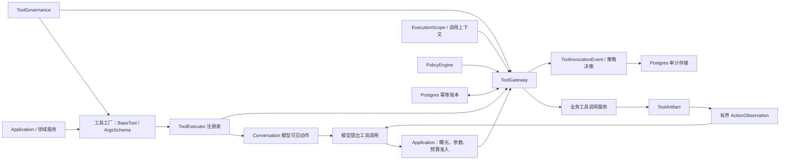

# 工具声明、执行与审计依赖图

```mermaid
flowchart LR
    Service["Application / 领域服务"] --> Factory["工具工厂：BaseTool / ArgsSchema"]
    Governance["ToolGovernance"] --> Factory
    Factory --> Registry["ToolExecutor 注册表"]
    Registry --> Projection["Conversation 模型可见动作"]
    Projection --> Model["模型提出工具调用"]
    Model --> Admission["Application：曝光、参数、预算准入"]
    Admission --> Gateway["ToolGateway"]
    Scope["ExecutionScope / 调用上下文"] --> Gateway
    Governance --> Gateway
    Policy["PolicyEngine"] --> Gateway
    Registry --> Gateway
    Gateway --> Execute["业务工具调用服务"]
    Execute --> Artifact["ToolArtifact"]
    Artifact --> Observation["有界 ActionObservation"]
    Observation --> Model
    Gateway --> Audit["ToolInvocationEvent / 策略决策"]
    Ledger["Postgres 幂等账本"] <--> Gateway
    Audit --> Store["Postgres 审计存储"]
```

工具协议及实际调用坐标由[工具专题](../topics/tools.md)拥有。知识保存、删除和恢复的 Command、确认及 Receipt 由对应 Application 单独维护；语义核验与用户交付见[核验专题](../topics/verification-and-completion.md)。
