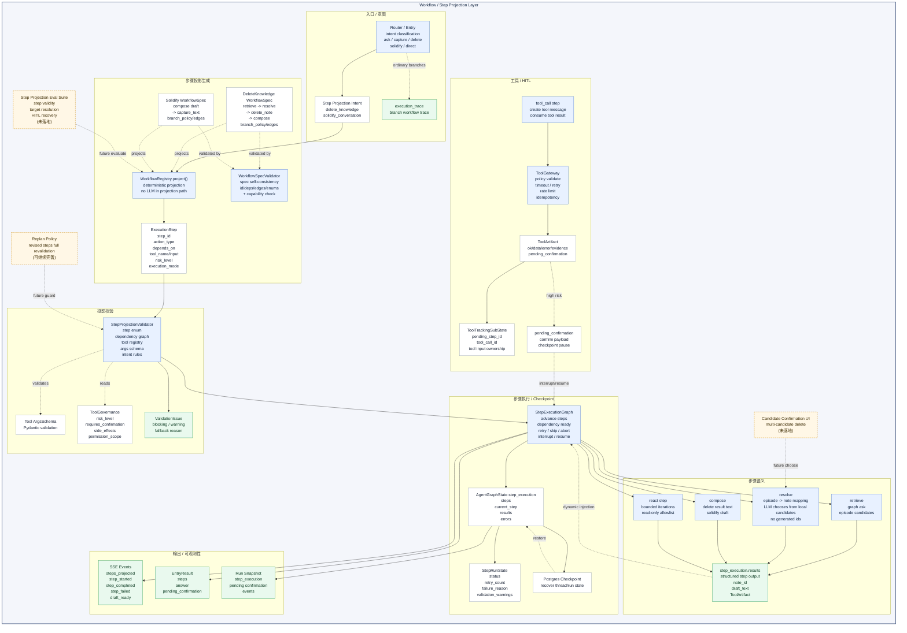

# Workflow / Step Projection Model / Layer 依赖类图

```mermaid
flowchart LR
    classDef layer fill:#e8f1ff,stroke:#4f7ccf,stroke-width:1px,color:#10233f
    classDef model fill:#ffffff,stroke:#9aa4b2,stroke-width:1px,color:#172033
    classDef projection fill:#e9f9ee,stroke:#2e9e5b,stroke-width:1px,color:#0c3b22
    classDef future fill:#fff7e6,stroke:#d08b00,stroke-dasharray: 5 3,color:#3b2a00
    classDef pipeline fill:#f4f6fb,stroke:#3a4f7a,stroke-width:2px,color:#10233f

    subgraph StepProjectionLayer["Workflow / Step Projection Layer"]
        direction TB

        subgraph Entry["入口 / 意图"]
            direction TB
            RouterLayer["Router / Entry<br/>intent classification<br/>ask / capture / delete<br/>solidify / direct"]:::layer
            StepProjectionIntent["Step Projection Intent<br/>delete_knowledge<br/>solidify_conversation"]:::model
            ExecutionTrace["execution_trace<br/>branch workflow trace"]:::projection
            RouterLayer --> StepProjectionIntent
            RouterLayer -. ordinary branches .-> ExecutionTrace
        end

        subgraph StepProjectionGen["步骤投影生成"]
            direction TB
            ProjectorLayer["WorkflowRegistry.project()<br/>deterministic projection<br/>no LLM in projection path"]:::layer
            ExecutionStep["ExecutionStep<br/>step_id<br/>action_type<br/>depends_on<br/>tool_name/input<br/>risk_level<br/>execution_mode"]:::model
            DeleteTemplate["DeleteKnowledge WorkflowSpec<br/>retrieve -> resolve<br/>-> delete_note<br/>-> compose<br/>branch_policy/edges"]:::model
            SolidifyTemplate["Solidify WorkflowSpec<br/>compose draft<br/>-> capture_text<br/>branch_policy/edges"]:::model
            SpecValidator["WorkflowSpecValidator<br/>spec self-consistency<br/>id/deps/edges/enums<br/>+ capability check"]:::layer
            StepProjectionIntent --> ProjectorLayer
            ProjectorLayer --> ExecutionStep
            DeleteTemplate -. projects .-> ProjectorLayer
            SolidifyTemplate -. projects .-> ProjectorLayer
            DeleteTemplate -. validated by .-> SpecValidator
            SolidifyTemplate -. validated by .-> SpecValidator
        end

        subgraph Validate["投影校验"]
            direction TB
            StepProjectionValidatorLayer["StepProjectionValidator<br/>step enum<br/>dependency graph<br/>tool registry<br/>args schema<br/>intent rules"]:::layer
            ArgsSchema["Tool ArgsSchema<br/>Pydantic validation"]:::model
            ToolGovernance["ToolGovernance<br/>risk_level<br/>requires_confirmation<br/>side_effects<br/>permission_scope"]:::model
            ValidationIssue["ValidationIssue<br/>blocking / warning<br/>fallback reason"]:::projection
            ExecutionStep --> StepProjectionValidatorLayer
            StepProjectionValidatorLayer -. validates .-> ArgsSchema
            StepProjectionValidatorLayer -. reads .-> ToolGovernance
            StepProjectionValidatorLayer --> ValidationIssue
        end

        subgraph Execute["步骤执行 / Checkpoint"]
            direction TB
            StepExecutionGraph["StepExecutionGraph<br/>advance steps<br/>dependency ready<br/>retry / skip / abort<br/>interrupt / resume"]:::layer
            AgentStepExecutionState["AgentGraphState.step_execution<br/>steps<br/>current_step<br/>results<br/>errors"]:::model
            StepRunState["StepRunState<br/>status<br/>retry_count<br/>failure_reason<br/>validation_warnings"]:::model
            CheckpointStore["Postgres Checkpoint<br/>recover thread/run state"]:::model
            StepProjectionValidatorLayer --> StepExecutionGraph
            StepExecutionGraph --> AgentStepExecutionState
            AgentStepExecutionState --> StepRunState
            AgentStepExecutionState --> CheckpointStore
            CheckpointStore -. restore .-> AgentStepExecutionState
        end

        subgraph StepSemantics["步骤语义"]
            direction TB
            RetrieveStep["retrieve<br/>graph ask<br/>episode candidates"]:::layer
            ResolveStep["resolve<br/>episode -> note mapping<br/>LLM chooses from local candidates<br/>no generated ids"]:::layer
            ComposeStep["compose<br/>delete result text<br/>solidify draft"]:::layer
            ReactStep["react step<br/>bounded iterations<br/>read-only allowlist"]:::layer
            StepResults["step_execution.results<br/>structured step output<br/>note_id<br/>draft_text<br/>ToolArtifact"]:::projection
            StepExecutionGraph --> RetrieveStep
            StepExecutionGraph --> ResolveStep
            StepExecutionGraph --> ComposeStep
            StepExecutionGraph --> ReactStep
            RetrieveStep --> StepResults
            ResolveStep --> StepResults
            ComposeStep --> StepResults
            ReactStep --> StepResults
            StepResults -. dynamic injection .-> StepExecutionGraph
        end

        subgraph ToolHitl["工具 / HITL"]
            direction TB
            ToolCallStep["tool_call step<br/>create tool message<br/>consume tool result"]:::layer
            ToolGateway["ToolGateway<br/>policy validate<br/>timeout / retry<br/>rate limit<br/>idempotency"]:::layer
            ToolArtifact["ToolArtifact<br/>ok/data/error/evidence<br/>pending_confirmation"]:::model
            ToolTracking["ToolTrackingSubState<br/>pending_step_id<br/>tool_call_id<br/>tool input ownership"]:::model
            PendingConfirmation["pending_confirmation<br/>confirm payload<br/>checkpoint pause"]:::model
            ToolCallStep --> ToolGateway
            ToolGateway --> ToolArtifact
            ToolArtifact --> ToolTracking
            ToolArtifact -. high risk .-> PendingConfirmation
            PendingConfirmation -. interrupt/resume .-> StepExecutionGraph
        end

        subgraph Output["输出 / 可观测性"]
            direction TB
            EventStream["SSE Events<br/>steps_projected<br/>step_started<br/>step_completed<br/>step_failed<br/>draft_ready"]:::projection
            EntryResult["EntryResult<br/>steps<br/>answer<br/>pending_confirmation"]:::projection
            Snapshot["Run Snapshot<br/>step_execution<br/>pending confirmation<br/>events"]:::projection
            StepExecutionGraph --> EventStream
            StepExecutionGraph --> EntryResult
            AgentStepExecutionState --> Snapshot
        end

        ReplanPolicy["Replan Policy<br/>revised steps full revalidation<br/>(可继续完善)"]:::future
        CandidateConfirmUI["Candidate Confirmation UI<br/>multi-candidate delete<br/>(未落地)"]:::future
        StepProjectionEval["Step Projection Eval Suite<br/>step validity<br/>target resolution<br/>HITL recovery<br/>(未落地)"]:::future
        ReplanPolicy -. future guard .-> StepProjectionValidatorLayer
        CandidateConfirmUI -. future choose .-> ResolveStep
        StepProjectionEval -. future evaluate .-> ProjectorLayer
    end

    class StepProjectionLayer pipeline
```
