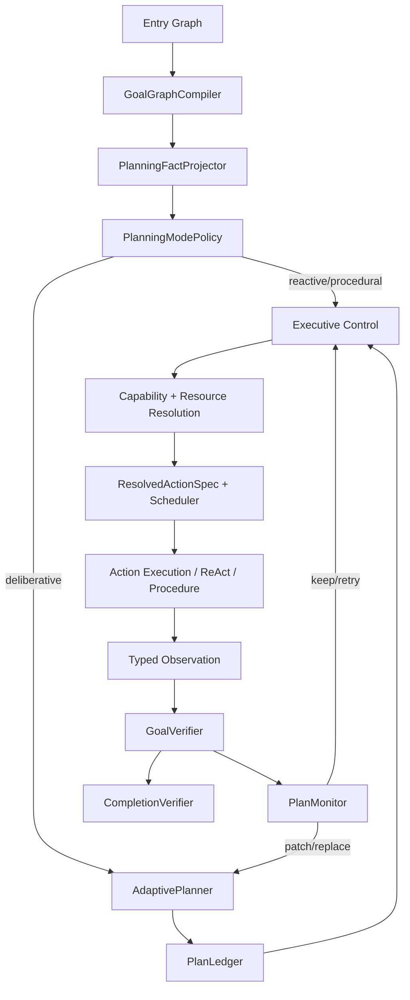

# personalAgent 当前核心架构

本文是当前工程 Agent 主链的事实源，只描述已经进入正式代码并能影响行为的机制。已落地方案不继续保留在 `docs/future`；尚未闭合的本地并行与语义 Steering 见 [并行 Join 与语义 Steering 后续设计](../future/parallel-steering-runtime-design.md)。

## 1. 架构定位

personalAgent 不是按 `ask / capture / research` 选择固定顶层 Workflow 的请求分发器，而是一个 Goal-owned Agent runtime：

```text
EntryInput
  -> TaskAnalyzer
  -> TaskSpec + GoalGraph
  -> PlanningModePolicy
  -> Reactive control | AdaptivePlan | Governed Procedure
  -> Capability Resolution
  -> ResolvedActionSpec
  -> Tool / Retriever / ReAct / A2A / Procedure
  -> Observation
  -> GoalVerifier
  -> PlanMonitor
  -> CompletionVerifier
```

系统只有两类执行语义：

- **开放式任务**：结果契约稳定，路径由 Planner/Executive 根据 Observation 动态选择；
- **受治理过程**：事务拓扑、副作用、审批和恢复不变量稳定，由 Procedure 原子执行。

Capture、Ask、Workspace、Research 等是可组合领域能力，不是顶层路由类别。

## 2. 主链

正式 LangGraph 由四层子图组成：




LangGraph 负责 checkpoint、interrupt/resume 和节点恢复；语义决策由模型组件提出，状态合法性由 contracts、validator、policy、gateway 和 verifier 控制。

## 3. Task 与 Goal

`TaskAnalyzer` 输出 provider-neutral 语义：

- `user_goal`；
- 一个或多个独立、可验证 Goal；
- `result_contract: response | artifact | external_state`；
- success criterion、evidence/freshness 要求和 constraint；
- `ResourceHint` 及其 `origin`；
- typed Goal relation；
- clarification 或 rejection。

Analyzer 不输出 Workflow、Tool、MCP server、Agent、Procedure、step 拓扑或委派姿态。旧 `goal_kind`、Router、GoalInterpreter、Pattern Selector、WorkflowPlanner 和固定动作序列已删除。

`GoalGraphCompiler` 将分析结果编译为：

```text
TaskSpec
SuccessCriterion[]
ResourceRequirement[]
ExecutionLedger
ContextEnvelope
```

每个 Goal 只描述一个可单独验证的结果。例如“保存资料并回答问题”必须拆成 `external_state` 与 `response` 两个 Goal，并用 typed dependency 表达后者是否消费前者结果。Goal 不描述“先搜索、再总结”这类执行方法。

运行期若 Observation 证明原 Goal 需要分解，Planner 只能提出 `GoalDecompositionProposal`。`GoalDecompositionValidator` 校验 observation lineage、task/graph revision、深度、数量、side-effect authority 和 criterion，不能扩大用户授权。

## 4. 自适应规划

### PlanningModePolicy

`PlanningFactProjector` 从正式状态确定性投影：Goal 数量、硬依赖、证据与 freshness 要求、mutation、mandatory Procedure、用户显式 operation 和 provider binding。

模式分为：

| Mode | 语义 |
| --- | --- |
| `reactive` | 一个有界动作可安全推进，Executive 逐轮决策 |
| `deliberative` | 需要短视窗策略、依赖或多目标协调 |
| `procedural` | mandatory Procedure 覆盖当前开放 Goal |

确定性规则先处理明确情况；只有灰区才调用语义 assessor，并受独立预算限制。模型不可用时不会回退到关键词或结果类型动作表。

### AdaptivePlanner

Deliberative 模式创建最多五步的 provider-neutral `AdaptivePlan`。`PlanStep` 只声明：

- Goal 与 criterion 归属；
- semantic objective；
- `CapabilityRequirement` 或 Procedure id；
- dependency；
- observation/verification contract；
- failure class 与 replan policy；
- side-effect intent。

Planner 不能选择具体 Tool、MCP provider、A2A provider或物理并发。模型计划失败时，contract compiler 只根据显式 Task/Goal/Procedure 契约生成安全计划；它不猜测隐藏动作序列。

### PlanLedger

`PlanStep` 不持有可写 status。状态只由 `PlanEvent` 投影：

```text
proposed -> ready -> selected -> running -> observed -> satisfied
                                             -> invalidated/cancelled
```

Plan patch 使用 `plan_id + plan_revision + task_revision + ledger_event_cursor` 做 compare-and-set。Patch 只能修改未启动或已失效步骤，不能改 user Goal、immutable criterion、provider、权限，也不能取消已运行分支。

短 horizon 用尽但仍有开放 Goal 时创建 replacement plan。Replacement 沿用同一个 PlanLedger 事件流并追加 `plan_replaced`，不会丢失旧 plan 的决策历史。

### Frontier 与 Scheduler

`FrontierSelector` 只选择语义 ready set；Resolver 随后为每个 action 绑定能力和资源；Scheduler 独占 dispatch 校验及物理并发。当前生产 profile 的 `max_frontier_width=1`，因此不宣称本地 action 已物理并行。

## 5. Executive

Executive 是在线控制器，不是任务级 Planner。它读取 materialized `ControlState`，只能输出 typed decision：

```text
clarify
activate_skill
execute_meta_capability
delegate
invoke_procedure
request_confirmation
finish
stop
```

Deliberative 模式下，Executive 只能从已验证 frontier 中选择动作；Reactive 模式下，它可以为当前 ready Goal 提出一个有界动作。它不能直接写 Ledger、调用 provider 或宣布完成。

`DecisionValidator` 校验 Goal ownership、dependency、revision、budget、mandatory Procedure、mutation、delegation 和 approval。所有 Goal 已 verified/degraded 时，Finish 提案先于 frontier 选择；最终完成仍必须由 CompletionVerifier 接受。

## 6. Capability、MCP 与 A2A

统一 Capability Registry 收录：

| kind | 执行边界 |
| --- | --- |
| `local_tool` | ToolGateway |
| `mcp_tool` | ToolGateway |
| `retriever` | graph-native retriever 或 ToolGateway |
| `agent` | AgentGateway / SubagentRuntime |

MCP 和 A2A 不通过独立路由进入主链。Planner/Executive 先产生 `CapabilityRequirement`，Resolver 再在全局 registry 中进行 hard eligibility、coverage、policy、provider binding 和 outcome-aware ranking。

Capability descriptor 可以声明完整操作面，例如 `search + read`；Action request 才是实际授权。Resolver 只授予 request operation 与 capability operation 的交集，不能因为选择多操作 capability 扩大当前 action scope。

具体执行链为：

```text
BoundedAction
  -> CapabilityResolver
  -> ResourceAccessResolver
  -> ResolvedActionBuilder
  -> Scheduler.validate_dispatch
  -> ToolGateway | AgentGateway | graph-native executor
```

A2A 使用 submit/poll lifecycle，child artifact 默认不可信，必须回到父 Goal verification。MCP tool 和本地 tool 共享 policy、schema、idempotency、timeout、HITL 与 audit，但 A2A 不伪装成 ToolGateway tool。

## 7. Procedure 与 Mutation

需要稳定事务语义的操作由 `Governed Procedure` 承载，例如知识写入和删除。Procedure applicability 从结构化 domain/resource/operation 判断，不依赖 route 名称。

Mutation 路径遵循：

```text
read-only proposal
  -> evidence
  -> mandatory Procedure
  -> confirmation
  -> commit-time policy/control check
  -> idempotent gateway execution
  -> MutationReceipt
  -> GoalVerifier
```

Planner 可以把 Procedure 作为原子 step，但不能展开、跳过或替换其内部不变量。

## 8. Context Gateway

`ContextProjection` 不只是审计记录，而是模型输入的唯一选择依据：

```text
ContextItem[]
  -> ContextManager.project(purpose, budget)
  -> ContextProjection
  -> ContextProjectionMaterializer
  -> ModelContextGateway
  -> model
```

Planner、Plan patch、Executive、bounded ReAct、PlanMonitor 和 semantic GoalVerifier 都只消费 materialized payload。`omitted_refs/redacted_refs` 不会进入 prompt；runtime/trusted 且 admitted 的 item 才能成为 instruction，tool/provider/候选答案等内容保持 untrusted content。

ReAct 不再把工具 Observation 拼回 instruction 字符串。每轮重新投影 objective、允许工具、先前结果和 Observation，并保留独立 context event。

## 9. Observation、Monitor 与 Verification

Action success 不等于 Goal success。执行结果先形成 typed Observation、artifact ref 和 attempt，再由 GoalVerifier 按 criterion 判定。

PlanMonitor 使用两层策略：

1. 确定性处理 task/goal revision、horizon exhaustion、capability/verification gap 和 retryable technical failure；
2. 对未分类 Observation 使用有预算的 semantic fallback。

Semantic Monitor 只能输出 `none/local_retry/step_invalidated/branch_invalidated`，且 affected step 必须属于已选择集合。非法输出 fail closed。Replan signature 去重、patch/replacement 配额和 model-call budget 防止计划抖动。

GoalVerifier 先执行确定性证据与 receipt 下限，再允许 semantic verifier 降级判断。Semantic verifier 只消费 purpose-scoped context。CompletionVerifier 独占任务完成权，检查全部开放 Goal、required criterion、approval 和 CompletionClaim。

## 10. Artifact、事件与恢复

执行 artifact 的唯一主链事实源是 PostgreSQL `execution_artifacts`：包含 run/step、schema version、hash、retention、redaction、producer 和 consumer refs。未接主链的进程内 `WorkingArtifactStore` 已删除。

状态分三层保存：

- LangGraph checkpoint：当前可恢复执行现场；
- ExecutionLedger / PlanLedger event：Goal 与 Plan 的可回放状态；
- PostgreSQL artifact/replay/run repository：大对象、调试和 replay 引用。

Replay 可以解释 Task revision、Plan snapshot、frontier、resolution、Observation、patch/replacement、verification 和 completion 的因果链。

## 11. Agentic 与确定性边界

当前 Agentic 不来自“有多少 Workflow”，而来自闭环：

```text
Goal
  -> choose mode/strategy
  -> select frontier/action
  -> resolve capabilities
  -> act
  -> observe
  -> verify
  -> keep/retry/patch/replace/finish
```

模型拥有语义不确定性的提案权；代码拥有状态、授权和副作用的裁决权：

| 模型可以决定 | 模型不能决定 |
| --- | --- |
| Goal 语义、灰区 mode、短期策略 | 具体 provider、权限、物理并发 |
| 下一有界动作、ReAct 工具选择 | 调用 allow-list 外工具 |
| Observation 的模糊影响 | 修改 immutable Goal/criterion |
| 开放 criterion 的语义支持度 | 跳过 receipt/evidence/完成门禁 |
| 是否建议 patch/decomposition | 直接写 Ledger 或执行 mutation |

## 12. E2E 例子

### 保存后回答

```text
用户：保存这段资料，然后回答其中的问题
  -> TaskAnalyzer: Goal A external_state, Goal B response, B consumes A
  -> PlanningMode: deliberative/procedural mixed
  -> Plan: Procedure(A) -> capability(B)
  -> knowledge_ingest + confirmation + receipt
  -> GoalVerifier verifies A
  -> horizon replacement advances B
  -> internal retrieval resolves read capability
  -> answer + evidence
  -> GoalVerifier verifies B
  -> CompletionVerifier completes task
```

### 会话总结

```text
用户：总结今天群聊
  -> response Goal + conversation/thread/read requirement
  -> runtime:knowledge_retrieval satisfies scoped read grant
  -> graph-native thread retriever loads platform messages
  -> declared Answer result projects into Agent state
  -> GoalVerifier -> Finish proposal -> CompletionVerifier
```

### 外部资料探索

```text
用户：基于指定代码库分析问题
  -> artifact/response Goal + codebase requirement
  -> AdaptivePlan stays provider-neutral
  -> Resolver may select local, MCP or A2A capability by coverage/policy
  -> bounded ReAct sees only selected tools
  -> provider output remains untrusted Observation
  -> verifier requests more evidence, patches route, or accepts result
```

## 13. 当前边界

以下能力未作为当前事实宣称：

- 本地多个 action 的真实 worker 并发与 all/any/quorum join；
- 用户运行中修改 TaskSpec 的 semantic steering API；
- 对所有 evidence 类型完成统一强类型替换，部分领域 adapter 仍产生 dict payload；
- outcome ranking 的跨进程生产样本闭环。

这些差距不能用 schema、DI、event existence 或 mock 调用冒充已落地能力。

## 14. 验证基线

核心测试覆盖：Task semantic contracts、PlanningMode、provider-neutral plan、Plan CAS、horizon replacement history、semantic monitor、Context Gateway、mandatory Procedure、Capability scope、ReAct ToolGateway、Goal/Completion verification、summary/capture/ask/solidify/clarification 主链。

编排质量集已使用当前契约：以 `primary_result_contract` 取代旧 Router intent，以 `goal_graph_compiled -> planning_mode_assessed -> executive_decision -> decision_validated` 作为 Agentic 主链里程碑。clarification 使用 `waiting`，mutation approval 使用 `blocked_approval`，二者分别中断和恢复。SSE 不再合成已删除的兼容步骤事件。

2026-07-14 本地验证结果：

- `pytest tests -q`：830 passed；
- `pytest evals -q --ignore=evals/open_ragbench`：137 passed，14 skipped（真实外部模型或服务 gate）；
- `pytest evals/open_ragbench -q --num-queries 3 --corpus-mode relevant`：2 passed；
- `compileall src tests evals` 与 `git diff --check`：通过。

Open RAGBench 默认全量候选排序属于长时性能/质量基准，本轮在 10 分钟命令上限内未完成，不能记为通过；日常回归使用文档约定的 3-query smoke，正式检索对比应单独运行全量 benchmark 并保留报告。

任何后续优化必须继续满足：简单任务不被强制规划；复杂任务存在可见短 horizon；模型不可绕过 scope、Procedure、approval 与 verifier；旧 Router、`goal_kind` 动作表和 raw prompt 拼接不得恢复。
