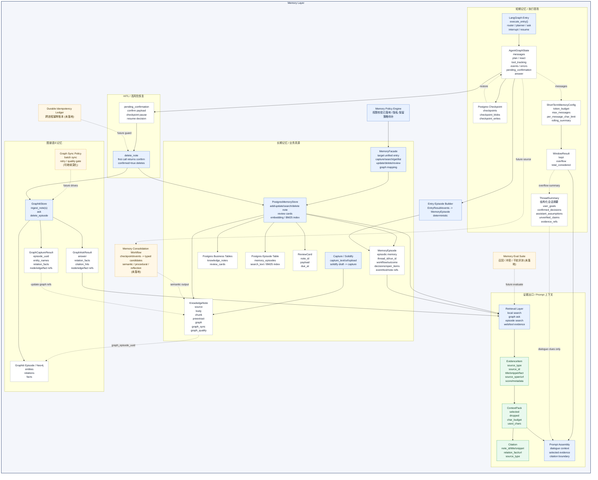

# Agent 记忆层说明

优秀 Agent 的记忆层不是把所有历史都塞进上下文，而是把不同生命周期、不同可信度的信息放到不同载体里，再按任务需要取回。当前项目的记忆层可以理解为“两条真源、一个证据出口”：短期执行现场由 LangGraph checkpoint 承载，长期知识由 Postgres note/chunk/review 承载，最终进入回答的是经过检索、归一、排序和预算筛选后的 evidence。

对应代码主要位于 [src/personal_agent/agent/](../../src/personal_agent/agent/)、[src/personal_agent/memory/](../../src/personal_agent/memory/)、[src/personal_agent/storage/](../../src/personal_agent/storage/)、[src/personal_agent/graphiti/](../../src/personal_agent/graphiti/) 和 [src/personal_agent/core/evidence.py](../../src/personal_agent/core/evidence.py)。

## 设计目标

记忆层需要同时满足两类要求：

- 对模型友好：进入 prompt 的上下文要短、准、可解释，能帮助模型理解指代、当前任务和可引用证据。
- 对系统可靠：对话现场、长期事实、图谱语义、复习材料和 HITL 暂停状态必须有清晰边界，避免历史回答被误当事实。

因此当前记忆层遵循一个核心原则：

```text
执行现场用 checkpoint 恢复
正式知识用长期存储检索
回答依据用 evidence 进入 prompt
```

也就是说，项目里不存在独立的“会话存档表”或进程内 working memory 真源。LangGraph entry 是唯一对话入口，同一 `thread_id` 的对话历史以 checkpoint `messages` 为短期真源；长期事实只有显式 capture / solidify 后才会进入 `knowledge_notes`。

## 当前实现与能力

当前记忆层可以按“短期现场 -> 短期上下文窗口 -> 长期写入 -> 长期检索 -> 图谱语义 -> Evidence 组装 -> Prompt 使用”的链路理解。它不是单一 Memory 类，而是一组围绕生命周期和可信度分工的模型与存储边界。

### 短期执行现场

短期记忆保存 Agent 正在做什么、做到哪一步、是否等待用户确认。它不是普通聊天缓存，而是可恢复的运行现场。

主要载体：

- [AgentGraphState](../../src/personal_agent/agent/orchestration_models.py)：checkpoint-safe 的图执行状态。
- Postgres checkpoint：由 LangGraph Postgres checkpointer 管理 `checkpoints`、`checkpoint_blobs`、`checkpoint_writes`。
- `messages`：同一 `thread_id` 下跨 run 累积的用户/助手对话。
- `plan / react / tool_tracking / events / execution_trace / pending_confirmation`：当前执行、恢复、确认和审计需要的状态。

这层的价值是保证同一 thread 内的多轮任务可连续、可暂停、可恢复。高风险确认、solidify 草稿、计划步骤结果都先保存在 checkpoint 中；只有正式写入 `knowledge_notes` 后，才算长期知识。

### 短期上下文窗口

checkpoint `messages` 是同一 thread 内累积的全量真源，但不会原样进入 prompt。进入 router、planner、ask、direct_answer 前，会经过 [short_term_context.py](../../src/personal_agent/agent/short_term_context.py) 的统一策略。

当前已落地能力：

- token 预算：用字符启发式估算 token，CJK 和拉丁字符按不同折算率处理。
- 条数上限：同时受 `max_messages` 和 `token_budget` 约束。
- 单条截断：超长消息保留首尾，中间插入截断标记。
- 角色过滤：只保留 user / assistant，过滤工具消息等内部消息。
- 排除当前轮：entry 分支可用 `exclude_latest=True` 避免本轮输入重复进入上下文。
- 滚动摘要：溢出消息达到触发条件时，可调用 `summarize_thread` 生成 `[早前对话摘要]`。
- 纯文本预算：planner query understanding 使用 `char_budget` 做字符级裁剪。

当前滚动摘要仍是轻量 prompt 策略，有两个需要明确治理的风险：

- 每次重新摘要可能不稳定：同一批历史对话可能被 LLM 压出不同重点，影响 planner、ask 或 direct answer 的行为一致性。
- 摘要可能把助手推测写成事实：历史助手回答里的猜测、方案或未验证判断，如果被摘要成确定表述，会污染后续上下文。

因此，进入 prompt 的短期对话线索必须带有明确边界：只用于理解指代、用户目标、已确认选择和待办状态，不作为事实证据；如果与当前可追溯 evidence、工具结果或长期知识冲突，以当前证据为准。

### 长期知识写入

长期记忆保存用户希望 Agent 长期记住、可反复检索和引用的知识。它由 [PostgresMemoryStore](../../src/personal_agent/storage/postgres_memory_store.py) 管理，核心业务表是 `knowledge_notes` 和 `review_cards`。

写入来源：

- `capture_text`：把用户输入的知识沉淀为 note。
- `capture_url`：提取链接正文后沉淀为 note。
- `capture_upload`：提取上传文件内容或元数据后沉淀为 note。
- `solidify_conversation`：先在 checkpoint 形成草稿，再通过 capture 写入长期知识。

长期知识采用 parent/chunk 双层结构：parent note 表达文档级或主题级知识，chunk note 保存原文片段、证据定位和 citation 单元。`parent_note_id / chunk_index / source_span` 用来建立文档和片段关系，避免长文直接塞进 prompt。

### 图谱语义同步

长期 note 可以同步到 Graphiti。Postgres 保存原文、摘要、chunk 和 episode 映射；Graphiti 保存实体、关系和 episode 级语义索引。

当前实现中的关键边界：

- `KnowledgeNote.graph_sync` 记录图谱同步状态：`idle / pending / synced / failed / skipped`。
- `KnowledgeNote.graph` 保存 episode、entity、relation、node、edge、fact 引用。
- `GraphCaptureResult` 是图谱写入结果模型，屏蔽 Graphiti 具体返回结构。
- `graph_episode_uuid` 是 Postgres note/chunk 与 Graphiti episode 的回溯桥。

因此，Graphiti 不是替代 `knowledge_notes` 的长期事实库，而是长期知识的语义检索层。真正用于原文回溯和引用的业务真源仍然在 Postgres note/chunk。

### 长期检索与证据组装

Ask 路径不会直接把所有 note 塞进 prompt，而是先从本地长期知识、图谱结果和必要的外部工具结果中生成 evidence，再统一排序和裁剪。

当前检索与证据链路：

- `PostgresMemoryStore.search_notes()`：基于 `search_text`、`search_vector`、embedding 和 filters 做本地 note/chunk 检索。
- `GraphitiStore.ask()`：基于图谱 episode、edge、fact 做语义检索。
- `EvidenceItem`：把 graph fact、note、chunk、web、tool 结果统一成证据项。
- `ContextPack`：对 evidence 去重、排序、按字符预算选择进入 prompt 的证据。
- `Citation`：从 selected evidence 派生用户可见引用。

这层的价值是把“模型看到的上下文”从存储结构中解耦出来。存储可以是 note、chunk、Graphiti fact 或 web hit，但进入 prompt 前都必须变成统一 evidence，并经过预算和引用边界控制。

### HITL 与删除恢复

高风险删除不是直接改长期存储。`delete_note` 首次执行只返回确认 payload，Graph 将其写入 `AgentGraphState.pending_confirmation` 并中断。用户确认后，Graph 从 checkpoint 恢复，给同一步骤补上 `confirmed=True` 和 `idempotency_key`，再次调用工具才真正删除 note、chunk、review card 和可用的图谱 episode。

用户拒绝时，Graph 会把当前步骤标记为 skipped，递归跳过依赖它的后续步骤，清空 `pending_confirmation`，并返回取消说明。

### 复习材料

`review_cards` 保存与长期 note 关联的复习卡。capture 流程生成 note 后会派生到期提醒卡，digest 接口返回近期 note 和到期 card，用于知识回顾。复习卡依附于长期知识，不保存对话上下文。

## 核心模型与契约

### AgentGraphState 短期记忆状态

`AgentGraphState` 是 LangGraph checkpoint 中最重要的短期记忆模型。它保存可恢复过程状态，不保存长期事实。

核心字段：

- `run_id / thread_id / user_id / session_id`：运行和会话身份。
- `messages`：同一 thread 内跨 run 累积的用户/助手对话。
- `tool_messages`：当前动作的内部工具交换通道，不污染用户可见对话。
- `router_decision`：入口意图分类结果。
- `plan`：计划步骤、步骤结果、当前步骤和重试信息。
- `react`：ReAct 迭代、允许工具、停止原因和结果。
- `tool_tracking`：当前工具调用归属，用于恢复后消费正确结果。
- `citations / matches`：回答阶段的轻量证据摘要。
- `pending_confirmation`：等待用户确认的高风险动作。
- `answer / answer_completed`：当前 run 的最终输出状态。
- `events / errors`：运行事件和错误。

这个模型的边界很关键：它是“运行现场”，不是长期事实库。大文本、完整检索结果和业务知识应通过引用或长期存储承载，避免 checkpoint 膨胀。

### ShortTermMemoryConfig 与 WindowResult

短期上下文策略由 `ShortTermMemoryConfig` 配置，由 `apply_window()` 和 `build_dialogue_context()` 执行。

| 能力 | 字段 / 模型 | 当前用途 |
| --- | --- | --- |
| token 预算 | `token_budget` | 从最近消息往前累加，防止 prompt 被历史对话撑爆 |
| 条数上限 | `max_messages` | 限制进入 prompt 的对话轮数 |
| 单条截断 | `per_message_char_limit` | 超长消息保留首尾，避免单条消息吞掉窗口 |
| 纯文本预算 | `char_budget` | 给 planner query understanding 等纯文本场景使用 |
| tokenizer | `tokenizer_enabled`、`tokenizer_encoding` | 优先用 tiktoken 做预算，缺失时回退到 CJK/Latin 启发式 |
| 滚动摘要 | `rolling_summary_enabled`、`rolling_summary_trigger` | 对溢出旧消息增量生成 `[结构化短期摘要]` |
| 结果模型 | `WindowResult`、`DialogueContextResult` | 输出 kept、overflow、total_considered 和可回写的 `ThreadSummary` |

这层把“checkpoint 存全量”和“prompt 用窗口”分开：数据不会因为 prompt 裁剪而丢失，只是本轮不会全部喂给模型。

### ThreadSummary 结构化短期摘要

当前已经新增独立 `ThreadSummary` 模型，并作为 `AgentGraphState.thread_summary` 随 LangGraph checkpoint 持久化。`build_dialogue_context_result()` 会在窗口溢出时把已有 `ThreadSummary` 与新增 overflow 对话一起交给 `compress_context`，再把结构化结果回写到 state，避免每轮重复总结同一批旧历史。

当前结构：

| 分类 | 含义 | Prompt 使用边界 |
| --- | --- | --- |
| `user_goals` | 用户当前想完成的任务和目标 | 只作为意图线索 |
| `user_constraints` | 用户明确提出的约束、偏好、格式要求 | 可作为会话内约束，但不等同外部事实 |
| `confirmed_decisions` | 用户已经确认的选择、拒绝项、执行方向 | 可作为本 thread 的决策状态 |
| `pending_tasks` | 尚未完成或等待继续处理的事项 | 只作为任务状态 |
| `open_questions` | 尚未澄清的问题和冲突点 | 不能当事实使用 |
| `assistant_assumptions` | 助手提出但用户未确认的假设、判断、方案 | 不能当事实，使用前必须重新验证 |
| `unverified_claims` | 对项目、外部世界或资料内容的未验证声明 | 不能当事实，必须依赖 evidence / tool result |
| `evidence_refs` | 如果摘要引用了工具、note 或 web 证据，记录来源 id | 只有能回溯到 evidence 时才可作为事实线索 |
| `context_notes` | 兼容旧字符串摘要或无法归类的上下文线索 | 只作为对话理解线索 |

配套 prompt 规则应该明确：

```text
短期摘要是历史对话线索，不是事实证据。
user_goals、user_constraints、confirmed_decisions 可用于理解当前任务。
assistant_assumptions、unverified_claims、open_questions 不能作为事实使用。
项目事实、外部事实和长期知识结论必须依赖当前 evidence、工具结果或长期记忆检索。
如果摘要与当前证据冲突，以当前证据为准。
```

`ThreadSummarizer.compress_context()` 的 prompt 要求只输出 JSON，并明确把助手历史回复放入 `assistant_assumptions`，把没有 evidence 或用户确认支撑的判断放入 `unverified_claims`。旧版纯文本 summarizer 输出仍会被兼容包装进 `context_notes`，但新主链路按结构化字段渲染。

### MemoryFacade 长期记忆入口

`MemoryFacade` 是长期记忆统一入口的设计锚点，内部持有 `PostgresMemoryStore`。它不管理短期对话历史，因为短期记忆完全属于 LangGraph checkpoint。

当前职责：

- 绑定 `user_id:session_id` 生命周期。
- 给 `AgentService` 提供统一 memory 入口。
- 明确长期知识和短期 checkpoint 的边界。

当前已经完成 P0 收敛：`AgentRuntime`、`ingestion_pipeline`、`runtime_ask`、`web/api`、`delete_note` 工具、structural retriever 和编排删除解析都通过 `MemoryFacade` 访问长期记忆，不再直接操作 `PostgresMemoryStore`。外部层只表达“我要做什么记忆操作”，不直接拼装 `knowledge_notes`、`review_cards`、chunk 或 graph mapping 这些内部结构。

这个类的设计价值在于隔离调用方：未来即使增加多个长期存储后端、权限过滤、用户画像、workspace 策略、审计或记忆压缩，也可以在 facade 层收敛。

### PostgresMemoryStore 长期知识存储

`PostgresMemoryStore` 是 note 和 review 的业务真源。

当前核心表：

| 表 | 记忆类型 | 保存内容 | 主要写入来源 | 生命周期 |
| --- | --- | --- | --- | --- |
| `knowledge_notes` | 长期知识 | parent note、chunk note、source、graph refs、search_text、search_vector、embedding_vector | capture / solidify / graph sync | 长期保存，除非用户删除 |
| `review_cards` | 长期复习记忆 | 复习卡 payload、note_id、due_at | capture / digest 相关流程 | 长期保存，随 note 删除清理 |
| `checkpoints` / `checkpoint_blobs` / `checkpoint_writes` | 短期现场 | LangGraph checkpoint state | LangGraph checkpointer | 同一 thread 的对话与恢复周期 |

`knowledge_notes` 的外层字段服务检索和索引：`id`、`user_id`、`parent_note_id`、`source_fingerprint`、`graph_episode_uuid`、`search_text`、`search_vector`、`embedding_vector`、`created_at`、`updated_at`。完整 `KnowledgeNote` 放在 `payload` JSONB 中。

### KnowledgeNote 长期知识模型

`KnowledgeNote` 是长期知识的业务模型，也是 note/chunk 的统一载体。

核心子模型：

- `NoteSource`：source type、source ref、fingerprint、metadata。
- `NoteBody`：title、content、summary。
- `NoteChunk`：parent_note_id、index、source_span。
- `NotePreExtract`：section_map、graph_worthy、status、topic。
- `NoteGraphKnowledge`：episode、entities、relations、node_refs、edge_refs、fact_refs。
- `NoteGraphSync`：图谱同步状态和错误。
- `NoteGraphQuality`：实体数量、关系数量、弱关系等质量指标。

同一个模型既可以表达 parent note，也可以表达 chunk note。区别由 `chunk.parent_note_id` 决定：为空表示 parent，非空表示 chunk。

### GraphCaptureResult / GraphAskResult 图谱边界

`GraphCaptureResult` 和 `GraphAskResult` 是图谱 provider 与核心证据层之间的边界模型。它们位于 `core`，避免核心 evidence 层反向依赖具体的 Graphiti 实现。

当前用途：

- `GraphCaptureResult`：承接图谱写入结果，包括 episode、entity、relation、node、edge、fact 引用。
- `GraphAskResult`：承接图谱查询结果，包括 answer、relation facts、citation hits、node/edge/fact refs。
- `GraphCitationHit`：表示 episode 级 citation 命中，后续可映射回 note/chunk。

这层的价值是 provider-neutral：现在可以接 Graphiti，也保留了未来接 structural retriever 或其他 graph provider 的空间。

### EvidenceItem / ContextPack 证据上下文

`EvidenceItem` 是回答阶段的统一证据模型，`ContextPack` 是进 prompt 前的证据包。

`EvidenceItem.source_type` 当前支持：

- `graph_fact`：图谱事实或关系。
- `note`：长期 parent note。
- `chunk`：长期 chunk note。
- `web`：外部搜索结果。
- `tool`：工具输出。

`ContextPack` 保存 selected / dropped 两组 evidence，并记录 `char_budget` 与 `used_chars`。只有 selected evidence 会进入 prompt；citations 也由 selected evidence 派生，避免引用和上下文不一致。

### PendingConfirmation HITL 暂停状态

`pending_confirmation` 是 checkpoint 中的高风险动作暂停状态。以删除笔记为例，payload 通常包含：

```json
{
  "step_id": "del-3",
  "action_type": "delete_note",
  "note_id": "note-123",
  "title": "DNS",
  "summary": "DNS 是域名系统...",
  "description": "将删除笔记「DNS」及其关联的复习卡片和图谱映射。"
}
```

它不是长期知识，也不是业务审批表。它属于当前 thread/run 的可恢复执行现场。

## Typed Long-Term Memory 与 Episodic Memory 设计

当前项目的长期记忆主线是 semantic / document memory：用户显式 capture 或 solidify 后，内容进入 `knowledge_notes`，并通过 parent/chunk、Graphiti episode 和 evidence 支撑可追溯问答。

LangGraph / LangMem 语境中常见的长期记忆还会进一步区分：

| 类型 | 记什么 | 当前项目状态 |
| --- | --- | --- |
| `semantic` | 用户事实、偏好、知识、文档内容 | 已用 `knowledge_notes` parent/chunk 承载，是当前主线 |
| `episodic` | 某次任务、会话、workflow 的经历、结果和决策过程 | 已用 `MemoryEpisode` / `memory_episodes` 落地 deterministic run episode |
| `procedural` | 用户偏好的做事方式、稳定流程、操作经验 | 已用 `MemoryItem` / `memory_items(memory_type='procedural')` 建立独立存储边界 |
| `reflection` | 失败复盘、经验教训、后续改进 | 已用 `MemoryItem` / `memory_items(memory_type='reflection')` 建立候选存储边界，失败 run 可自动生成 candidate |

当前已经把 procedural / reflection 从“散落在 workflow/docs/tests 里的隐性经验”提升为可存储、可检索、可审计的 typed memory item。需要继续谨慎的是自动生成策略：短期对话里混有用户事实、临时想法、助手猜测、工具中间结果和被否定方案，不能直接总结成长期事实。因此后续自动提炼这些类型时，仍应该走 Memory Consolidation Workflow，而不是把短期摘要直接写入 `knowledge_notes` 或 `memory_items`。

### 为什么要区分 episodic memory

`episodic memory` 记录的是“发生过什么、做过什么、结果如何”，不是“什么事实一定为真”。它对当前工程的价值主要在五个方面：

1. 跨 thread 延续任务

   checkpoint 适合同一 `thread_id` 内恢复现场，但用户新开会话后说“继续上次那个面试文档”时，系统需要一个长期可检索的任务经历索引。Episodic memory 可以记录上次 workflow 的目标、结果、相关文件和遗留事项。

2. 任务复盘和可解释性

   `AgentEvent` 很细，适合调试；episode 更像任务卡片，适合回答“上次改了什么”“为什么这样设计”“做到哪一步了”“还有什么没做”。

3. 降低 checkpoint 历史查询压力

   checkpoint 是恢复现场，不适合长期承担历史知识检索。workflow 完成后可以把原始 messages/events/tool audit 压成 episode，长期保存轻量索引。

4. 反哺 workflow、eval 和 UI 改进

   episode 可以记录 workflow、outcome、failure_point、HITL decision、candidate_count 等字段，后续统计哪些 workflow 经常失败、用户在哪里拒绝、resolve 为什么找不到目标。

5. 为 procedural memory 提供证据来源

   procedural memory 不应该从单次对话直接生成。多个相似 episode 反复出现后，才能提炼出“用户偏好的做事方式”或“项目稳定操作流程”。

### Episodic memory 如何获得

Episode 应该从当前工程已有的短期执行现场和审计材料生成：

```text
LangGraph checkpoint
  messages / events / plan / react / tool_tracking / pending_confirmation / answer / errors
    +
ToolInvocationEvent
  tool_name / input / output / artifact.ok / error / side_effects
    +
EntryResult / run snapshot / verifier result
    ↓
Episode Builder
    ↓
MemoryEpisode
```

当前实现已落地第一类：

- 确定性 episode：不调用 LLM，直接从 `EntryResult` 和事件生成 workflow、run_id、thread_id、outcome、工具调用、HITL 决策、错误类型和相关 note refs，并写入 `memory_episodes`。

仍待增强：

- LLM 总结型 episode：把 messages/events 压成任务摘要、关键决策、遗留问题和下次继续线索。LLM 只能总结已发生事件，不能创造事实，输出必须带 source refs。

不要每轮对话都生成 episode。推荐在这些边界点生成：

- `run_completed`。
- workflow completed / failed / cancelled。
- HITL 确认或拒绝后。
- 重要副作用后，例如写入 note、删除 note、图谱同步失败。
- 用户明确要求“记一下这次过程 / 总结这次修改 / 下次继续”。

### Episodic memory 如何保存

当前已引入独立 `memory_episodes` 表，避免把经历记录混进 `knowledge_notes` 的事实知识主线：

```text
memory_episodes
  id
  user_id
  session_id
  thread_id
  run_id
  workflow
  title
  summary
  outcome
  entry_text
  payload
  event_refs
  tool_refs
  note_refs
  decisions
  open_items
  search_text / BM25 index
  created_at
  updated_at
```

对应核心模型是：

```python
class MemoryEpisode(BaseModel):
    id: str
    memory_type: Literal["episodic"]
    user_id: str
    session_id: str
    thread_id: str
    run_id: str
    workflow: EntryIntent
    title: str
    summary: str
    outcome: Literal["completed", "failed", "waiting_confirmation", "cancelled"]
    entry_text: str
    decisions: list[str] = []
    open_items: list[str] = []
    event_refs: list[str] = []
    note_refs: list[str] = []
    tool_refs: list[str] = []
    metadata: dict[str, Any] = {}
    created_at: datetime
    updated_at: datetime
```

Memory Consolidation Workflow 未来可以通过 `memory_candidates` 过渡：

```text
memory_candidates
  -> policy / confirmation
  -> semantic 写 knowledge_notes
  -> episodic 写 memory_episodes
```

不建议直接把所有 episode 写入 `knowledge_notes`，因为 semantic note 是事实证据主线，而 episode 是历史经历索引。两者在 Ask 中的可信边界不同。

### Episodic memory 什么时候使用

Episodic memory 不应该默认参与所有事实问答。它适合这些场景：

- 用户问历史执行：例如“上次我们改了什么”“之前为什么这么设计”“上次删除成功了吗”。
- 跨 thread 续做任务：例如“继续上次那个面试文档”“接着改 planning 那块”。
- workflow 调试和产品分析：统计 delete/solidify/resolve 的失败点、用户拒绝率、工具失败率。
- procedural memory 的来源：多个 episode 聚合后提炼稳定做事方式。
- 项目过程类回答：例如“这个项目为什么没有用通用 planner”“LangExtract 是怎么被引入的”。

Ask 检索时可以由 query planner 加一个开关：

```text
needs_episodic_context = true
```

当问题包含“上次 / 之前 / 为什么当时 / 做过什么 / 继续那个任务”等历史执行意图时，检索 `memory_episodes`。如果问题是普通事实问答，仍优先 semantic note/chunk、graph fact 和 web/tool evidence。

使用边界必须明确：

```text
semantic memory 说明“什么是真的”
episodic memory 说明“某次发生过什么”
procedural memory 说明“以后倾向怎么做”
```

如果 episodic 与 semantic 冲突，不能直接用 episode 覆盖 semantic，只能提示“这是历史记录 / 旧决策 / 某次会话中的说法”，事实结论仍应依赖当前 selected evidence。

### Memory Consolidation Workflow

自动从短期记忆生成长期记忆是可行方向，但必须先生成候选，而不是直接写正式记忆。

推荐新增 workflow：

```text
Collect thread context
  -> Extract memory candidates
  -> Classify memory type
  -> Dedupe / conflict check
  -> Policy check
  -> User confirm or auto-approve
  -> Persist typed memory
```

候选记忆应至少包含：

```json
{
  "memory_type": "semantic | episodic | procedural | reflection",
  "content": "...",
  "confidence": 0.82,
  "source_thread_id": "...",
  "source_run_id": "...",
  "source_message_ids": ["..."],
  "evidence_refs": [],
  "status": "candidate | confirmed | rejected | superseded",
  "requires_confirmation": true
}
```

不同类型的默认策略不同：

| 类型 | 自动写入建议 | 保护措施 |
| --- | --- | --- |
| semantic | 谨慎，建议用户确认 | 来源、置信度、冲突检测、可删除 |
| episodic | 可半自动 | thread/run refs、outcome、event refs、retention |
| procedural | 必须谨慎 | 多个 episode 支撑、用户确认、版本化 |
| reflection | 可半自动 | 绑定失败 run / eval / verifier 结果 |

这条 workflow 可以复用当前已有能力：checkpoint 提供短期现场，`solidify_conversation` 提供对话草稿雏形，`MemoryFacade` 提供长期入口，HITL 提供确认，Evidence/source refs 提供回溯。

## Model / Layer 依赖类图

这张图描述“记忆层如何消费模型与存储契约”，不是 Python 继承关系。为表达分层，沿用 [tools.md](tools.md) 的约定：

- 蓝色节点是处理层。
- 白色节点是已落地的模型 / 契约。
- 绿色节点是已落地、被多层共同消费的证据 projection。
- 黄色虚线节点是尚未落地的未来模型 / 后端能力。

关键边界需要特别明确：

- `AgentGraphState` 是短期执行现场，保存 checkpoint 可恢复状态，不是长期事实库。
- `ShortTermMemoryConfig` 只决定 prompt 窗口，不决定数据是否保留；完整 thread 对话仍在 checkpoint。
- `ThreadSummary` 已落地为结构化会话状态，随 checkpoint 持久化；它只作为对话线索，不替代 evidence。
- `MemoryFacade` 是长期记忆统一入口；runtime、API、工具、ingestion、structural retriever 和编排删除解析都通过它访问长期记忆。
- `KnowledgeNote` 是长期业务真源；Graphiti episode 是语义索引和关系检索层。
- `EvidenceItem / ContextPack` 是回答前的统一证据出口，避免 prompt 直接依赖底层存储结构。



## 与优秀 Agent 记忆层的对照

| 维度 | 优秀 Agent 记忆层 | 当前项目状态 |
| --- | --- | --- |
| 短期 / 长期分层 | 执行现场和长期事实分离 | 已用 checkpoint 承载短期现场，`knowledge_notes` 承载长期知识 |
| 对话真源 | 同一 thread 对话可恢复，prompt 有窗口策略 | 已用 checkpoint `messages` 做真源，并通过 `short_term_context` 裁剪 |
| 长期知识模型 | 文档级知识和片段级证据可回溯 | 已用 parent/chunk note、`source_span`、citation 单元表达 |
| 图谱记忆 | 图谱用于语义关系，不替代原文真源 | 已用 Graphiti episode 与 Postgres note/chunk 映射 |
| 证据出口 | 多来源检索结果归一为 evidence，再进 prompt | 已用 `EvidenceItem`、`ContextPack`、`Citation` 收敛 |
| HITL 恢复 | 高风险动作可暂停、确认、恢复 | 已用 checkpoint `pending_confirmation` 支持删除确认 |
| prompt 边界 | 历史对话不直接当事实，证据优先 | 已明确短期对话只用于指代和目标理解 |
| 短期摘要治理 | 摘要应区分目标、决策、假设、未验证声明和证据引用 | 已有 checkpoint 持久化 `ThreadSummary`、结构化渲染和摘要边界提示 |
| 复习记忆 | 长期知识可转化为复习材料 | 已有 `review_cards` 和 digest 返回 |
| Typed long-term memory | 区分 semantic / episodic / procedural / reflection | 已有 semantic notes、episodic episodes、procedural/reflection typed memory items；自动 consolidation 待补齐 |
| 权限与隐私 | 用户级、session、来源和保留策略可配置 | 当前有 user/session 隔离和基础 PolicyEngine；隐私、保留、workspace 策略仍待增强 |
| 评测闭环 | 评估召回、遗忘、冲突、长会话干扰 | 当前有单元测试，专项 memory eval 仍可补齐 |

## 主要差距

当前实现已经完成记忆层的核心边界：checkpoint 短期现场、结构化 `ThreadSummary`、Postgres 长期知识、Graphiti 语义索引、Evidence 统一出口、`MemoryFacade` 统一入口、PolicyEngine 权限门、图谱同步对账基础版、note 版本/冲突状态，以及 semantic / episodic / procedural / reflection 的 typed memory 边界。后续差距应聚焦在自动化治理、质量评测和长会话稳定性：

1. 自动 Memory Consolidation 还未形成完整 workflow

   procedural / reflection 已经有 `memory_items` 存储边界，但从 checkpoint、episode、eval、verifier 和用户反馈中自动提炼候选、合并、确认、拒绝和 supersede 的工作流还没有落地。

2. 短期摘要已有结构化基础，但还缺少质量评测和自动修正

   当前 `ThreadSummary` 已经分开保存目标、约束、决策、待办、开放问题、助手假设、未验证声明和 evidence refs，并随 checkpoint 持久化。后续还需要评估摘要漂移、字段误分、过期任务清理和跨长会话的增量稳定性。

3. 隐私、保留期限和 workspace 策略仍需细化

   当前已有 user/session 隔离和统一 PolicyEngine owner 校验，但 workspace 级访问控制、来源类型、敏感级别、长期保留期限、自动清理策略和审计查询还需要继续增强。

4. 图谱对账已可用，但自动运维还不完整

   当前已经能查询同步状态、重试失败、发现弱质量和孤儿 episode。下一步是 graph provider 侧 episode inventory 的原生分页查询、独立审计落库、自动调度和 rebuild 策略。

5. 知识版本已可标记，但自动冲突治理还不完整

   当前已经支持 supersede / deprecated / conflicted 状态，并能默认排除旧知识。后续还需要自动冲突检测、source trust 策略、时间新鲜度排序和冲突证据的用户可见提示。

6. 记忆质量还缺少专项评测

   当前有短期窗口、evidence、检索和流程测试，但还没有系统化 memory eval，例如长期召回率、错误引用率、历史干扰率、冲突处理准确率、图谱孤儿证据率和 episodic 延续命中率。

## 按优先级排序的演进建议

以下列表只保留尚未完整落地的演进项。已落地的 PolicyEngine、图谱对账基础版、知识版本/冲突状态、typed long-term memory、结构化 ThreadSummary 已经合并进上方“当前实现”和“主要差距”，不再占用待办优先级。

### P0：建立 Memory Consolidation Workflow

自动从短期记忆生成长期记忆应该先进入候选区：

- 收集 checkpoint messages/events。
- 抽取 typed memory candidates。
- 分类 semantic / episodic / procedural / reflection。
- 做去重、冲突检测、敏感性和保留策略判断。
- 按类型决定用户确认或 policy auto-approve。
- 再写入 `knowledge_notes`、`memory_episodes` 或 `memory_items`。

这一步可以把 `solidify_conversation` 从单一“对话草稿入库”升级为更通用的 consolidation workflow，同时避免把短期摘要直接当长期事实。

### P1：完善 Evidence Rerank 与引用治理

当前 `ContextPack` 已经能统一 evidence 并按预算选择。后续可以继续增强：

- 引入 cross-encoder 或 LLM reranker。
- 对 note/chunk/graph/web/tool 设定可解释权重。
- 对 orphan graph fact 做更严格降权或屏蔽。
- 引用必须来自 selected evidence，继续保持 prompt 与 citation 一致。
- 对证据不足的回答触发澄清或拒答。

### P2：建立 Memory Eval Suite

需要用评测证明记忆层不是“看起来有检索”，而是真的提升回答质量：

- 长期知识召回率。
- 引用正确率。
- 历史对话干扰率。
- 旧知识过期识别率。
- 图谱事实孤儿率。
- chunk 命中和 parent 回溯准确率。
- HITL 恢复和删除一致性。
- episodic memory 的任务延续命中率、错误归因率和旧决策污染率。

这一步会让记忆层从工程实现变成可持续优化的系统能力。

## 面试讲解口径

面试时不要把记忆层讲成“我把聊天记录存起来了”，而要讲成：

> 我把记忆层按生命周期和可信度拆开：当前执行现场放在 LangGraph checkpoint，用于多轮对话、暂停和恢复；真正长期事实必须通过 capture 或 solidify 写入 Postgres note/chunk；图谱只做语义索引和关系检索，原文证据仍回到 note/chunk；最终进入 prompt 的不是原始存储，而是统一 Evidence 和 ContextPack。

可以按四层来讲：

1. 短期执行现场层

   同一 `thread_id` 的对话、计划、ReAct、工具结果、HITL 暂停状态都在 `AgentGraphState` 和 Postgres checkpoint 中。这样多轮任务、用户确认、恢复执行都能回到同一个现场。短期摘要已升级为结构化 `ThreadSummary`，区分用户目标、已确认决策、助手假设和未验证声明，但它仍只作为会话线索，不能替代 evidence。

2. 长期知识存储层

   只有用户显式 capture 或 solidify 后，内容才进入 `knowledge_notes`。长期知识采用 parent/chunk 结构，parent 保存主题级摘要，chunk 保存片段证据和 `source_span`，避免把长文直接塞进上下文。

3. 图谱语义索引层

   Graphiti 负责实体、关系和 episode 检索，但它不是长期事实真源。Postgres note/chunk 通过 `graph_episode_uuid` 映射回 Graphiti，回答时可以用图谱找到关系，再回到 note/chunk 做原文引用。

4. Evidence 出口层

   本地 note、chunk、graph fact、web 和 tool 结果都会统一成 `EvidenceItem`，再由 `ContextPack` 去重、排序、按预算选择。历史对话只帮助理解指代，不直接作为事实依据；事实回答必须依赖 selected evidence。

这个项目记忆层最值得强调的亮点有：

- 短期记忆和长期记忆真源分离，避免把聊天历史当事实库。
- checkpoint 保存可恢复执行现场，支持 HITL 暂停和 resume。
- 长期知识用 parent/chunk note 支撑原文回溯和 citation。
- Graphiti 是语义索引层，不替代 Postgres 业务真源。
- `EvidenceItem / ContextPack` 让多来源证据以统一形状进入 prompt。
- prompt 边界清楚：历史对话用于理解上下文，事实结论以证据为准。
- 结构化 `ThreadSummary` 随 checkpoint 持久化，并在 prompt 中声明“摘要不是既定事实”，避免把助手推测写成事实。
- `MemoryFacade` 已经成为长期记忆统一入口，工具、API、runtime、ingestion、structural retriever 和编排删除解析都通过它访问长期记忆。

面试中需要注意边界表述：

- 可以说“已有短期 checkpoint 记忆和长期 note/chunk 记忆”，不要说“所有记忆都统一在一个 MemoryStore 中”。
- 可以说“Graphiti 已作为语义检索层接入”，不要说“Graphiti 是唯一长期事实库”。
- 可以说“已有 checkpoint 持久化的结构化 ThreadSummary”，不要说“已经有完整摘要质量评测和自动修正闭环”。
- 可以说“已有 user/session 隔离和基础 PolicyEngine 权限门”，不要说“完整隐私、保留期限、workspace 和审计策略已落地”。
- 可以说“已有 evidence 统一出口”，不要说“已有完整 memory eval 闭环”。
- 可以说“`MemoryFacade` 已经收敛主要长期记忆访问入口”，不要说“权限、workspace 和审计策略已经完整落地”。

最适合收尾的一句话：

> 我这个记忆层真正想解决的不是“让 Agent 记住更多”，而是“让 Agent 知道什么只是当前对话现场，什么才是可引用的长期事实”。所以我把 checkpoint、note/chunk、Graphiti 和 evidence 分成不同层，最后只把经过筛选和可追溯的证据交给模型。
