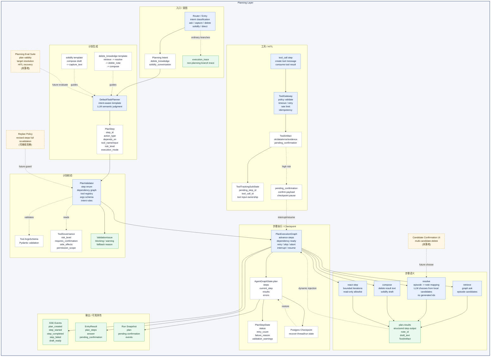

# 规划层

优秀 Agent 不一定需要把所有请求都交给一个开放式 planner。很多生产 Agent 更适合先把业务能力做成明确 workflow，再把其中需要展示、校验、恢复和确认的步骤投影成结构化 plan。

当前项目里的 `ask_branch`、`capture_branch`、`delete_knowledge` 和 `solidify_conversation` 本质上都是 workflow。所谓“规划层”目前更准确地说是 **workflow planning / step projection 层**：它把 `delete_knowledge`、`solidify_conversation` 这类固定或半固定 workflow 表达成 `PlanStep`、`PlanStepState`、`plan.results` 和步骤事件，以复用工具层校验、LangGraph checkpoint、HITL 和前端计划面板。它还不是成熟的通用自主规划器。

当前受控执行链路是：`DefaultTaskPlanner` 基于 intent 生成模板化 `PlanStep`，`PlanValidator` 校验步骤结构、依赖图和 intent 规则，并读取工具 schema / 治理契约做执行前阻断；Graph 把步骤推进到 checkpoint-safe 的 `PlanStepState`；工具调用再通过工具层的 `ToolGateway` 执行 timeout、retry、rate limit、HITL、幂等和审计。这里的核心价值不是让 LLM 自由编排，而是把 workflow 的关键节点纳入统一步骤状态和治理边界。

对应代码主要位于 [src/personal_agent/agent/planner.py](../../src/personal_agent/agent/planner.py)、[src/personal_agent/agent/plan_validator.py](../../src/personal_agent/agent/plan_validator.py)、[src/personal_agent/agent/orchestration_graph.py](../../src/personal_agent/agent/orchestration_graph.py)、[src/personal_agent/agent/orchestration_nodes/_steps.py](../../src/personal_agent/agent/orchestration_nodes/_steps.py) 和 [src/personal_agent/agent/orchestration_models.py](../../src/personal_agent/agent/orchestration_models.py)。

## 重新设计原则

结合当前项目实际和主流 Agent 设计建议，规划层应该重新定义为 **Workflow / Step Planning Layer**，而不是继续描述成通用 planner。

主流设计里有一个重要区分：

- workflow：LLM 和工具按预定义代码路径执行，顺序和控制流主要由系统决定。
- agent / planner：LLM 动态决定过程、工具使用和下一步动作。

当前项目更接近 workflow-first 架构：`ask_branch`、`capture_branch`、`delete_knowledge`、`solidify_conversation` 都有清楚业务路径。真正需要 LLM 的地方不是“重新发明流程”，而是 query understanding、候选解析、草稿生成、证据重排、低风险检索探索等局部决策。

因此重新设计的核心原则是：

```text
固定流程下沉为 Workflow
动态语义判断保留给 LLM Decision Node
PlanStep 变成 workflow 的可视化 / 恢复 / 审计 projection
真正开放式 planner 只作为未来能力，在满足明确触发条件时启用
```

这个设计把当前的“规划层”拆成四个更清楚的概念：

| 概念 | 职责 | 当前对应 | 未来命名建议 |
| --- | --- | --- | --- |
| Workflow | 业务流程真源，定义固定控制流、状态转移和副作用边界 | ask/capture/delete/solidify 分支 | `WorkflowSpec` / `WorkflowRunner` |
| Step Projection | 面向前端、checkpoint、审计和 HITL 的步骤视图 | `PlanStep`、`PlanStepState`、`plan.results` | `WorkflowStep` / `StepRun` |
| Decision Node | LLM 参与的局部语义决策 | query planner、resolve、solidify compose、ReAct retrieve | `DecisionNode` |
| Autonomous Planner | 模型动态生成步骤 DAG，仅用于流程未知的复杂任务 | 当前未成熟落地 | `PlannerDAG` / `TaskGraph` |

这样重构后，当前项目不用强行证明“planner 很智能”，而是可以更准确地说：项目已经有多个 production-style workflow，其中 delete / solidify 使用 step projection 暴露计划面板和 HITL；真正自主 planner 是后续扩展。

## 目标架构

目标架构应该从“Planner 生成步骤，Graph 执行步骤”调整为“Workflow 是执行真源，Planner/Decision 只填充不确定部分”。

```text
Entry / Router
    ↓
WorkflowRegistry.select(intent)
    ↓
WorkflowSpec
    ├─ deterministic nodes
    ├─ decision nodes
    ├─ tool actions
    ├─ human tasks
    └─ step projection
    ↓
WorkflowRunner on LangGraph checkpoint
    ↓
ToolGateway / MemoryFacade / Evidence / HITL / Events
```

### WorkflowRegistry

`WorkflowRegistry` 负责根据 router intent 选择 workflow，而不是让 LLM 从零生成流程。

当前可以注册：

| Intent | Workflow | 是否需要 Step Projection |
| --- | --- | --- |
| `ask` | `AskWorkflow` | 否，已有 retrieval trace / ContextPack trace |
| `capture_text / capture_link / capture_file` | `CaptureWorkflow` | 否，已有 capture flow trace |
| `delete_knowledge` | `DeleteKnowledgeWorkflow` | 是，高风险、需要候选解析、HITL 和前端确认 |
| `solidify_conversation` | `SolidifyConversationWorkflow` | 是，需要草稿、写入和前端展示 |
| `direct_answer` | `DirectAnswerWorkflow` | 否 |
| `summarize` | `SummarizeWorkflow` | 可选 |

这能让 README 中的多层 Agent 结构更一致：入口和路由选择 workflow，运行时编排 workflow，工具和记忆提供能力，观测治理记录过程，eval 验证质量。

### WorkflowSpec

`WorkflowSpec` 是每个 workflow 的业务真源。它应该表达：

- workflow id / version。
- 允许的 intent。
- 固定节点和条件边。
- 哪些节点可以调用 LLM。
- 哪些节点可以调用工具。
- 哪些节点会产生副作用。
- 哪些节点需要 HITL。
- 哪些节点需要进入前端 step projection。
- 错误策略：retry / skip / abort / clarify / human_select。

示意结构：

```python
class WorkflowSpec(BaseModel):
    workflow_id: str
    version: str
    intent: str
    steps: list[WorkflowStepSpec]
    projection_policy: StepProjectionPolicy
    recovery_policy: RecoveryPolicy
```

`WorkflowSpec` 比当前 `PlanStep[]` 更强，因为它不是模型输出的临时列表，而是系统维护的业务流程契约。

### Step Projection

当前 `PlanStep` 不应该再被看作“planner 自由生成的步骤”，而应该改造成 workflow 的 projection：

- 展示给前端：用户知道系统正在检索候选、解析目标、等待确认、执行删除。
- 保存到 checkpoint：恢复时知道当前卡在哪个节点。
- 连接 HITL：确认 payload 和 step id 能对齐。
- 连接审计：工具调用、确认、拒绝、失败都能回到具体步骤。
- 连接 eval：可以评估目标解析、确认流程、失败恢复。

因此更合适的命名是：

```text
PlanStep      -> WorkflowStepView / StepProjection
PlanStepState -> StepRunState
plan.results  -> workflow.step_results
PlanValidator -> StepProjectionValidator + WorkflowPolicyValidator
```

不一定要马上改代码，但文档和架构理解应该先收敛到这个方向。

### Decision Node

LLM 应该集中出现在不可完全规则化的节点，而不是控制整个 workflow：

| Decision Node | 输入 | 输出 | 约束 |
| --- | --- | --- | --- |
| `QueryUnderstandingDecision` | question + short context | `QueryUnderstanding / RetrievalPlan` | strict JSON schema，失败 fallback |
| `DeleteTargetResolveDecision` | 候选 note 列表 + 用户描述 | selected candidate / null | 只能从候选 ID 选择 |
| `SolidifyDraftDecision` | checkpoint messages + 用户要求 | draft / no-op | 不能写入助手假设 |
| `EvidenceRerankDecision` | question + candidates | ranked ids | 只能重排已有 evidence |
| `ReadOnlyReactDecision` | retrieve step context | graph/web action or final observation | allowlist + max iterations |

这样 LLM 的输出都是局部、结构化、可校验的，不再承担“设计整个流程”的职责。

### Autonomous Planner 触发条件

真正的开放式 planner 不应该默认启用，只在满足这些条件时使用：

- 用户目标不能映射到已有 workflow。
- 任务需要多个异构工具组合，步骤顺序无法预先写死。
- 所有可用工具都是低风险或已具备强 guardrail。
- 可以接受更高延迟和成本。
- 有 eval 和审计覆盖。
- 计划输出是 DAG，并且必须经过 `PlannerDAGValidator`。

对于当前项目，短期内不建议把 delete / solidify 升级成开放式 planner。更应该做的是把它们下沉成显式 workflow。

## 设计目标

当前规划层需要同时满足两类要求：

- 对模型友好：模型只在有限位置参与语义判断，例如删除候选检索、目标解析辅助、solidify 草稿生成和步骤说明，不直接操作数据库、checkpoint 或 HITL 细节。
- 对系统可靠：固定 workflow 的步骤必须能被结构化表示、按步骤恢复、精确归属工具结果，并在高风险动作前暂停确认。

因此规划层的职责不是“替工具层执行动作”，也不是“让模型自由设计流程”，而是把 workflow 投影成有语义边界的步骤图：

```text
用户请求 / router intent
    ↓
DefaultTaskPlanner 生成模板化 PlanStep
    ↓
PlanValidator 校验步骤、依赖、工具 schema、治理契约
    ↓
PlanExecutionGraph 推进 PlanStepState
    ↓
ToolGateway / HITL / checkpoint resume
    ↓
compose 输出用户可见结果
```

当前真正使用 step projection 的主要是两类任务：

- `delete_knowledge`：删除长期知识，属于高风险操作，必须先解析真实目标，再经过确认。
- `solidify_conversation`：把已有对话结论整理成正式知识，需要先生成草稿，再写入长期记忆。

普通 `ask / capture / direct_answer / summarize` 直接走对应 Graph workflow 分支，并通过 `execution_trace` 记录过程，不进入 `PlanStep` 执行器。这也说明当前项目并不是“所有 workflow 都必须变成 plan”；只有需要步骤状态、HITL、前端计划展示或后续 replan 空间的 workflow 才投影成 plan。

## 当前实现与能力

当前规划层可以按“意图进入 -> workflow 模板选择 -> 步骤 projection -> 计划校验 -> 步骤执行 -> 工具隔离 / HITL -> 恢复与输出”的链路理解。它和 [tools.md](tools.md) 的工具层、[memory.md](memory.md) 的记忆层互相配合：规划层组织固定 workflow 的关键步骤和依赖，工具层负责可控执行，记忆层保存 checkpoint 现场和长期知识。

### 计划生成

`DefaultTaskPlanner` 根据 router intent 生成计划。当前不是完全开放式的通用 planner，而是对核心 workflow 采用 intent-aware 模板，再保留必要的 LLM 语义判断。

当前核心模板：

| Intent | 计划模板 | 说明 |
| --- | --- | --- |
| `delete_knowledge` | `retrieve -> resolve -> tool_call(delete_note) -> compose` | 先找候选，再解析真实 `note_id`，随后创建确认或执行删除 |
| `solidify_conversation` | `compose -> tool_call(capture_text)` | 先从 checkpoint 对话生成可入库草稿，再写入长期知识 |

这个设计刻意限制了 planner 的自由度：删除和固化都不是“模型想怎么编排都行”，而是固定 workflow 的步骤化表达。换句话说，当前 `PlanStep` 更像 workflow execution 的 projection，而不是开放式 planner 的自由产物。

### 计划校验

计划生成后不会直接执行。`PlanValidator` 会先校验：

- `action_type / risk_level / on_failure / status` 是否合法。
- `depends_on` 是否引用存在步骤，依赖图是否有环。
- `tool_call.tool_name` 是否已注册。
- `tool_input` 是否满足 LangChain tool 的显式 args schema。
- ReAct 步骤是否只调用允许工具，是否越权调用高风险或写入类工具。
- intent 特定规则是否满足，例如删除必须依赖 `resolve`，固化写入必须依赖 `compose`。

这一步的价值是把 prompt 里的软约束变成执行前硬边界。模型生成的计划只是候选，只有通过校验的计划才会进入 Graph。

### 步骤执行

通过校验后，`PlanExecutionGraph` 会把 `PlanStep` 转成 checkpoint-safe 的 `PlanStepState`，保存在 `AgentGraphState.plan.steps` 中。每个步骤执行时更新：

- `status`：`planned / running / completed / failed / skipped`。
- `retry_count`。
- `failure_reason`。
- `validation_warnings`。
- `AgentGraphState.plan.results[step_id]`。

步骤结果不靠自然语言串联，而是写入结构化 `plan.results`，后续步骤通过依赖关系读取上游结果。例如 `resolve` 产出的 `note_id` 会被动态注入 `delete_note.tool_input.note_id`，`compose` 产出的 solidify 草稿会被动态注入 `capture_text.text`。

### 检索与目标解析

`delete_knowledge` 的安全关键不在删除工具本身，而在删除前如何确定目标。当前使用 `retrieve -> resolve` 两步拆开：

- `retrieve`：调用图谱检索，获得 `answer / entity_names / relation_facts / related_episode_uuids` 等候选线索。
- `resolve`：把候选线索映射回本地 `knowledge_notes`，或者让 LLM 只在最近 parent notes 的 `note_id / title / summary` 列表中选择一个明确候选。

`resolve` 不修改数据库，也不能让 LLM 生成新 ID。它只在已有候选中选择真实 `note_id`；如果不确定，就失败并返回“请提供更具体的标题或内容描述”。

这层边界很重要：删除哪个对象不是 planner 在计划阶段拍脑袋写死，而是在运行时从真实知识库候选中解析出来。

### 工具调用与 HITL

`tool_call` 步骤不直接在 planner 中执行，而是通过 LangGraph 工具消息和工具层进入 `ToolGateway`。工具结果走内部 `tool_messages`，并由 `ToolTrackingSubState` 做归属校验，避免 checkpoint 恢复后消费到旧结果。

以 `delete_note` 为例：

1. 第一次调用未带确认时，不删除数据，只返回 `pending_confirmation=true`。
2. Graph 将确认 payload 写入 `AgentGraphState.pending_confirmation`。
3. Graph 调用 `interrupt()` 暂停在 checkpoint 中。
4. 用户通过同一 `thread_id` resume，并给出确认或拒绝。
5. 确认后，Graph 注入 `confirmed=true` 和 `idempotency_key`，再次调用工具才真正删除。

真正删除时会清理目标 `knowledge_notes`、parent 的 chunk notes、关联 `review_cards`、上传文件引用，以及可用的 Graphiti episode 映射。

### Compose 输出

`compose` 是把结构化步骤结果转成用户可见文本或草稿的步骤，不是简单总结器。

在 `delete_knowledge` 中，`compose` 消费 `delete_note` 的 artifact，生成确认请求、删除成功、取消或失败说明。

在 `solidify_conversation` 中，`compose` 从 checkpoint `messages` 中判断哪些会话事实属于本次固化范围，生成一条可独立入库的知识草稿。如果没有足以固化的知识正文，步骤会失败，不写入长期知识。草稿保存在 checkpoint 的 `plan.results` 中，并发出 `draft_ready` 事件，便于前端展示。

### ReAct 步骤

`PlanStep.execution_mode="react"` 表示单个步骤内部可以运行受控 Thought / Action / Observation 循环。它是步骤内部策略，不替代整体计划执行器。

当前约束：

- 默认只允许只读工具，例如 `graph_search / web_search`。
- 不允许高风险、写长期知识、删除或需要确认的工具。
- `max_iterations` 有上限。
- 每轮 action / observation 进入事件流。
- ReAct 失败或耗尽后回到计划步骤状态机，由 `on_failure` 决定跳过、重试或中止。

## 核心模型与契约

### PlanStep 计划步骤

`PlanStep` 是 planner 输出的步骤契约，描述“打算做什么”。它还不是执行状态，也不保存工具结果。

核心字段：

| 字段 | 含义 |
| --- | --- |
| `step_id` | 步骤唯一标识，例如 `del-2` |
| `action_type` | 步骤类型：`retrieve / resolve / tool_call / compose / verify` |
| `description` | 面向用户、事件和日志的步骤说明 |
| `tool_name` | `tool_call` 或 ReAct 可调用的工具名 |
| `tool_input` | 工具输入；部分字段允许由上游步骤动态注入 |
| `depends_on` | 前置步骤 id |
| `risk_level` | 风险等级：`low / medium / high` |
| `requires_confirmation` | 是否需要用户确认 |
| `on_failure` | 失败策略：`skip / retry / abort` |
| `execution_mode` | `deterministic` 或 `react` |
| `allowed_tools` | ReAct 模式允许调用的工具列表 |
| `max_iterations` | ReAct 最大迭代轮数 |

这个模型的边界是“意图和编排”。它不应该保存长期事实，也不应该直接表达数据库变更结果。

### PlanStepState 执行状态

`PlanStepState` 是进入 LangGraph 后的 checkpoint-safe 状态，描述“执行到哪里了”。它由 `PlanStep` 转换而来，并在每次步骤推进时更新。

核心字段：

- `status`：步骤生命周期。
- `retry_count`：当前重试次数。
- `failure_reason`：失败原因。
- `validation_warnings`：校验警告。
- `tool_call_id` / pending 信息：用于工具消息归属。
- `result` 或 `AgentGraphState.plan.results[step_id]`：步骤结构化结果。

这层和 [memory.md](memory.md) 的短期执行现场一致：它属于 checkpoint，可恢复、可暂停、可审计，但不是长期知识真源。

### PlanValidator 校验门

`PlanValidator` 是计划执行前的安全门。它同时消费 planning 模型、工具注册表、工具 args schema 和 `ToolGovernance`。

当前校验重点：

- 结构合法：步骤类型、依赖图、枚举值、失败策略。
- 工具存在：`tool_call.tool_name` 必须在 `ToolExecutor` 注册表中。
- 参数合法：用工具显式 Pydantic args schema 校验 `tool_input`。
- 风险一致：高风险 / 需确认工具不能被 ReAct 自主调用。
- intent 合法：删除必须经过 `resolve`，固化必须经过 `compose`。

如果存在 blocking issue，Graph 会尝试 fallback plan；如果仍不可用，则转成用户可见澄清或错误提示，不执行危险工具。

### StepResult / plan.results 数据传递

`plan.results` 是步骤之间传递结构化数据的主要通道。它避免用自然语言描述来驱动后续副作用。

典型结果：

| 步骤 | 结果字段 | 后续用途 |
| --- | --- | --- |
| `retrieve` | `related_episode_uuids`、`relation_facts` | 给 `resolve` 找本地 note 候选 |
| `resolve` | `note_id`、`title`、`summary`、`candidates` | 动态注入 `delete_note.tool_input.note_id` |
| `compose` for solidify | `draft_text` / 草稿正文 | 动态注入 `capture_text.text` |
| `tool_call` | `ToolArtifact` | 更新计划状态、HITL、compose 输出和审计 |

这层的规则是：后续副作用工具必须消费上游结构化结果，不能依赖 planner 预填的占位符或模型臆造 ID。

### PendingConfirmation 恢复契约

`pending_confirmation` 是规划层和记忆层共享的 HITL 暂停状态。它保存在 `AgentGraphState` checkpoint 中，通常包含：

```json
{
  "step_id": "del-3",
  "action_type": "delete_note",
  "note_id": "note-123",
  "title": "DNS",
  "summary": "DNS 是域名系统...",
  "description": "将删除笔记「DNS」及其关联的复习卡片和图谱映射。"
}
```

用户拒绝时，Graph 会把当前步骤标记为 skipped，递归跳过依赖它的后续步骤，清空 `pending_confirmation`，并返回取消说明。用户确认时，Graph 使用同一 checkpoint 恢复，不重新规划。

### EntryResult / 事件流

规划层对外暴露的不只是最终答案，还包括可观测执行过程：

- `EntryResult.plan_steps`。
- SSE `plan_created`。
- SSE `plan_step_started`。
- SSE `plan_step_completed`。
- SSE `plan_step_failed`。
- SSE `draft_ready`。
- run snapshot 中的 `plan / pending_confirmation`。

这让前端和调试 API 能看到计划如何生成、哪个步骤暂停、哪个工具返回了什么，而不是只看到一段最终文本。

## Model / Layer 依赖类图

这张图描述“规划层如何消费模型、工具契约和 checkpoint 状态”，不是 Python 继承关系。为表达分层，沿用 [tools.md](tools.md) 和 [memory.md](memory.md) 的约定：

- 蓝色节点是处理层。
- 白色节点是已落地的模型 / 契约。
- 绿色节点是已落地、被多层共同消费的事件或结果 projection。
- 黄色虚线节点是尚未落地的未来模型 / 治理能力。

关键边界需要特别明确：

- `PlanStep` 是计划意图，`PlanStepState` 是 checkpoint 中的执行状态。
- `PlanValidator` 是执行前硬边界；计划通过校验后才允许进入 Graph。
- `resolve` 只能从真实候选中选择目标，不能直接执行删除，也不能让 LLM 生成新对象 ID。
- `tool_call` 步骤最终仍经过工具层的 `ToolGateway`，规划层不绕过工具治理。
- `pending_confirmation` 属于短期执行现场，不是长期审批表。
- `plan.results` 是步骤间结构化数据通道，后续副作用工具不应依赖自然语言占位符。



## 与优秀 Agent 规划层的对照

| 维度 | 优秀 Agent 规划层 | 当前项目状态 |
| --- | --- | --- |
| 计划边界 | 固定 workflow 和开放式规划有清晰边界 | 当前 ask/capture/direct 是 workflow 分支，delete/solidify 被投影成 `PlanStep` 执行 |
| 步骤语义 | 每种步骤有明确输入、输出和可执行含义 | 已定义 `retrieve / resolve / tool_call / compose / verify`，但主要服务固定 intent workflow |
| 计划校验 | LLM 计划必须经过 schema、依赖和风险校验 | 已用 `PlanValidator` 校验依赖图、工具 schema、风险和 intent 规则 |
| 工具治理 | 计划不绕过工具层，高风险动作受 HITL 和幂等保护 | 已通过 `ToolGateway` 执行工具，`delete_note` 走确认和 idempotency key |
| 目标解析 | 模糊对象先解析为真实系统对象，再执行副作用 | 已用 `resolve` 从 graph episode 或本地 note 候选中选择 `note_id` |
| 状态恢复 | 计划状态可 checkpoint，暂停后能 resume | 已用 `AgentGraphState.plan` 和 Postgres checkpoint 保存步骤状态 |
| 结果传递 | 步骤间用结构化结果，不靠自然语言猜测 | 已用 `plan.results` 动态注入 `note_id` 和 solidify 草稿 |
| 可观测性 | 前端和调试侧能看到计划、步骤、暂停和失败 | 已有 plan SSE events、`EntryResult.plan_steps` 和 run snapshot |
| ReAct 边界 | ReAct 是单步策略，不能越权替代 workflow 执行 | 已限制只读工具、allowlist 和最大迭代 |
| 评测闭环 | 有计划有效性、目标解析和恢复一致性 eval | 当前有流程和单元测试，专项 planning eval 仍可补齐 |

## 主要差距

当前规划层已经具备“workflow step projection + 计划校验 + checkpoint 执行 + HITL 恢复”的核心边界。距离成熟生产级规划 / workflow 层，主要差距在于概念边界需要进一步收敛、计划 schema 的稳定性、目标解析的人机协同、replan 治理和专项评测：

1. planning 与 workflow 的边界需要重新命名和收敛

   当前 `ask_branch / capture_branch / delete_knowledge / solidify_conversation` 本质上都是 workflow，只是 delete 和 solidify 被投影成 `PlanStep`。后续可以把固定流程下沉为显式 `DeleteKnowledgeWorkflow`、`SolidifyConversationWorkflow`，让 planner 只负责选择 workflow、解释步骤、填充动态语义目标和生成 UI projection，避免把固定 workflow 包装成“通用规划”。

2. 多候选删除还缺少结构化确认 UI

   当前 `resolve` 只选择单个删除目标；如果候选不明确，会失败并要求用户提供更具体描述。后续应支持多候选确认 UI，让系统把候选列表、标题、摘要和来源展示给用户，由用户明确选择一个或多个目标。

3. revised steps 的复校验还需要继续收敛

   当前 replan 更偏失败补救。后续 revised steps 应和初始计划一样完整经过 `PlanValidator`、工具 schema、风险治理、依赖图和 intent 规则校验，避免补救计划绕过初始安全边界。

4. 计划步骤 JSON schema 可以更稳定

   当前 `PlanStep` 已经结构化，但还可以进一步定义面向 planner 输出的稳定 JSON schema、contract tests 和向后兼容规则，减少 prompt 或模型切换导致的计划格式漂移。

5. `resolve` 的召回和置信度还可以增强

   当前本地候选选择只给 LLM `note_id / title / summary`，降低了误删风险，但可能召回不足。后续可以加入更明确的置信度、候选排名、来源解释，以及“必须用户确认候选”的中间状态。

6. solidify 的范围判断仍需要长会话干扰评测

   solidify 依赖 checkpoint 对话和 LLM 判断哪些内容应当固化。长会话里用户更正、废弃方案、助手假设和未验证声明都可能混在一起。后续应结合 [memory.md](memory.md) 中的结构化 `ThreadSummary` 思路，避免把助手推测或已废弃内容写入长期知识。

## 按优先级排序的演进建议

当前工程已经完成规划层的核心执行边界：intent-aware workflow step projection、`PlanValidator`、checkpoint-safe step state、`plan.results`、工具层治理和 HITL resume。下一阶段优先级应该从“计划能跑”转向“workflow 与 planning 边界更清晰、步骤可协作、可验证、可评测”。

### P0：重新定义 planning 与 workflow 的职责边界

最高优先级是把概念边界收敛清楚：

- `ask_branch / capture_branch / direct_answer / summarize` 明确为普通 workflow。
- `delete_knowledge / solidify_conversation` 下沉为显式 workflow，保留 `PlanStep` 作为 UI、checkpoint 和审计 projection。
- Planner 负责选择 workflow、解释步骤、填充动态语义目标、必要时生成低风险检索步骤，而不是自由决定整个流程。
- `PlanValidator` 保留为 workflow projection 的结构校验和安全门，不再被描述成通用 planner 的万能守卫。
- 文档和代码命名可逐步从“规划层”收敛为“Workflow / Step Planning Layer”。

这一步能避免面试和维护中的概念歧义：当前项目有 workflow 编排能力，planning 是其中一种步骤 projection，而不是所有 workflow 的上位替代。

### P1：建立 WorkflowRegistry 和显式 WorkflowSpec

把当前隐含在 router、orchestration graph 和 `_steps.py` 里的 workflow 显式登记：

- `AskWorkflow`
- `CaptureWorkflow`
- `DeleteKnowledgeWorkflow`
- `SolidifyConversationWorkflow`
- `DirectAnswerWorkflow`
- `SummarizeWorkflow`

每个 workflow 至少声明：

- workflow id / version。
- 对应 intent。
- 是否需要 step projection。
- 是否允许 LLM decision node。
- 是否允许工具调用。
- 是否存在高风险副作用。
- HITL 策略。
- recovery policy。

这一步不要求立即重写 LangGraph，只需要先建立 registry 和 spec，让后续文档、前端、测试和代码都以 workflow 为真源。

### P2：把 PlanStep 改造成 Workflow Step Projection

保留当前 `PlanStep / PlanStepState` 也可以，但语义要改：

- 不再表示“LLM 自由生成的计划”。
- 表示 workflow 节点的用户可见 projection。
- `plan.results` 改名或语义收敛为 `step_results`。
- `PlanValidator` 拆成 `WorkflowSpecValidator` 和 `StepProjectionValidator`。
- 前端计划面板继续消费 projection，而不是直接暗示后端由通用 planner 控制。

这样能最大化复用当前代码，又避免概念误导。

### P3：删除和固化下沉为显式 Workflow

`delete_knowledge`：

```text
DeleteKnowledgeWorkflow
  normalize_request
  retrieve_candidates
  resolve_candidate
  human_confirm
  execute_delete_note
  compose_result
```

`solidify_conversation`：

```text
SolidifyConversationWorkflow
  collect_thread_context
  draft_knowledge
  validate_draft
  capture_text
  compose_result
```

其中 `retrieve_candidates` 可以保留 read-only ReAct，`resolve_candidate` 和 `draft_knowledge` 是 LLM decision nodes，但 workflow 主干由系统定义。

### P4：为删除目标解析增加候选确认

最高收益的下一步是把 `resolve` 从“系统自动选一个或失败”升级为“系统可提出候选，用户明确确认”：

- 返回候选 `note_id / title / summary / source / confidence`。
- 支持单选和后续可选的多选删除。
- 用户选择后再动态注入 `delete_note.note_id`。
- 不明确时不调用删除工具。
- 候选确认结果进入 checkpoint 和审计事件。

这一步能显著降低误删风险，也让模糊删除请求有更好的用户体验。

### P5：统一 initial projection 和 revised projection 校验

所有 revised steps 都应和初始计划共享同一个校验门：

- 依赖图复校验。
- 工具 args schema 复校验。
- 风险等级和 `requires_confirmation` 复校验。
- ReAct allowlist 复校验。
- intent 特定规则复校验。
- revised plan 与已完成步骤之间的兼容性检查。

目标是让 replan 只能修复失败，不能降低安全边界。

### P6：固化 Workflow / Step Projection JSON Schema 与 Contract Tests

workflow projection 输出应有一套稳定的 JSON schema 和测试样例：

- 每个 `action_type` 的必填 / 禁止字段。
- 每个 intent 允许的步骤组合。
- 占位符和动态注入字段规范。
- 高风险工具依赖和确认规则。
- 失败策略合法组合。
- 模型输出解析失败的 fallback 行为。

这一步能减少 planner prompt、模型版本或工具描述变化带来的隐性回归。

### P7：增强 solidify 的事实边界

solidify 写入的是长期知识，因此需要比普通总结更严格：

- 区分用户明确事实、用户偏好、已确认决策、助手假设和未验证声明。
- 对“助手推测”和“未确认方案”默认不写入。
- 用户要求固化范围不清楚时先澄清。
- 草稿中保留来源对话线索或 evidence refs。
- 与未来结构化 `ThreadSummary` 协同，降低长会话干扰。

这一步能避免把短期对话噪声沉淀成长期记忆。

### P8：完善 workflow 可观测性和调试视图

当前已经有 SSE events 和 run snapshot。后续可以进一步补齐：

- 每一步的输入、输出、依赖和耗时。
- fallback plan / revised plan 的差异视图。
- `resolve` 候选和选择理由。
- HITL 暂停、确认、拒绝和恢复链路。
- 工具审计事件和计划步骤之间的互链。

这一步能让 workflow / step planning 从“后端可运行”变成“前端和调试侧可解释”。

### P9：建立 Workflow / Planning Eval Suite

workflow / planning 层需要专项评测证明它真的降低风险，而不是只是多了一层步骤：

- 计划格式有效率。
- intent 模板命中率。
- 工具选择准确率。
- 参数动态注入准确率。
- 删除目标解析准确率。
- 高风险误执行率。
- HITL resume 一致性。
- solidify 长会话干扰率。

这一步能让 planning prompt、步骤 schema 和校验规则进入持续优化闭环。

## 面试讲解口径

面试时不要把规划层讲成“我让 LLM 生成计划”，而要讲成：

> 我把规划层设计成复杂任务和高风险动作的可恢复编排层。LLM 可以提出步骤，但步骤必须经过 `PlanValidator` 校验；真正执行时进入 LangGraph checkpoint，每个步骤都有状态和结构化结果；高风险工具不由计划直接触发，而是经过 ToolGateway、HITL 和幂等保护。

可以按四层来讲：

1. 计划生成层

   `DefaultTaskPlanner` 根据 intent 生成受约束的计划。普通问答和 capture 不进规划层；删除知识和固化对话才需要计划。删除是 `retrieve -> resolve -> delete_note -> compose`，固化是 `compose -> capture_text`。

2. 计划校验层

   `PlanValidator` 会检查步骤类型、依赖图、工具是否存在、工具参数 schema、风险等级、ReAct allowlist 和 intent 特定规则。模型生成的计划只是候选，通过校验才允许执行。

3. 步骤执行与状态恢复层

   执行期用 `PlanStepState` 和 `AgentGraphState.plan` 保存 checkpoint-safe 状态。步骤结果写入 `plan.results`，后续步骤通过结构化结果动态注入参数。例如删除的 `note_id` 来自 `resolve`，固化的 `capture_text.text` 来自 `compose` 草稿。

4. 工具治理和 HITL 层

   `tool_call` 步骤最终仍走工具层的 `ToolGateway`，不会绕过工具 schema、风险治理、timeout、retry、rate limit、审计和幂等。`delete_note` 首次调用只创建确认 payload，用户确认后同一 checkpoint resume，带 `confirmed=True` 和 `idempotency_key` 才真正删除。

这个项目规划层最值得强调的亮点有：

- 规划层只服务真正需要步骤边界的任务，避免所有请求都被过度规划。
- 删除目标必须经过 `resolve` 从真实候选中解析，不能由 planner 直接写死 `note_id`。
- `PlanValidator` 把工具 schema、风险治理和 intent 规则变成执行前硬边界。
- 计划状态进入 checkpoint，支持高风险确认暂停和 resume。
- 步骤间通过 `plan.results` 传结构化数据，避免用自然语言猜测后续副作用参数。
- ReAct 被限制为单步内部策略，且只能调用低风险只读工具。
- 规划层和工具层、记忆层边界清楚：planning 编排动作，tools 执行动作，memory 保存现场和长期知识。

面试中需要注意边界表述：

- 可以说“已有 intent-aware 计划模板和校验执行链路”，不要说“已有完全通用自主规划器”。
- 可以说“删除流程支持 HITL 暂停和恢复”，不要说“所有高风险业务都有完整确认 UI 和回滚”。
- 可以说“`resolve` 会从图谱映射或本地 note 候选中选择目标”，不要说“已经支持批量多候选删除确认”。
- 可以说“replan 有失败补救能力”，不要说“revised steps 已有完整生产级治理闭环”。
- 可以说“solidify 会先生成草稿再写入长期知识”，不要说“已经完全解决长会话事实污染”。
- 可以说“已有步骤事件和 snapshot”，不要说“已有完整 planning eval suite”。

最适合收尾的一句话：

> 我这个规划层真正想解决的不是“让 Agent 看起来更会规划”，而是“让复杂动作在执行前可校验、执行中可恢复、执行后可追踪”。所以我把计划、校验、checkpoint 状态、工具治理和 HITL 拆成不同边界，保证模型可以参与决策，但不能绕过系统安全门。
