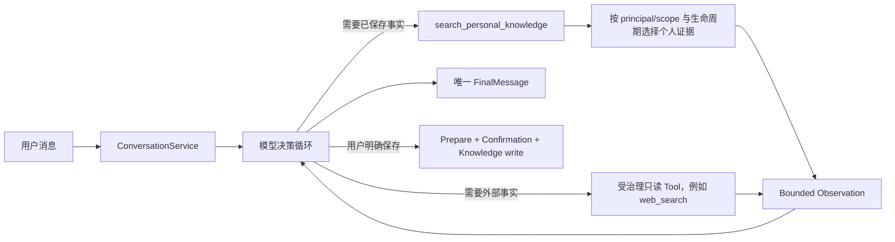

# Capture 与 Conversation Grounded Answer

**当前只有一个面向用户的最终回答 owner：Conversation loop。** Capture/Knowledge 负责写入和选择个人证据，web_search 等只读资源负责外部证据；它们都返回 bounded Observation，不生成第二个产品答案。

## 主链



Ask 不是独立 Workflow、Runtime facade 或 HTTP 路由。产品只有 Conversation answer path；paired 产品 E2E 证明它覆盖 personal-only 与 multi-source 用户目标。

## Capture 写路径

```text
正式 Capture/Knowledge 入口
  -> Artifact
  -> EvidenceBlock / EvidenceSpan
  -> Claim grounding + admission
  -> KnowledgeItem / lifecycle state
  -> 可重建 retrieval projection
```

`KnowledgeService` 是 Claim、EvidenceSpan、conflict 与 scope 的事实 owner。模型回答、trace 和 Observation 不自动写回；显式保存仍走 frozen selection、用户确认和 canonical Knowledge 写入口。

## Grounded read 路径

1. Conversation 只在模型选择 `search_personal_knowledge` 后调用 `ConversationKnowledgeReadPort.select_personal_evidence()`；服务端先校验当前 principal 和作用域，再按查询选择最多 8 条证据。
2. 结果成为 `search_personal_knowledge` 的有界 `tool_result`，包含原文 citation、claim summary 和 conflict ids；它是只读上下文，不是答案。
3. 成功 `Observation` 提交后，下一模型回合仍读取该 Observation，但逐回合能力投影不再暴露已经完成的 `search_personal_knowledge`；该投影不保存新业务事实，Admission 的重复搜索拒绝只作为 fail-closed 防线。
4. 用户明确禁止上网且正向要求使用已保存事实时，模型可以从个人证据回答，外部搜索调用必须为零。
5. 用户要求官方或当前外部资料时，模型必须调用可见的只读搜索工具；`Observation` 与个人证据进入同一个循环。单个官方文档查询，或少量需要和个人 Context 在父级回答中合并的只读查询，不委托整个请求；只有可独立验证且确实需要广泛综合、Context 隔离或并行研究的子目标才使用外部研究智能体。
6. Conversation 生成唯一 FinalMessage。没有足够证据时必须给 limitation，不能把 Tool success 当完成。

这种形态与优秀 Agent 的共同点是“一个 manager/loop 组合多个只读资源”；采用它的原因不是框架对齐，而是 ASK-001A/B 的同入口 baseline 与目标 E2E。

## 权力与事实边界

| 对象 | Owner | 不能做什么 |
| --- | --- | --- |
| Artifact / Evidence / Claim | Knowledge Application | 不能生成通用 FinalMessage |
| personal evidence projection | Conversation context materialization | 不能无模型选择进入上下文，也不能成为第二写入口 |
| Tool Observation | Gateway / execution system | 不能证明 Goal 完成 |
| FinalMessage | Conversation semantic loop | 不能无确认写回长期知识 |
| save/delete Command 与 Receipt | 对应 Knowledge lifecycle Application | 不能由模型伪造执行事实 |

## 可执行证据

- `ASK-001A`：同一 Conversation 只使用 owner 个人资料，逐项引用冲突原文，不调用 web、不泄漏其他 principal、不新增 Claim。
- `ASK-001B`：同一 Conversation 同时使用个人证据与官方 Web 证据，最终回答包含官方 URL，只有一个 `FinalMessage`，不泄漏、不写知识；`narrow_research_routing` 横切套件独立检查直接读取与零整体委托。
- `E08`：Conversation 回答本身不写 Claim；显式 solidify 后才进入知识写路径。

运行：

```powershell
uv run pytest evals/e2e_quality/test_conversation_grounded_answer.py -q -s
```

## 仍保留的组件评测

Open RAGBench、MultiHopRAG 等只保留明确的 retrieval/component strategy。历史
Offline Eval 不包含自行生成 FinalMessage 的平行 runtime strategy；离线 scorer 不能反向定义生产架构，也不能替代 Conversation 产品 E2E。
