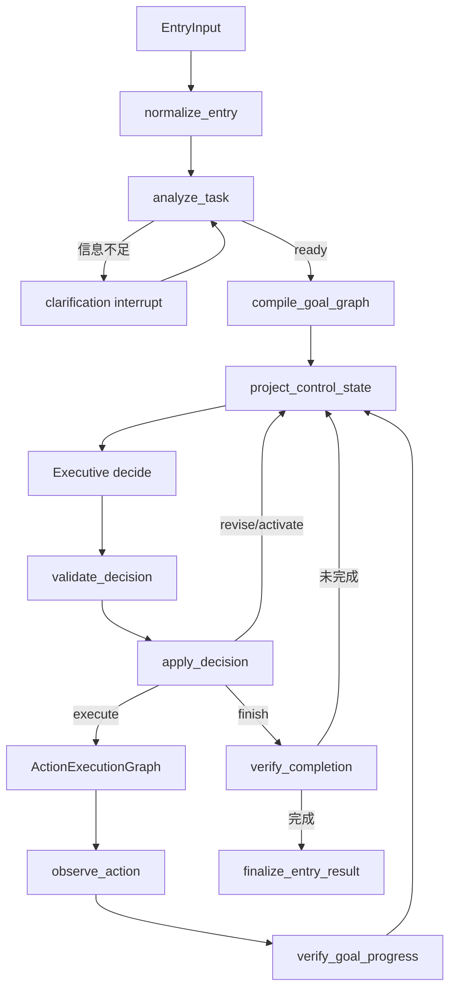

# Entry 到 Executive Agent Loop

本文描述一次 `entry` 请求从输入到最终返回的当前主链路。系统只有一条顶层控制链：Task Analyzer 形成可修订的 Goal Graph，Executive 在 Observation 反馈下逐轮决策，确定性 Runtime 校验并执行当前动作。

## 总链路

`EntryGraph`、`ExecutiveGraph`、`ActionExecutionGraph` 和局部 `ReActGraph` 都由 LangGraph 承载，并共享持久化 checkpoint。业务 workflow 不再拥有顶层路由权。

## 1. 任务分析

`normalize_entry` 负责输入 guard、run/thread 标识和运行态清零。`analyze_task` 调用 `DefaultTaskAnalyzer`，输出：

- 用户总目标；
- 一个或多个可验证 Goal；
- `consumes_output`、`requires_completion` 或 `ordering_preference` 关系；
- Goal 级资源提示；
- 必要的澄清信息。

Task Analyzer 不读取 Capability Registry，不选择 MCP、A2A、tool、Execution Pattern 或 workflow，也不判断 capability coverage。空输入触发结构化澄清；模型不可用时显式返回 `analyzer_unavailable`，生产链路没有关键词意图兜底。

## 2. Goal Graph 编译

`GoalGraphCompiler` 将 `TaskAnalysis` 确定性编译为 `TaskSpec`、`ContextEnvelope` 和初始 `ExecutionLedger`。`GoalGraphValidator` 校验关系端点、重复关系、自依赖与阻塞环。

初始关系只是执行假设：

- `user_explicit` 关系不可修改；
- `model_inferred` 与 `runtime_derived` 关系可被后续 Observation 推翻；
- `ordering_preference` 不阻塞执行，也不制造伪依赖。

## 3. Executive 决策

每轮先从 TaskSpec、Ledger、最新 Observation、剩余预算和可用能力类型投影 `ControlState`。Executive 一次只产生一个强类型 `ControlDecision`：

- `clarify`
- `activate_skill`
- `revise_plan`
- `execute_meta_capability`
- `execute_parallel`
- `delegate`
- `invoke_protocol`
- `request_confirmation`
- `finish`
- `stop`

配置 structured model 时，模型可以同时比较 ready Goal、证据缺口、Skill、Plan Macro 和 capability class。模型只提出决策，不直接修改 Ledger、扩大 scope、执行副作用或宣布完成。

`DecisionValidator` 与 `LedgerPatchValidator` 负责确定性门禁。依赖修订必须引用触发它的 Observation，并通过端点、可变性、阻塞环、终态和 abandoned 传播校验。通过后的变更记录为 append-only `ExecutionEvent`，再由 Projector 更新 Ledger。

## 4. 动作执行

开放式工作被物化为当前一个 `BoundedAction`，而不是预先生成完整 step DAG。动作可使用 `acquire`、`explore`、`reason`、`transform`、`verify`、`delegate`、`commit` 或 `remember` 元能力，并显式携带预算、读写集、副作用等级和 capability requirement。

CapabilityResolver 在统一 Registry 中按当前 requirement、scope、policy、provider binding 与 coverage 选择 native、MCP 或 A2A 实现：

- MCP 通常参与 `acquire/explore/commit`，调用仍经过 ToolGateway；
- A2A 参与 `delegate`，输入是 provider-neutral `SubtaskSpec`，调用经过 AgentGateway；
- Agent 返回值只是 Observation，主 Agent 保留验证和最终回答所有权。

稳定事务走 `ProcedureCall`。ingest、solidify、delete、Research lifecycle 等 Procedure 持有固定 transition、HITL、幂等、admission 与 receipt 规则，但完成后仍回到同一个 Executive Loop。

确定性单步可直接执行；需要局部探索时进入受 allowed tools 和迭代预算约束的 `ReActGraph`。ReAct 只负责当前动作，不能重写任务计划。

## 5. Observation 与验证

动作执行结果先归一为 `ActionOutcome`，再由 `observe_action` 形成 Goal 级 Observation。失败也会记录 attempt，供下一轮 Executive 判断重试、换能力、澄清、委派、修订关系或停止。

动作成功只将 Goal 推到 `candidate_complete`。`GoalVerifier` 根据该 Goal 的 criterion 和 provenance evidence 判定：

- `goal_verified`
- 重新激活并附带 evidence gap
- `goal_degraded`

`finish` 还必须通过 `CompletionVerifier`；存在未解决 Goal、未满足 criterion、待确认项或缺失 completion claim 时，Runtime 会拒绝完成并回到 Executive。

## 6. 中断、恢复与输出

当前有两类 LangGraph interrupt：

1. Task Analyzer 请求用户补充信息；
2. Protocol 或外部 mutation 请求副作用确认。

恢复必须使用相同 `thread_id` 和 checkpoint。确认与具体调用绑定，不能被其他动作复用。

`finalize_entry_result` 将最终状态映射为 `EntryResult`，包括回复、run/thread 标识、执行轨迹、引用、事件和待确认信息。Web SSE 从相同事件流投影 `task_analyzed`、decision、action、tool、observation、verification、confirmation 和 completion 状态。

## 设计模式

| 模式 | 当前角色 |
| --- | --- |
| Compiler | `GoalGraphCompiler` 将语义分析编译为运行时事实 |
| Specification / Validator | Graph、Decision、Patch、Completion 的确定性不变式 |
| Command | `ControlDecision` 与 `LedgerPatchOperation` 表达受约束变更 |
| Event Sourcing | `ExecutionEvent` 是进度与计划修订的追加事实 |
| Projector | 从事件重建 `ExecutionLedger` |
| Ports and Adapters | Analyzer、Capability、ToolGateway、AgentGateway 隔离模型与 provider |
| State | LangGraph 节点和 checkpoint 管理可恢复控制状态 |

这些模式的目的不是增加层级，而是把模型擅长的语义判断与 Runtime 必须保证的授权、图一致性、副作用和完成条件分开。
