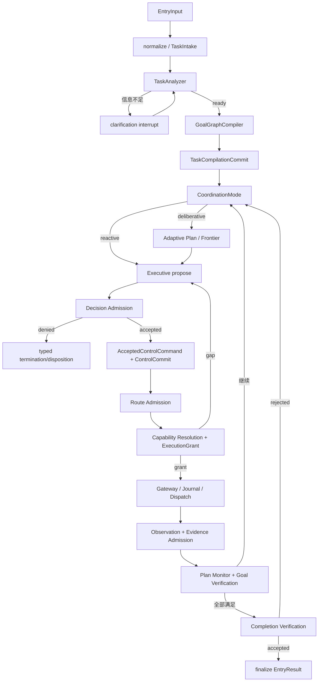

# 历史设计：Entry 到 Executive Agent Loop

> 状态：历史迁移资料，不是当前生产主链。`TaskAnalyzer`、`GoalGraphCompiler`、
> `AdaptivePlanner`、`ExecutiveController` 和 `orchestration_graph.py` 已从正式 Conversation
> 入口删除。当前事实见
> [personalAgent 当前核心架构](../summary/core-architecture-current-state.md)；不得依据本文恢复旧
> 通用主链。

本文描述当前 entry 主链。业务模块的职责和设计原因见 [当前核心架构](../summary/core-architecture-current-state.md)。

## 总链路

这不是固定业务 Workflow。Reactive 任务跳过 Plan；Mutation 可被 Route Admission 强制进入 Procedure；能力缺失回到 Executive；Observation 可以触发局部 plan patch；interrupt 使用同一个 thread/checkpoint 恢复。

## 1. Intake、分析与编译

`TaskIntakeState` 保存 Task 建立前的输入引用、clarification 和 proposal revision。`TaskAnalyzer` 只输出语义提案，不读取 Capability Portfolio，也不选择 provider。

`GoalGraphCompiler` 将提案编译为 `TaskContract`、初始 `TaskRuntimeProjection` 和 `ContextInventory`。它确定性校验 Goal identity、依赖端点、阻塞环、资源归属、Mutation taxonomy 和最低成功标准。

`TaskCompilationCommitter` 通过 proposal revision CAS 原子确认“哪个 intake proposal 生成了哪一版 Task/Runtime”。旧的 `TaskSpec`、`ExecutionLedger` 和 `ContextEnvelope` 命名已删除。

## 2. 协调与短期计划

`CoordinationModePolicy` 输出 reactive 或 deliberative。Procedure/ReAct/Tool/Delegation 是 ExecutionRoute，不是第三种 mode。

Deliberative 模式由 `AdaptivePlanner` 创建短 horizon、provider-neutral 的 `PlanDefinition`。Plan step 只声明 `CapabilityRequirement` 与期望 Observation。`FrontierSelector` 选择依赖已满足的 step；`PlanMonitor` 在执行后决定保持、局部重试或 CAS patch。

## 3. Executive、Admission 与 Commit

Executive 每轮只生成一个 `ControlProposal`，可包含 clarify、bounded action、delegate、procedure、confirmation、capability acquisition、finish 或 terminate。

`DecisionValidator` 不修改 Proposal，而是输出显式 `StageAdmissionDecision`。Accepted admission 由 `AcceptedCommandCompiler` 编译成新的 `AcceptedControlCommand`。`ControlCommitter` 将 proposal/admission/command 与 Task revision、event cursor 绑定，拒绝 stale commit。

## 4. Route、Capability 与执行

`RouteAdmission` 根据 Action 语义、风险、mandatory Procedure 和 delegation policy 选择 execution route，但不能扩大 AcceptedCommand 的资源与操作范围。

`CapabilityResolver` 使用 Requirement、Goal 有效资源、Policy、实时 availability 和 provider binding 选择能力。成功时签发一次性叶子 Grant：

- `AtomicCapabilityGrant`：单个 Tool/MCP invocation；
- `ProcedureGrant` / `ProcedureNodeGrant`：Procedure start 与具体 node；
- `DelegationGrant`：具体 child Agent start。

远程能力没有实时 availability 时 fail closed。没有合法 Grant 时产生 `CapabilityGapObservation`，不使用相似 Tool 猜测执行。

Gateway 在 dispatch 前复核 Grant、binding、resource、operation、confirmation 和 commit-time policy。`InvocationJournal.reserve` 同时建立 prepared outbox；随后记录 dispatched、observed 或 uncertain，使用 idempotency key 与 revision 防止重复副作用。

## 5. Context 与模型调用

Runtime 从 `ContextInventory` 按 purpose/snapshot/budget 创建 `ContextProjection`，`ModelContextGateway` 只 materialize 被选中的 item，并区分可信 instruction 与不可信 content。

每个 `StructuredModelRequest` 必须有 `context_projection_ref`。Agent 主链使用 projection id；完整输入由当前服务独占的有界调用使用 content-addressed sealed context。Structured 与 streaming client 都通过 Model Invocation Admission 获取 provider、egress 和 token scope。

## 6. Observation、Monitor 与 Verification

执行结果先归一为带 typed provenance、trust 和 taint 的 `ObservationRef`。外部内容默认不可信，进入 semantic verification 前必须获得 criterion-scoped `EvidenceAdmissionDecision`。

`PlanMonitor` 判断 Observation 对当前计划的影响；`GoalVerifier` 判断 evidence 是否满足 SuccessCriterion；两者互不替代。Mutation 还必须通过确定性 `MutationReceipt` 检查。

技术调用结果写 `CapabilityExecutionOutcomeEvent`，Goal 验证后才写 `CapabilityEffectivenessEvent`。Action 成功不会直接把 Goal 标记为 verified。

## 7. Completion、中断与恢复

`CompletionVerifier` 检查所有必需 Goal、criterion、verification report、pending interaction 和 completion claim。验证失败会回到控制循环，而不是接受模型的 finish 自述。

当前 interrupt 包括任务澄清和 Mutation confirmation。恢复使用相同 `thread_id` 和 `RunCheckpoint`；confirmation 与具体 invocation 绑定，不能跨 Action 复用。

`RunCheckpoint` 保存恢复所需引用、ControlTurnState、commits、Journal/outbox、Observation、Evidence admission 和 Verification report。业务定义仍由 TaskContract 所有，Checkpoint 不复制 Goal definition。

## 8. 关键不变量

- Analyzer/Planner/Executive 输出都是 proposal。
- 只有 AcceptedControlCommand 可以进入 route 和 execution resolution。
- 只有精确 ExecutionGrant 可以启动 agent runtime dispatch。
- Mutation 需要 confirmation、commit-time policy 和 receipt。
- Observation 不自动成为 Evidence，Evidence 不自动表示内容真实。
- Goal verification 与 Task completion 分开。
- Task/Control/Dispatch 都有 CAS 或原子 commit 边界。
